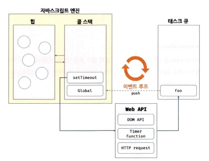
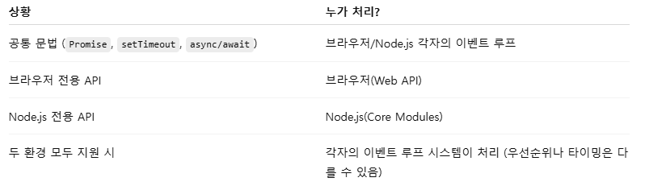
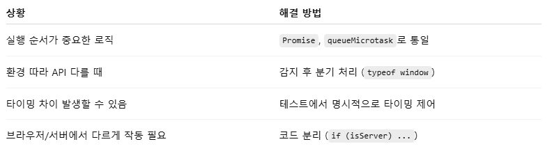

# 10회차, 이벤트 루프
- [10회차, 이벤트 루프](#10회차-이벤트-루프)
- [이벤트 루프와 태스크 큐](#이벤트-루프와-태스크-큐)
- [Q\&A](#qa)

> 들어가기 전
>
> 자바스크립트 엔진은 단 하나의 실행 컨텍스트 스택 가짐 => 싱글 스레드
> - 동시에 2개 이상의 함수 실행 불가
> - 실행 컨텍스트 스택의 최상위 요소인 실행 중인 실행 컨텍스트를 제외한 모든 실행 컨텍스트는 대기 중인 태스크들
> - 싱글 스레드 방식은 처리에 시간이 걸리는 태스크를 실행하는 경우 블로킹(작업 중단) 발생
>
> 동기 vs 비동기
> - 동기 : 현재 실행 중인 태스크가 종료할 때까지 다음에 실행할 태스크가 대기하는 방식
>   - 장점 : 실행 순서 보장
>   - 단점 : 앞선 태스크가 종료할 때까지 이후 태스크들이 블로킹 됨
> - 비동기 : 현재 실행 중인 태스크가 종료되지 않은 상태라도 다음 태스크를 실행하는 방식
>   - 장점 : 블로킹 발생X
>   - 단점 : 태스크의 실행 순서 보장X

# 이벤트 루프와 태스크 큐
- 자바스크립트 → 싱글 스레드로 동작
  - 한 번에 하나의 태스크만 처리 가능
- **이벤트 루프(event loop)** : 자바스크립트의 동시성 지원
  - 브라우저에 내장되어 있는 기능 중 하나
  - 
    - 자바스크립트 엔진 → 태스크가 요청되면 콜 스택 통해 요청된 작업을 순차적으로 실행
      - **콜 스택(call stack)** : 소스 코드 평가 과정에서 생성된 실행 컨텍스트가 추가되고 제거되는 스택 자료구조인 실행 컨텍스트 스택
      - **힙(heap)** : 객체가 저장되는 메모리 공간
        - 콜 스택의 요소인 실행 컨텍스트는 힙에 저장된 객체 참조
        - 구조화 되어 있지 않음
          - 메모리에 값을 저장하려면 먼저 값을 정할 메모리 공간의 크기 정해야 함
          - 객체는 크기가 정해지지 않아 런타임에 메모리 크기 결정(동적 할당)    
    - 브라우저/Node.js → 자바스크립트 엔진을 구동하는 환경
      - **태스크 큐(task queue/event queue/callback queue)** : 비동기 함수의 콜백 함수 또는 이벤트 핸들러가 일시적으로 보관되는 영역
        <details>
        <summary>마이크로태스크 큐</summary>
        
        - 프로미스의 후속 처리 메서드의 콜백 함수 일시 보관
        - 태스크 큐와는 별도의 큐
        - 태스크 큐보다 우선순위 높음
        - 이벤트 루프는 콜 스택이 비면 ① 마이크로태스크 큐에 대기 중인 함수를 가져와 실행하고, 이후 마이크로태스크 큐가 비면 ② 태스크 큐에서 대기하고 있는 함수를 가져와 실행
        </details>

      - **이벤트 루프(event loop)** : 콜 스택에 현재 실행 중인 실행 컨텍스트가 있는지, 태스크 큐에 대기 중인 함수가 있는지 반복해서 확인
        - 콜 스택이 비어있고, 태스크 큐에 대기 중인 함수가 있다면 이벤트 루프는 순차적(FIFO)으로 태스크 큐에 대기 중인 함수를 콜 스택으로 이동시킴
        - 이 때 콜 스택으로 이동한 함수는 실행됨 → 태스크 큐에 일시 보관된 함수가 비동기 처리 방식으로 동작

      > ✔️ 브라우저와 Node.js는 분리된 환경
      > 
      > - 브라우저 : 사용자의 기기에서 실행
      >   -  UI 표시 및 사용자 상호작용
      > - Node.js : 서버나 로컬에서 실행
      >   - 데이터 처리, 파일 접근, DB 조회 등
      > - 서로 같은 메모리나 큐를 공유하지 않음
      >   - 이벤트 루프가 충돌하거나 경쟁X(독립적 실행) 
      >   - API 통신(fetch, axios 등)으로 서버 결과 수신
      >   - 브라우저에서 UI로 통합
      > <details>
      >  <summary>Node.js의 이벤트 루프와 브라우저 비교</summary>
      >
      >  **Node.js 이벤트 루프 특징 요약**
      >  - Node.js는 서버 사이드 플랫폼으로, 자바스크립트 엔진(싱글 스레드)을 사용하나 비동기 I/O 처리가 핵심
      >  - **이벤트 루프 + 비동기 I/O + 백그라운드 스레드(libuv)** 조합으로 동시성 처리 가능
      >  - 이벤트 루프는 여러 단계(phases)로 구성되어 있음
      >    - **timers**: `setTimeout`, `setInterval` 콜백 실행
      >    - **pending callbacks**: 시스템 콜백 처리
      >    - **idle, prepare**: 내부 처리
      >    - **poll**: I/O 이벤트 처리 및 새로운 I/O 대기
      >    - **check**: `setImmediate()` 콜백 실행
      >    - **close callbacks**: `socket.on('close')` 등 처리
      >    - 각 단계 후, **마이크로태스크 큐(Promise)** 실행됨
      >
      >  <br/>
      >
      >  **마이크로태스크 우선순위 (Node.js)**
      >  | 우선순위 | 큐 종류 | 예시 |
      >  |----------|---------|------|
      >  | 1️⃣ | `process.nextTick()` | Node.js 전용 |
      >  | 2️⃣ | 마이크로태스크 큐 | `Promise.then()`, `queueMicrotask()` |
      >  | 3️⃣ | 각 루프 단계의 태스크 큐 | `setTimeout()`, `setImmediate()` 등 |
      >  - `process.nextTick()`은 이벤트 루프 단계보다 먼저 실행됨 → 과용 주의
      >
      >  <br/>
      >
      >  **브라우저와의 비교 정리**
      >
      >  | 항목 | Node.js | 브라우저 |
      >  |------|---------|----------|
      >  | 이벤트 루프 단계 | 복잡 (6단계 이상) | 단순 (태스크 큐 + 마이크로태스크) |
      >  | 타이머 함수 | `setTimeout`, `setImmediate` | `setTimeout` |
      >  | UI 처리 | ❌ 없음 | ✅ 렌더링 엔진 있음 |
      >  | 비동기 I/O | 파일, 네트워크 (libuv) | HTTP, DOM 이벤트 등 |
      >  | 마이크로태스크 | `process.nextTick`, `Promise` | `Promise` |
      >  | Web API | ❌ 없음 | ✅ 존재 (타이머, fetch, DOM 등) |
      >  - 동일한 코드가 Node.js와 브라우저 모두 실행되면?
      >  
      >
      >  <br/>
      >
      >  **실행 환경에 따른 대응법**  
      >  1. 환경별 차이를 피하는 방법(실행 결과 일치 보장)
      >    - 환경 독립적인 표준 API만 사용
      >      - Promise, async/await, queueMicrotask 등은 ECMAScript 표준이고, 동작이 거의 동일
      >      - setTimeout, clearTimeout도 명세대로 구현되어 있어 결과 차이 거의 없음
      >    - 결과에 민감한 경우 마이크로태스크 큐 사용
      >      - Node.js에서 process.nextTick()은 다른 마이크로태스크보다 먼저 실행되기 때문에 주의 필요
      >      - 가능하면 Promise 기반으로 통일해 예측 가능한 순서 유지
      >  2. 환경마다 다르게 동작해야 할 경우
      >    - 환경 감지 후 조건 분기
      >    ```js
      >    if (typeof window !== 'undefined') {
      >      // 브라우저 환경
      >    } else {
      >      // Node.js 환경
      >    }
      >    ```  
      >    - 런타임 환경에 맞는 polyfill 사용
      >      - Node.js에서 fetch 사용하려면 node-fetch 설치
      >      - 브라우저에서 Buffer 쓰고 싶다면 polyfill 필요
      >  3. 테스트 자동화로 차이 감지 및 통제
      >    - Jest + jsdom으로 브라우저 유사 환경 테스트
      >    - Node.js 환경에서 동일 로직 실행 테스트
      >    - 타이밍 민감한 코드 → fakeTimer, jest.advanceTimersByTime() 같은 도구로 테스트
      >  4. 환경별 코드 분리
      >   
      >  </details>

*예시*
```js
function foo () {
  console.log('foo');
}

function bar () {
  console.log('bar');
}

setTimeout(foo, 0); // 0초(실제는 4ms) 후에 foo 함수 호출
bar();
```
- 전역 코드가 평가되어 전역 실행 컨텍스트 생성, 콜 스택에 푸시
- 전역 코드가 실행되면서 setTimeout 호출
  - setTimeout 함수의 함수 실행 컨텍스트 생성, 콜 스택에 푸시되어 현재 실행 중인 실행 컨텍스트 됨
  - 브라우저의 Web API(호스트 객체)인 타이머 함수도 함수이므로 실행 컨텍스트 생성
- setTimeout 함수가 실행되면 콜백 함수를 호출 스케줄링하고 종료되어 콜 스택에서 pop
  - 호출 스케줄링(타이머 설정 및 만료) 시 콜백 함수를 태스크 큐에 푸시 => 브라우저 역할
- 병행 처리
  - ① 브라우저는 타이머 설정 후 타이머 만료 기다림
    - 타이머가 만료되면 콜백 함수 foo가 태스크 큐에 푸시
    - 지연 시간이 4ms이하면 최소 지연 시간 4ms 지정
    - 4ms 후에 콜백 함수 foo가 태스크 큐에 푸시되어 대기
      - 이 때 콜 스택이 비어야 호출되므로 지연 시간에 약간의 시간차가 발생할 수 있음
  - ② 자바스크립트 엔진은 bar 함수 호출 → bar 함수 실행 컨텍스트 생성, 콜 스택 푸시 → 현재 실행 중인 실행 컨텍스트
    - 이후 bar 함수 종료 → 콜 스택에서 pop
    - 이 때 브라우저가 타이머를 설정한 후 4ms가 경과했다면 foo함수는 아직 태스크 큐에서 대기 중
- 전역 코드 실행 종료, 전역 실행 컨텍스트가 콜 스택에서 pop
  - 콜 스택에는 아무런 실행 컨텍스트 존재X
- 이벤트 루프에 의해 콜 스택 비어있음 감지
  - 태스크 큐에서 대기 중인 콜백 함수 foo가 이벤트 루프에 의해 콜 스택에 푸시 → 현재 실행 중인 컨텍스트
  - foo 함수 종료로 콜 스택에서 pop

> 📌 정리
> - 자바스크립트 엔진 - 싱글 스레드
>   - 비동기 함수는 태스크 큐에 푸시되어 대기하다가 콜 스택이 비면(전역 코드 및 명시적으로 호출된 함수가 모두 종료) 콜 스택에 푸시되어 실행
>   - 모든 자바스크립트 코드가 자바스크립트 엔진에서 싱글 스레드 방식으로 동작하면 자바스크립트는 비동기로 동작 불가
> - 브라우저 - 멀티 스레드
>   - 자바스크립트 엔진, 렌더링 엔진, Web API 제공
>   - Web API : 브라우저에서 제공하는 API(ECMAScript 사양에 정의된 함수X), DOM API, 타이머 함수, HTTP요청(Ajax)와 같은 비동기 처리 포함
>     <details>
>      <summary>Web API 및 DOM API 추가 설명</summary> 
>
>      **Web API**
>      - 브라우저가 자바스크립트 외부에서 제공하는 API 집합
>      - ECMAScript 표준 아님
>      - 비동기 기능 처리 담당
>
>      | 기능 | 예시 |
>      |------|------|
>      | 타이머 | `setTimeout()`, `setInterval()` |
>      | 네트워크 | `fetch()`, `XMLHttpRequest()` |
>      | 스토리지 | `localStorage`, `sessionStorage` |
>      | 기타 | `WebSocket`, `Geolocation`, `Notification` 등 |
>
>      **DOM API**
>      - HTML 문서 구조를 조작할 수 있는 브라우저 API
>      - Web API 중 DOM 관련 API를 지칭
>      - 문서 탐색, 조작, 이벤트 연결 가능
>
>      | 기능 | 예시 |
>      |------|------|
>      | 요소 선택 | `document.querySelector()`, `getElementById()` |
>      | 속성 제어 | `.classList.add()`, `.setAttribute()` |
>      | 구조 변경 | `.appendChild()`, `.remove()` |
>      | 이벤트 | `.addEventListener()` |
>
>      - DOM API는 브라우저의 렌더링 엔진과 밀접하게 연관됨


---
# Q&A
**1. 자바스크립트는 싱글 스레드인데 비동기 처리가 가능한 이유는 무엇인가요?**  
자바스크립트 엔진 자체는 싱글 스레드이지만, 브라우저는 멀티 스레드 환경입니다.   
비동기 처리는 브라우저의 Web API가 담당하고, 그 결과 콜백은 태스크 큐에 등록됩니다. 이벤트 루프가 콜 스택이 비었는지 확인하고, 큐에서 콜백을 꺼내 실행하기 때문에 싱글 스레드에서도 비동기처럼 동작할 수 있습니다.

**2. setTimeout과 Promise는 실행 우선순위에 차이가 있나요?**  
네, 있습니다.  
Promise의 후속 처리 메서드는 마이크로태스크 큐에 들어가고, setTimeout은 태스크 큐에 들어갑니다.  
이벤트 루프는 콜 스택이 비었을 때 먼저 마이크로태스크 큐를 모두 처리한 후 태스크 큐를 처리하기 때문에, Promise 콜백이 더 먼저 실행됩니다.
```js
Promise.resolve().then(() => console.log('promise'));
setTimeout(() => console.log('timeout'), 0);
// 출력 순서: promise → timeout
```

**3. 콜 스택(Call Stack)과 태스크 큐(Task Queue)의 역할 차이를 설명해보세요.**  
콜 스택은 현재 실행 중인 함수의 실행 컨텍스트를 쌓아두는 곳으로, 자바스크립트의 함수 실행 흐름을 관리합니다.  
반면 태스크 큐는 비동기 작업의 콜백을 일시적으로 보관하는 곳입니다.  
콜 스택이 비면 이벤트 루프가 태스크 큐에서 대기 중인 콜백을 꺼내 콜 스택에 푸시하고 실행합니다.

**4. setTimeout(fn, 0)은 실제로 0초 후에 실행되나요?**  
아니요. 자바스크립트는 0초를 설정하더라도 실제로는 **최소 지연 시간(보통 4ms 이상)**이 적용됩니다. 또한 콜 스택이 비어야 실행될 수 있으므로 실제 실행 시점은 현재 코드 흐름과 큐 상황에 따라 달라집니다.

**5. 이벤트 루프가 중요한 이유는 무엇인가요?**  
이벤트 루프는 싱글 스레드 환경에서도 비동기 처리를 가능하게 하는 핵심 구조입니다.  
이벤트 루프가 없다면 자바스크립트는 모든 작업을 순차적으로만 실행해야 해서, DOM 렌더링 지연이나 UI 멈춤 같은 문제가 발생할 수 있습니다.  
 이벤트 루프 덕분에 UI 응답성과 비동기 네트워크 처리 등이 원활하게 이뤄질 수 있습니다.