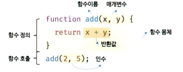
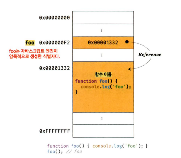
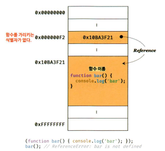
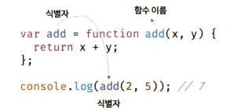

# 11회차, 함수
- [11회차, 함수](#11회차-함수)
  - [1. 함수란?](#1-함수란)
    - [1-1. 함수를 사용하는 이유](#1-1-함수를-사용하는-이유)
    - [1-2. 함수 리터럴](#1-2-함수-리터럴)
  - [2. 함수 정의](#2-함수-정의)
    - [2-1. 함수 선언문](#2-1-함수-선언문)
    - [2-2. 함수 표현식](#2-2-함수-표현식)
    - [2-3. Function 생성자 함수](#2-3-function-생성자-함수)
    - [2-4. 화살표 함수](#2-4-화살표-함수)
  - [3. 참조에 의한 전달과 외부 상태의 변경](#3-참조에-의한-전달과-외부-상태의-변경)
  - [4. 다양한 함수의 형태](#4-다양한-함수의-형태)

## 1. 함수란?
- 수학의 함수 : 입력을 받아 출력을 내보내는 일련의 과정
  - f(x, y) = x + y
  - f(2, 5) = 7
- 프로그래밍 언어의 함수 : 코드 블록으로 감싼 하나의 실행 단위
  - 매개변수(parameter) : 함수 내부로 입력 전달받는 변수
  - 인수(argument) : 입력
  - 반환값(return value) : 출력
  - 함수 정의 → 함수 생성 → 함수 호출 → 반환값 반환
    - 함수를 구분하기 위해 식별자인 함수 이름 사용  
    

### 1-1. 함수를 사용하는 이유
- 코드의 재사용↑ : 여러 번 호출 가능해 동일한 작업 반복적으로 수행 가능
- 유지보수의 편의성↑, 코드의 신뢰성↑ : 코드 중복 억제, 높은 재사용성은 실수 줄임
- 코드의 가독성↑ : 함수는 객체 타입의 값으로 이름(식별자)을 붙일 수 있음

### 1-2. 함수 리터럴
- 리터럴 : 사람이 이해할 수 있는 문자 또는 약속된 기호를 사용해 값을 생성하는 표기 방식
- ✨ 함수는 객체! 
  - 일반 객체와는 달리 호출할 수 있고, 고유한 프로퍼티 가짐  

|구성 요소|설명|
|---|---|
|함수 이름|- 함수 이름은 식별자이므로 식별자 네이밍 규칙 준수 필수 <br/> - 함수 이름은 함수 몸체 내에서만 참조할 수 있는 식별자 <br/> 함수 이름은 생략 가능 (이름O - 기명 함수, 이름X - 익명 함수) |
|매개변수 목록|- 0개 이상의 매개변수를 소괄호로 감싸고 쉼표로 구분 <br/> - 각 매개변수에는 함수를 호출할 때 지정한 인수가 순서대로 할당, 순서에 의미 있음 <br/> - 매개변수는 함수 몸체 내에서 변수와 동일 취급, 식별자 네이밍 규칙 준수|
|함수 몸체|- 함수가 호출되었을 때 일괄적으로 실행될 문들은 하나의 실행 단위로 정의한 코드 블록 <br/> - 함수 몸체는 함수 호출에 의해 실행|
||

## 2. 함수 정의
- 함수를 호출하기 전 인수를 전달받을 매개변수와 실행할 문들, 반환할 값을 지정하는 것
  - 함수 선언문이 평가되면 식별자가 암묵적으로 생성되고 함수 객체 할당
  - ECMAScript에서도 변수는 '선언', 함수는 '정의'로 표현

|함수 정의 방식|예시|
|---|---|
|함수 선언문|function add(x, y) {return x + y;};|
|함수 표현식|let add = function (x, y) {return x + y;};|
|Function 생성자 함수|let add = new Function('x', 'y', 'return x + y');|
|화살표 함수(ES6)|let add = (x, y) => x + y;|

### 2-1. 함수 선언문  
```js
function add(x, y) {
  return x + y;
}

console.dir(add);       // 함수 참조 : f add(x, y)
console.log(add(2, 5)); // 함수 호출 : 7
```
- 참고
  - console.dir : 함수 객체의 프로퍼티까지 출력
    - Node.js 환경에서는 console.log와 같은 결과 출력
- 특징
  - 함수 리터럴과 형태 동일 (단, 함수 선언문은 함수 이름 생략 불가, 생략하면 SyntaxError)
  - 표현식이 아닌 문 → 변수에 할당 불가
    <details>
    <summary>이 경우에는?</summary>
    
    ```js
    let add = function add(x, y) {
      return x + y;
    };

    console.log(add(2, 5)); // 7
    ```
    - 자바스크립트 엔진이 코드의 문맥에 따라 동일한 함수 리터럴을 함수 선언문(표현식이 아닌 문) 또는 함수 리터럴 표현식(표현식인 문)으로 해석하는 경우 있음
    - 기명 함수 리터럴은 함수 선언문/함수 리터럴 표현식으로 해석될 수 있음
      - 단독 사용 → 함수 선언문
      - 함수 리터럴이 값으로 평가되어야 하는 문맥(함수 리터럴을 변수에 할당하거나 피연산자로 사용) → 함수 리터럴 표현식
      ```js
      // 함수 선언문
      function foo() {
        console.log('foo');
      }
      foo(); // foo

      // 함수 리터럴
      (function bar() {console.log('bar');});
      bar(); // ReferenceError: bar is not defined
      ```
      
      
      - bar는 괄호가 붙어 함수 리터럴 표현식
      - 그림은 자바스크립트 엔진 내부의 메모리 구조
        - 상자 = 메모리 영역
      - 함수 이름은 '함수 몸체 내에서만 참조할 수 있는 식별자'
        - 함수 몸체 외부에서는 함수 이름으로 함수 참조(호출) 불가 = 함수 가리키는 식별자 없음
        - 자바스크립트 엔진은...
          - 함수 선언문 → 해석해 함수 객체 생성
            - 생성된 함수를 호출하기 위해 함수 이름과 동일한 이름의 식별자를 암묵적으로 생성 + 함수 객체 할당
          - 함수 표현식 → 식별자X, 내부에서만 참조 가능한 함수 객체 생성
    - 결론
      -  ✨ 함수는 함수 객체를 가리키는 식별자로 호출
      - 자바스크립트 엔진은 함수 선언식을 함수 표현식으로 변환해 함수 객체 생성(동일하게 동작X) 
    

    </details>

  - 크롬 개발자 도구의 콘솔에서 실행하면 undefined 출력


### 2-2. 함수 표현식

### 2-3. Function 생성자 함수
### 2-4. 화살표 함수  


## 3. 참조에 의한 전달과 외부 상태의 변경
## 4. 다양한 함수의 형태
