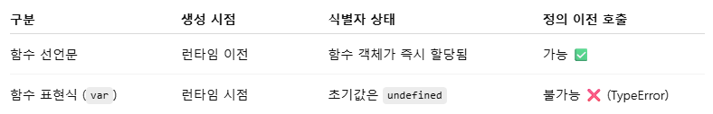
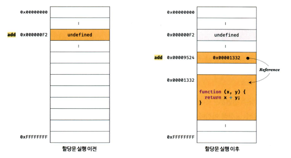
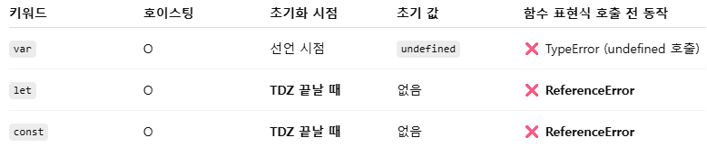
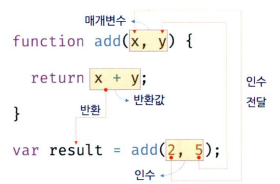
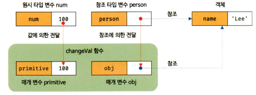

# 11회차, 함수
- [11회차, 함수](#11회차-함수)
  - [1. 함수란?](#1-함수란)
    - [1-1. 함수를 사용하는 이유](#1-1-함수를-사용하는-이유)
    - [1-2. 함수 리터럴](#1-2-함수-리터럴)
  - [2. 함수 정의](#2-함수-정의)
    - [2-1. 함수 선언문](#2-1-함수-선언문)
    - [2-2. 함수 표현식](#2-2-함수-표현식)
    - [2-3. Function 생성자 함수](#2-3-function-생성자-함수)
    - [2-4. 화살표 함수](#2-4-화살표-함수)
  - [3. 함수 호출](#3-함수-호출)
    - [3-1. 매개변수와 인수](#3-1-매개변수와-인수)
    - [3-2. 반환문](#3-2-반환문)
  - [4. 참조에 의한 전달과 외부 상태의 변경](#4-참조에-의한-전달과-외부-상태의-변경)
    - [4-1. 문제점 및 해결 방법](#4-1-문제점-및-해결-방법)
  - [5. 다양한 함수의 형태](#5-다양한-함수의-형태)
    - [5-1. 즉시 실행 함수](#5-1-즉시-실행-함수)
    - [5-2. 재귀 함수](#5-2-재귀-함수)
    - [5-3. 중첩 함수(내부 함수)](#5-3-중첩-함수내부-함수)
    - [5-4. 콜백 함수](#5-4-콜백-함수)
    - [5-5. 순수 함수와 비순수 함수](#5-5-순수-함수와-비순수-함수)
- [Q\&A](#qa)

## 1. 함수란?
- 수학의 함수 : 입력을 받아 출력을 내보내는 일련의 과정
  - f(x, y) = x + y
  - f(2, 5) = 7
- 프로그래밍 언어의 함수 : 코드 블록으로 감싼 하나의 실행 단위
  - 매개변수(parameter) : 함수 내부로 입력 전달받는 변수
  - 인수(argument) : 입력
  - 반환값(return value) : 출력
  - 함수 정의 → 함수 생성 → 함수 호출 → 반환값 반환
    - 함수를 구분하기 위해 식별자인 함수 이름 사용  
    

### 1-1. 함수를 사용하는 이유
- 코드의 재사용↑ : 여러 번 호출 가능해 동일한 작업 반복적으로 수행 가능
- 유지보수의 편의성↑, 코드의 신뢰성↑ : 코드 중복 억제, 높은 재사용성은 실수 줄임
- 코드의 가독성↑ : 함수는 객체 타입의 값으로 이름(식별자)을 붙일 수 있음

### 1-2. 함수 리터럴
- 리터럴 : 사람이 이해할 수 있는 문자 또는 약속된 기호를 사용해 값을 생성하는 표기 방식
- ✨ 함수는 객체! 
  - 일반 객체와는 달리 호출할 수 있고, 고유한 프로퍼티 가짐  

|구성 요소|설명|
|---|---|
|함수 이름|- 함수 이름은 식별자이므로 식별자 네이밍 규칙 준수 필수 <br/> - 함수 이름은 함수 몸체 내에서만 참조할 수 있는 식별자 <br/> 함수 이름은 생략 가능 (이름O - 기명 함수, 이름X - 익명 함수) |
|매개변수 목록|- 0개 이상의 매개변수를 소괄호로 감싸고 쉼표로 구분 <br/> - 각 매개변수에는 함수를 호출할 때 지정한 인수가 순서대로 할당, 순서에 의미 있음 <br/> - 매개변수는 함수 몸체 내에서 변수와 동일 취급, 식별자 네이밍 규칙 준수|
|함수 몸체|- 함수가 호출되었을 때 일괄적으로 실행될 문들은 하나의 실행 단위로 정의한 코드 블록 <br/> - 함수 몸체는 함수 호출에 의해 실행|
||

## 2. 함수 정의
- 함수를 호출하기 전 인수를 전달받을 매개변수와 실행할 문들, 반환할 값을 지정하는 것
  - 함수 선언문이 평가되면 식별자가 암묵적으로 생성되고 함수 객체 할당
  - ECMAScript에서도 변수는 '선언', 함수는 '정의'로 표현

|함수 정의 방식|예시|
|---|---|
|함수 선언문|function add(x, y) {return x + y;};|
|함수 표현식|let add = function (x, y) {return x + y;};|
|Function 생성자 함수|let add = new Function('x', 'y', 'return x + y');|
|화살표 함수(ES6)|let add = (x, y) => x + y;|

### 2-1. 함수 선언문  
```js
function add(x, y) {
  return x + y;
}

console.dir(add);       // 함수 참조 : f add(x, y)
console.log(add(2, 5)); // 함수 호출 : 7
```
- 참고
  - console.dir : 함수 객체의 프로퍼티까지 출력
    - Node.js 환경에서는 console.log와 같은 결과 출력
- 특징
  - 함수 리터럴과 형태 동일 (단, 함수 선언문은 함수 이름 생략 불가, 생략하면 SyntaxError)
  - 표현식이 아닌 문 → 변수에 할당 불가
    <details>
    <summary>이 경우에는?</summary>
    
    ```js
    let add = function add(x, y) {
      return x + y;
    };

    console.log(add(2, 5)); // 7
    ```
    - 자바스크립트 엔진이 코드의 문맥에 따라 동일한 함수 리터럴을 함수 선언문(표현식이 아닌 문) 또는 함수 리터럴 표현식(표현식인 문)으로 해석하는 경우 있음
    - 기명 함수 리터럴은 함수 선언문/함수 리터럴 표현식으로 해석될 수 있음
      - 단독 사용 → 함수 선언문
      - 함수 리터럴이 값으로 평가되어야 하는 문맥(함수 리터럴을 변수에 할당하거나 피연산자로 사용) → 함수 리터럴 표현식
      ```js
      // 함수 선언문
      function foo() {
        console.log('foo');
      }
      foo(); // foo

      // 함수 리터럴
      (function bar() {console.log('bar');});
      bar(); // ReferenceError: bar is not defined
      ```
      
      
      - bar는 괄호가 붙어 함수 리터럴 표현식
      - 그림은 자바스크립트 엔진 내부의 메모리 구조
        - 상자 = 메모리 영역
      - 함수 이름은 '함수 몸체 내에서만 참조할 수 있는 식별자'
        - 함수 몸체 외부에서는 함수 이름으로 함수 참조(호출) 불가 = 함수 가리키는 식별자 없음
        - 자바스크립트 엔진은...
          - 함수 선언문 → 해석해 함수 객체 생성
            - 생성된 함수를 호출하기 위해 함수 이름과 동일한 이름의 식별자를 암묵적으로 생성 + 함수 객체 할당
          - 함수 표현식 → 식별자X, 내부에서만 참조 가능한 함수 객체 생성
    - 결론
      -  ✨ 함수는 함수 객체를 가리키는 식별자로 호출
      - 자바스크립트 엔진은 함수 선언식을 함수 표현식으로 변환해 함수 객체 생성(동일하게 동작X) 
    

    </details>

  - 크롬 개발자 도구의 콘솔에서 실행하면 undefined 출력


### 2-2. 함수 표현식
- 자바스크립트의 함수 => **일급 객체**
  - 값처럼 자유롭게 사용 가능
  - 변수 할당, 프로퍼티 값, 배열의 요소 모두 가능
  - 함수 리터럴로 생성한 함수 객체를 변수에 할당 가능 => **함수 표현식**
- 특징
  - 함수 이름 생략 가능(일반적) → 익명 함수
  - 함수 호출 시, 식별자 사용해야 함
    <details>
    <summary>예시 코드</summary>

    ```js
    let add = function foo(x, y) {
      return x + y;
    };

    console.log(add(2, 5)); // 식별자로 호출 : 7
    console.log(foo(2, 5)); // 함수 이름은 에러 발생 (함수 이름은 함수 몸체 내부에서만 유효한 식별자)
    ```
    </details> 
- ✨ 함수 선언문과의 차이점
```js
// 함수 참조
console.dir(add); // ƒ add(x, y)
console.dir(sub); // undefined

// 함수 호출
console.log(add(2, 5)); // 7
console.log(sub(2, 5)); // TypeError: sub is not a function

// 함수 선언문
function add(x, y) {
  return x + y;
}

// 함수 표현식
var sub = function (x, y) {
  return x - y;
};
```

- ✨ 함수 호이스팅 : 함수 선언문이 코드의 선두로 끌어올려진 것처럼 동작하는 현상
- 함수 선언문 → 전체 함수 객체가 호이스팅 → 코드 실행 전 호출 가능
- 함수 표현식 → 변수 선언만 호이스팅 → 함수 객체는 런타임 시점에 할당
- Why? 생성 시점 다름
  - 함수 선언문은 런타임 이전에 자바스크립트 엔진에 의해 먼저 실행됨
    - 식별자 생성 및 함수 객체 할당
  - 함수 표현식은 var 선언만 호이스팅, 초기값은 undefined
    - 함수 리터럴은 런타임 시점에 평가되어 호출 시점까지 함수 객체 존재X(즉 undefined 호출함) → TypeError
    
- 함수 선언문 대신 **함수 표현식 사용** 권장
  - 호이스팅 명시적 통제 가능
  - 코드의 실행 흐름 예측 가능
> 💡 var, let, const의 호이스팅
> 
> 
> - let/const도 호이스팅 가능하나, 변수에 접근 가능한 시점이 다름
> - TDZ (Temporal Dead Zone) : 변수 선언문이 스코프에 등록되어 있지만, 아직 초기화되지 않은 시점
>   - 이때 해당 변수에 접근하면 ReferenceError 발생

### 2-3. Function 생성자 함수
- 생성자 함수 : 객체를 생성하는 함수
- Function 생성자 함수
  - new 연산자와 함께 호출 시, 함수 객체 생성해서 반환
- ❌ Function 생성자 함수로 함수 생성 비추
  - 클로저 생성X
  - 함수 선언문이나 함수 표현식으로 생성한 함수와는 다르게 동작

### 2-4. 화살표 함수  
- ES6에서 도입
- `function` 키워드 대신 `화살표(=>)` 사용
- 항상 익명 함수
- 생성자 함수로 사용 불가
- 기존 함수와 this 바인딩 방식 다름
- prototype 프로퍼티 없음
- arguments 객체 생성X

## 3. 함수 호출
- 함수를 가리키는 식별자 + 함수 호출 연산자(한 쌍의 소괄호)로 호출
- 0개 이상의 인수를 쉼표(,)로 구분해 나열
- 함수 호출 시, 현재 실행 흐름 중단 → 호출된 함수로 실행 흐름 이동
  - 이 때 매개변수에 인수가 순서대로 할당, 함수 몸체의 문 실행

### 3-1. 매개변수와 인수
- 함수를 실행하기 위해 필요한 값을 함수 외부 → 함수 내부로 전달할 필요 있는 경우
- 매개변수(parameter, 인자)를 통해 인수(argument) 전달
- **인수**
  - 함수 호출할 때 지정
  - 값으로 평가될 수 있는 표현식
  - 개수와 타입에 제한 없음
- **매개변수**
  - 함수 정의할 때 선언
  - 개수는 적을 수록 좋음
    - 매개변수의 개수가 많다는 건 함수가 여러 가지 일을 한다는 증거
    - 최대 3개 이상 넘지 않기를 권장
    - 그 이상 있어야 한다면 하나의 매개변수 선언 + 객체를 인수로 전달
  - ✨ 사전에 타입 지정 불가
    - 자바스크립트는 **동적 타입** 언어이기 때문
    - ES6에서 매개변수 기본값 도입
      - 매개변수에 인수 전달하지 않았을 경우
      - undefined 전달한 경우
      ```js
      function add(a = 0, b = 0, c= 0) {
        return a + b + c;
      }

      console.log(add(1)); // 1
      // 원래라면 NaN 출력됨
      ``` 
  - 함수 몸체 내부에서 **변수와 동일**하게 취급
    - 함수가 호출되면 함수 몸체 내에서 암묵적으로 매개변수 생성
    - undefined로 초기화된 후 인수가 순서대로 할당됨
  - 함수 몸체 내부에서만 참조 가능 => *매개변수의 스코프 = 함수 내부*
  
- 💡 함수는 매개변수의 개수와 인수의 개수 일치 여부 확인X
  - 인수가 부족하면?
    - 인수 할당되지 않은 매개변수 값 = undefined
  - 인수가 더 많으면?
    - 초과된 인수는 무시
    - 암묵적으로 arguments 객체의 프로퍼티로 보관됨
### 3-2. 반환문
- `return` 키워드와 표현식을 통해 실행 결과를 함수 외부로 반환
- 역할
  - 함수의 실행 중단 및 함수 몸체 빠져나감
  - return 키워드 뒤에 오는 표현식 평가해 반환
    - 명시적으로 지정하지 않으면 undefined 반환
    - 반환문을 생략할 경우 함수 몸체의 마지막 문까지 실행한 후 암묵적으로 undefined 반환
- 함수 몸체 내부에서만 사용 가능
  - 전역에서 사용시 문법 에러 발생
  - Node.js는 모듈 시스템에 의해 파일별로 독립적인 스코프 가짐
    - 파일의 가장 바깥 영역에 반환문 사용해서 에러 발생X

## 4. 참조에 의한 전달과 외부 상태의 변경
- 매개변수는 함수 몸체 내부에서 변수와 동일하게 취급
  - 타입에 따라 값에 의한 전달(call by value), 참조에 의한 전달(call by reference) 방식 따름
*예시*
```js
// 매개변수 primitive는 원시 값을 전달받고, 매개변수 obj는 객체를 전달받는다.
function changeVal(primitive, obj) {
  primitive += 100;
  obj.name = 'Kim';
}

// 외부 상태
var num = 100;
var person = { name: 'Lee' };

console.log(num);       // 100
console.log(person);    // { name: 'Lee' }

// 원시 값은 값 자체가 복사되어 전달되고 객체는 참조 값이 복사되어 전달된다.
changeVal(num, person);

// 원시 값은 원본이 훼손되지 않는다.
console.log(num);       // 100

// 객체는 원본이 훼손된다.
console.log(person);    // { name: 'Kim' }
```
- primitive : **원시 타입** 인수 전달받은 매개변수
  - 원시 값은 변경 불가능한 값 -> 직접 변경 불가
    - 재할당을 통해 새로운 원시값으로 교체
  - 값 자체가 복사되어 매개변수로 전달되므로 함수 몸체에서 변경해도 원본 훼손X(부수 효과 발생X) 
- obj : **객체 타입** 인수 전달받은 매개변수
  - 객체는 변경 가능한 값 -> 직접 변경 가능
    - 재할당 없이 직접 할당된 객체 변경
  - 참조 값이 복사되어 매개변수로 전달되므로 부수 효과 발생


### 4-1. 문제점 및 해결 방법
- 여러 변수가 참조에 의한 전달 방식으로 참조 값을 공유하고 있다면 객체를 직접 변경 가능 -> 객체 변경 추적 어려움
  - 옵저버(Observer) 패턴 등을 통해 객체 참조하는 모든 이에게 변경 사실 통지, 추가 대응 필요
  - 객체를 **불변 객체**로 만들어 사용
    - 마치 원시 값처럼 변경 불가능한 값으로 동작하도록
    - 객체의 상태 변경은 깊은 복사(완전히 복제)하여 새로운 객체 생성 및 재할당
  - 함수형 프로그래밍
    - 순수 함수를 통해 부수효과를 최대한 억제해 오류 피하고 프로그램의 안정성 높이는 프로그래밍 패러다임

## 5. 다양한 함수의 형태
### 5-1. 즉시 실행 함수
- 함수 정의와 동시에 즉시 호출되는 함수(IIFE, Immediately Invoked Function Expression)
- 단 한 번만 호출(재호출 불가)
*코드와 함께 보는 특징*
```js
// 1. 익명 즉시 실행 함수
(function () {
  var a = 3;
  var b = 5;
  return a * b;
})();

// 2. 기명 즉시 실행 함수 (외부에서 foo 사용 시 ReferenceError)
(function foo() {
  var a = 3;
  var b = 5;
  return a * b;
})();
console.log(foo); // ❌ ReferenceError: foo is not defined

// 3. 괄호 없이 함수 정의만으로 실행 시도
function () {
  // ...
}(); // ❌ SyntaxError: Function statements require a function name

// 4. 기명 함수 정의 + 괄호 실행 시도
function foo() {
  // ...
}(); // ❌ SyntaxError: Unexpected token ')'

// 5. 함수 선언문 뒤에 괄호 붙인 경우
function foo() {}(); // ❌ SyntaxError: Unexpected token ')'

// 6. 기명 함수 정의를 괄호로 감싼 경우 (정상 실행)
(function foo() {})(); // ✅ OK

// 7. typeof로 확인 시 함수 리터럴로 평가됨
console.log(typeof (function f(){})); // 'function'
console.log(typeof (function (){}));  // 'function'

// 8. 다른 연산자도 괄호 대신 사용 가능
!function () {}(); // ✅ OK
+function () {}(); // ✅ OK

// 9. 즉시 실행 함수의 리턴값 사용 가능
var res = (function () {
  var a = 3;
  var b = 5;
  return a * b;
})();
console.log(res); // 15

// 10. 즉시 실행 함수에 인수 전달도 가능
res = (function (a, b) {
  return a * b;
})(3, 5);
console.log(res); // 15

```
- 1~2번
  - 일반적으로 익명 함수 사용
  - 기명 함수도 사용 가능 하지만 내부에서만 이름을 참조할 수 있으므로 외부에서는 ReferenceError
- 3번
  - function () {} 자체는 유효하지 않은 함수 선언 → 함수 선언문은 함수명 생략 불가
- 4~5번
  - 자바스크립트는 선언문 뒤에 암묵적으로 ;를 붙임
  - function foo() {};();로 선언문 + 그룹 연산자로 해석
    - 그룹 연산자에 피연산자 없으므로 에러 발생
- 6번
  - 그룹 연산자의 피연산자는 값으로 평가됨 -> 함수를 감싸면 함수 리터럴로 평가됨 → 호출 가능
- 7번
  - 괄호로 감싸면 함수 리터럴로 평가되기 때문에 typeof로 보면 'function'으로 나옴
  - 기명, 익명 모두 리터럴 평가 가능
- 8번
  - !, +, -, ~, void 등 단항 연산자를 앞에 붙이면 함수가 표현식으로 평가되어 즉시 실행 가능
  - (function() {})()와 동일한 효과
- 9~10번
  - 즉시 실행 함수는 일반 함수처럼 값을 반환할 수 있고, 매개변수도 전달 가능
  - 스코프 보호 및 캡슐화 목적 외에도 계산 즉시 실행 등에 사용

### 5-2. 재귀 함수
- 함수가 자기 자신을 호출하는 함수
- 반복되는 처리 위해 사용
  - 자신을 무한 재귀 호출하므로 스택 오버플로 에러 발생시킬 수 있음
  - 반드시 탈출 조건 만들어야 함

### 5-3. 중첩 함수(내부 함수)
- 함수 내부에 정의된 함수
  - 중첩 함수를 포함하는 함수 = 외부 함수
  - 외부 함수 내부에서만 중첩 함수 호출 가능
  - 자신을 포함하는 외부 함수를 돕는 헬퍼 함수의 역할
- ES6부터 문이 위치할 수 있는 문맥이면 어디든 함수 정의 가능
  - 함수 선언문은 이전에 코드 최상위/다른 함수 내부에서만 정의할 수 있었음
  - 단, 호이스팅으로 인해 혼란 주의  

*예시*
```js
function outer() {
  var x = 1;

  // 중첩 함수
  function inner() {
    var y = 2;
    // 외부 함수의 변수를 참조할 수 있다.
    console.log(x + y); // 3
  }

  inner();
}

outer();
```

### 5-4. 콜백 함수
- 함수의 매개변수를 통해 다른 함수의 내부로 전달되는 함수
- 고차 함수 : 매개변수를 통해 함수의 외부에서 콜백 함수를 전달받은 함수
  - 고차 함수로 인해 콜백 함수 호출
  - 필요에 따라 콜백 함수에 인수 전달 가능 -> 고차 함수에 콜백 함수 자체를 전달해야 함
  - 콜백 함수를 자신의 일부분으로 합성함
    - **고차 함수 내부에서만 호출된다면?** 
      - 익명 함수 리터럴로 정의해 바로 고차 함수에 전달
    - **다른 곳에서도 호출하거나 자주 호출된다면?** 
      - 함수 외부에서 콜백 함수 정의 후 함수 참조를 전달하는게 효율적!

### 5-5. 순수 함수와 비순수 함수
- **부수 효과** : 어떤 외부 상태에 의존하거나 외부 상태를 변경하는 경우
- **순수 함수** : 부수 효과 없는 함수
  - 동일한 인수가 전달되면 언제나 동일한 값 반환
  - 오직 인수에만 의존해 반환값 만듦
  - 함수의 외부 상태 변경X
- **비순수 함수** : 부수효과 있는 함수 
  - 함수 내부에서 외부 상태에 의존하거나 외부 상태를 직접 변경
    - 상태 추적이 어려워짐
    - 코드의 복잡성 증가, 예측 불가능한 오류 발생 가능
    - 디버깅, 유지보수, 협업에 불리함  

*순수 함수와 비순수 함수 코드 비교*
```js
// 순수 함수 예제
var count = 0; // 현재 카운트를 나타내는 상태

function increase(n) {
  return ++n; // 외부 상태 사용 X, 동일한 입력 -> 동일한 출력
}

count = increase(count);
console.log(count); // 1

count = increase(count);
console.log(count); // 2

// ----------------------------

// 비순수 함수 예제
var count = 0; // 현재 카운트는 외부 상태, increase 함수에 의해 변경됨

function increase() {
  return ++count; // 외부 상태(count)에 의존하며 외부 상태도 변경
}

increase();
console.log(count); // 1

increase();
console.log(count); // 2

```
> 📌 참고 - 함수형 프로그래밍과 순수 함수
>
> - 함수형 프로그래밍은 순수 함수를 통해 부수 효과를 최소화하고, 예측 가능한 흐름 유지를 목표로 함
> - 복잡한 조건문, 반복문을 제거하고 불변성(immutability) 유지
> - 자바스크립트는 다목적 언어지만, 함수형 프로그래밍의 장점을 부분적으로 도입해 활용 가능
> - 순수 함수 사용은 버그를 줄이고, 테스트하기 쉬운 코드를 작성하는 데 효과적

---
# Q&A
**1. 자바스크립트에서 함수 선언문과 함수 표현식의 차이는 무엇인가요?**  
함수 선언문은 function 함수명() {} 형태로 정의되며, 호이스팅에 의해 코드 실행 전에도 호출이 가능합니다.  
함수 표현식은 const foo = function () {} 처럼 변수에 할당되며, 변수만 호이스팅되고 함수 자체는 런타임 시점에 생성되기 때문에 정의 전에 호출하면 TypeError가 발생합니다.  
보통 명확한 실행 흐름과 예측 가능성을 위해 함수 표현식 사용이 권장됩니다.

**2. 즉시 실행 함수(IIFE)를 사용하는 이유는 무엇인가요?**  
즉시 실행 함수는 정의와 동시에 실행되는 함수로, 일회성 초기화 작업 등에 유용합니다.  
변수 스코프를 지역으로 제한하여 외부 오염을 막고, 캡슐화된 환경을 만들 수 있습니다.  
특히 전역 변수 사용을 피하고자 할 때 유용하며, ES6 이전에는 모듈 구현 방식으로도 활용됐습니다.

**3. 자바스크립트에서 매개변수에 객체를 넘길 때 원본이 변경되는 이유는 무엇인가요?**  
자바스크립트에서 객체는 참조 타입이기 때문에, 함수에 인수로 전달하면 객체의 **참조(주소)**가 전달됩니다.  
따라서 함수 내부에서 그 참조를 통해 객체의 속성을 변경하면 원본 객체에도 영향을 줍니다.  
이를 방지하려면 얕은 복사(Object.assign, spread 연산자) 또는 깊은 복사(structuredClone 등) 를 통해 방어적 복사를 수행해야 합니다.

**4. 순수 함수란 무엇이고, 왜 함수형 프로그래밍에서 중요하다고 하나요?**  
순수 함수는 동일한 입력에 대해 항상 동일한 출력을 반환하고, 외부 상태에 의존하거나 변경하지 않는 함수입니다.  
순수 함수는 테스트가 용이하고, **부수 효과(side effect)**가 없기 때문에 코드의 예측 가능성과 유지보수성을 높입니다.  
함수형 프로그래밍은 이러한 순수 함수로 로직을 구성해 안정적이고 버그가 적은 시스템을 구현하는 것을 목표로 합니다.

**5. 콜백 함수와 고차 함수의 차이를 설명해 주세요.**  
콜백 함수는 함수의 인수로 전달되어 특정 시점에 호출되는 함수입니다.  
고차 함수는 함수를 인수로 받거나 함수를 반환하는 함수입니다.  
즉, 콜백 함수는 사용자 정의 동작을 외부에서 주입하는 역할, 고차 함수는 콜백을 받아 실행하는 컨트롤러 역할을 합니다.