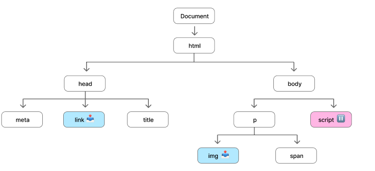

# 브라우저 동작 과정
- [브라우저 동작 과정](#브라우저-동작-과정)
  - [1. 탐색](#1-탐색)
    - [DNS 조회](#dns-조회)
    - [TCP 연결 수립 - TCP Handshake](#tcp-연결-수립---tcp-handshake)
    - [HTTP 요청 - TLS 협상](#http-요청---tls-협상)
  - [2. 응답](#2-응답)
    - [서버의 응답](#서버의-응답)
    - [TCP 혼잡 제어 / TCP Slow Start](#tcp-혼잡-제어--tcp-slow-start)
  - [3. 파싱(parsing)](#3-파싱parsing)
  - [4. 렌더 트리 생성](#4-렌더-트리-생성)

## 1. 탐색
### DNS 조회
: 해당 페이지의 자원이 어디에 위치하는 지 찾기

 

예를 들어 http://google.co.kr을 탐색한다면 HTML 페이지는 IP주소가 172.217.161.195인 서버에 위치하고 있음

만일 해당 사이트를 한 번도 방문한 적이 없다면 DNS 조회 필요!

> 사이트 IP 주소 찾는 법 : 명령 프롬프트(cmd) -> nslookup 사이트 주소 입력(nslookup google.co.kr)  

브라우저 -> DNS 조회 요청 -> 이름 서버에 의해 처리 -> IP 주소 응답

최초의 요청 이후 IP는 일정 기간 캐시되기 때문에 후속 요청은 이름 서버에 다시 연락하는 대신 캐시에서 IP 주소를 검색해 속도 높임

DNS 조회는 보통 호스트 이름 하나당 한 번만 수행

단, 요청된 페이지에서 자원들(글꼴, 이미지, 광고 등)이 다른 호스트 이름을 가지고 있다면 각각 요청하고 모두 수행되어야 함 

(모바일 네트워크 환경에선 각각의 DNS 조회는 휴대폰 ↔ cell tower ↔ DNS 서버를 거쳐야하기 때문에 지연시간 생길 수 있음)

 

 

### TCP 연결 수립 - TCP Handshake
: 브라우저는 서버와 TCP 3-way handshake를 통해 연결 설정

  - TCP(전송 제어 프로토콜) : 데이터 스트림을 신뢰성 있게 전달하기 위한 프로토콜 

  - TCP 3-way handshake : **데이터를 전송하기 전** 통신하려는 두 주체가 TCP 소켓 연결을 위한 매개변수를 주고 받을 수 있도록 만들어짐

 

 

### HTTP 요청 - TLS 협상
: 브라우저는 HTTP/HTTPS 요청(웹 페이지 요청)

  보안성 있는 연결을 위해  ① 통신 암호화에 쓰일 암호 결정, ② 서버 확인, ③ 실제 데이터 전송 전 안전하게 연결되도록 함  

  - TLS(전송 계층 보안) : 안전하게 통신하기 위해 사용되는 암호화된 프로토콜, 정보의 변형 방지

> HTTP 요청 메서드란?
>
>주어진 리소스에 수행하길 원하는 행동
>
>종류
>
>GET : 특정 리소스를 가져오도록 요청(데이터 받기)  
>HEAD : 특정 리소스를 GET 요청했을 때 돌아올 헤더 요청  
>POST : 서버로 데이터 전송  
>PUT : 요청 페이로드(payload)를 사용해 새로운 리소스 생성 또는   대상 리소스를 나타내는 데이터 대체(완전한 교체)  
>PATCH : 리소스의 부분적인 수정을 할 때  
>DELETE : 지정한 리소스 삭제  
>CONNECT : 요청한 리소스에 대해 양방향 연결 시작, 터널 열기 위해 사용될 수 있음  
>OPTIONS : 주어진 URL / 서버에 대해 허용된 통신 옵션 요청 -> URL 지정 또는 별표(*) 지정해 전체 서버 참조 가능  
>TRACE : 대상 리소스에 대한 경로를 따라 메시지 루프백 테스트 수행
> 
>

 

## 2. 응답
### 서버의 응답
: 서버는 요청을 받아 관련 응답 코드와 함께 해당 리소스(HTML, CSS 등)를 브라우저에게 응답

 

- TTFB(Time to First Byte) : 브라우저가 페이지를 요청하고 서버로부터 첫번째 정보(바이트)를 받는데 걸린 시간(밀리초)  
  - 이 때 전송받는 파일은 8비트의 데이터 형태 => 바이트 스트림

  - DNS 조회, TCP handshake(TLS handshake)를 사용한 연결 설정 포함됨

### TCP 혼잡 제어 / TCP Slow Start

**TCP(전송 제어 프로토콜) 란?**  
데이터 스트림을 신뢰성 있게 전달하기 위한 프로토콜

**역할**
1. 데이터와 패킷이 보내진 순서대로 전달하는 것을 보장 => 에러 없이 패킷이 신뢰할 수 있게 전달되었는가!
     - 패킷(packet) : 네트워크 전송 용량의 단위
    - 네트워크 패킷 = 사용자 데이터(payload) + 제어 정보(payload를 전달하기 위한 정보)
2. 혼잡 제어 구현: 네트워크의 혼잡을 피하기 위해 서버에서 보내는 패킷의 전송 속도를 줄이는 작업/기능
    - 혼잡 : 네트워크 내에 패킷의 수가 과도하게 증가하는 현상

**데이터를 받으면?**  

① TCP 패킷은 전송 중 세그먼트로 분할됨  
② TCP는 패킷의 순서를 보장하기 때문에 서버는 일정 개수의 세그먼트를 전송한 후  
③ 클라이언트(브라우저)로부터 ACK 패킷 형태로 승인 받아야 함

> 만약 서버가 각 세그먼트마다 ACK를 기다리면?
>   - 클라이언트로부터 빈번하게 ACK이 발생하고 저부하 네트워크 상황에서도 전송 시간 증가할 수 있음
> 
> 만약 서버가 한 번에 너무 많은 세그먼트를 보내면?
>   - 하드웨어 및 네트워크 상태에 따라 연결 용량이 제한되기 때문에 사용량이 많은 네트워크에서는 클라이언트가 세그먼트를 받을 수 없게 되고, 서버는 누락된 ACK에 의해 계속 재전송해야 하는 문제 발생

**전송되는 세그먼트 수의 균형을 맞추려면?** TCP Slow Start 알고리즘 사용
TCP slow start : 패킷 전송에 사용 가능한 대역폭을 감지하고 네트워크 연결 속도의 균형을 맞추는데 사용되는 알고리즘
   - 혼잡 윈도우(CWND) : 서버가 전송할 수 있는 데이터(세그먼트 수) 양에 대한 상한 설정
   - 임계값(SSThresh) : slow start의 활성화 여부 결정

  처음에는 패킷을 하나씩 보내고, 문제없이 서버가 ACK를 받으면 CWND의 크기를 2배로 증가(ACK 패킷마다 1씩 증가)시키다가 혼잡 현상이 발생하면 크기를 절반으로 줄이는 과정을 반복하여 균형 맞춤  
  즉, CWND의 크기는 임계값보다 커질 때까지 증가  
  따라서 처음에는 네트워크의 수용량을 예상할 수 없으나 한 번 혼잡 현상이 발생하면 어느 정도 예상할 수 있음

 

 

## 3. 파싱(parsing)

: 브라우저가 해석 가능한 자료 구조로 변환

Loader가 서버로부터 HTML 파일을 불러오면 브라우저는 렌더링 엔진 + 자바스크립트 엔진을 통해 화면의 요소 그림  
> 렌더링 엔진 : HTML, CSS 코드를 파싱해 화면에 그림  
> 자바스크립트 엔진 : 자바스크립트 코드를 읽어 기능을 작동시킴

ⓛ HTML 파싱 → DOM 트리 생성

: HTML → HTML Parser → DOM Tree

브라우저가 바이트 형태의 HTML 파일을 문자로 변환하면 HTML Parser가 해당 문자를 브라우저가 가지고 있는 토큰과 비교해 HTML 코드인지 확인 => 토큰화

여기서 토큰은 브라우저에 저장되어 있는 시작&종료 태그, 속성 이름&값 등을 포함

토큰화 과정을 통해 노드 생성하고, 노드 간의 계층 관계를 형성 => DOM 트리

>👀 개념 정리
>
>    - 토큰화 : 문자를 가장 작은 단위(토큰)로 쪼개고 이를 비교하여 HTML 코드인지 확인하는 과정
>
>    - 노드 : 트리를 이루는 구조의 가장 작은 단위로 받은 파일 요소에 대한 정보를 포함
>
>       (이 정보는 토큰을 통해 설명되며 토큰 위계서열을 기반으로 트리 내부에 연결됨
> 
>         DOM 트리의 경우 노드는 시작 태그 토큰 ~ 끝 태그 토큰으로 이루어짐)

 

**DOM 트리 특징**

- DOM 트리 : 문서의 내용 설명, 점진적으로 증가하는 구조

- html 요소 : 시작하는 태그, DOM 트리의 루트 노드

- img, link 태그 : 해당 태그 안에 명시되어 있는 리소스 다운 받음

- script 태그 : DOM 트리 생성을 중단하고 태그 안에 들어있는 자바스크립트 해석 => 자바스크립트 엔진 동작
  - 파싱할 때 script 태그를 만나면 DOM 트리 생성을 중단하는 이유는?  
브라우저는 자바스크립트를 실행하기 전까지 HTML 파싱을 진행하지 않기 때문
  - 이 과정을 피하려면?

    - defer : `<script defer>`는 HTML 파싱이 끝난 후 자바스크립트 실행하도록 지시 → HTML 파싱이 중단되지 않아 로딩 성능 향상  
    - async : `<script async>`는 자바스크립트 파일을 비동기적으로 다운로드 및 실행, 파싱 중 해당 파일을 비동기로 가져오고 다운로드가 끝나면 바로 실행

- Non-blocking resources : Parser가 해당 요소를 만나도 멈추지 않고 그대로 파싱하며, 동시에 해당 리소스를 얻기 위한 요청 보내는 요소 (images, media files 등)

- Preload scanner : 사용 가능한 컨텐츠를 분석하고 CSS나 자바스크립트 등 우선 순위가 높은 자원을 미리 요청→ 미리 전송받기 가능
  - 브라우저는 싱글 스레드(Single-threaded)인데 DOM트리를 만드는 프로세스는 메인 스레드를 차지하다보니 파싱이 멈추면 대기 시간이 길어지고, 해당 리소스의 크기가 너무 크면 병목현상이 발생함. 이를 보완하여 페이지가 더 빨리 로딩되도록 도와주는 수단
  - (단, CSS 다운로드는 자바스크립트 실행 막을 수 있음, 자바스크립트는 종종 요소에 영향 주는 CSS 속성 조작하기 때문)  
 

 

② CSS 파싱 → CSSOM 트리 생성

: CSS → CSS Parser → CSSOM Tree

 

브라우저가 바이트 형태의 스타일시트(CSS 파일)을 읽어 문자로 변환하면 CSS Parser가 토큰화 과정을 거쳐 토큰을 기반으로 CSSOM 트리 생성

이 때 브라우저는 CSS 규칙을 적용할 수 있는 스타일 맵(style map) 형태로 변환하여 상대 단위를 절대 픽셀 단위로 계산

(최종적으로 브라우저는 비트맵 형태의 픽셀 단위로 화면을 출력하기 때문, 예 : em, rem → px )

CSS 선택자를 기반으로 노드에 적용 가능한 가장 일반적인 규칙부터 속성 값을 구성하며, 부모-자식-형제 관계가 정의된 트리 구조 생성 => Cascading(캐스케이딩)

 

**CSSOM 트리 특징**

- HTML 요소에 적용 가능한 모든 스타일 정보가 포함

- 규칙이 구체적일 수록 더 많은 노드를 지나야하기 때문에 더 높은 비용이 듦

- 축소화, 미디어 쿼리 사용 등으로 최적화(소요 시간 짧아 필요할 때만 하기!)

 

③ 기타 작업
  - 자바스크립트 컴파일
    - 시점 : CSSOM 생성과 병렬적으로 진행
  (브라우저가 CSS 파싱하는 동안 preload scanner가 자바스크립트 파일도 비동기적으로 다운받을 수 있게 함)

    - 자바스크립트 실행 과정 : 해석 → 컴파일 → 실행    

        ① 해석
        - 자바스크립트 엔진이 `<script>` 태그 또는 외부 JS 파일 해석
        - 토큰화하여 토큰을 기반으로 AST(추상 구문 트리) 생성  

        ② 컴파일
        - 일부 자바스크립트 엔진은 AST를 바이트 코드로 변환하여 실행 속도 높임
        - AST를 인터프리터에게 넘겨 실행하는 방식도 있음
        - 최신 엔진은 JIT(Just-In-Time) 컴파일러를 사용해 성능 최적화  

        ③ 실행
        - 최종적으로 메인 스레드에서 바이트코드 실행  

② 접근성 트리(AOM, Accessibility Object Model)  
브라우저는 DOM을 기반으로 접근성 트리(AOM)를 생성하여 화면 리더기(Screen Reader) 같은 보조 기술이 페이지 콘텐츠를 이해할 수 있도록 지원
- 시점 : DOM 파싱과 함께 초기 접근성 트리 생성
- 특징  
  ① DOM이 변경될 때마다 접근성 트리도 자동 업데이트  
  ② CSS가 적용되면서 일부 요소가 접근성 트리에서 제외될 수 있음(예 : display: none;)  
  ③ AOM이 생성되기 전까지 보조 기술은 콘텐츠 읽을 수 없음

---
수정 필요
## 4. 렌더 트리 생성

DOM Tree + CSS Tree = Render Tree

display : none과 같은 속성이 적용된 요소는 렌더 트리 안에 포함되지 않음

때문에 웹 접근성을 위해 텍스트를 숨기려고 이러한 속성을 적용하면 렌더 트리 안에 해당 요소가 들어가 있지 않기 때문에 화면을 읽는 스크린 리더와 같은 프로그램들이 아예 인식을 못 함 -> 이런 속성 사용하면 안 됨

 

4. 레이아웃(리플로우)

DOM과 계산된 스타일을 따라가면서 요소의 크기, 좌표 등이 담긴 레이아웃 트리를 생성하게 됨

 

리플로우 : 레이아웃이 변경되면 렌더 트리 재생성

(position, width, height, margin, padding, left, right, top, bottom, border, border-with, display, float, overflow, font-family, font-size, font-weight, text-align, vertical-align )

리플로우와 리페인트가 반드시 순차적으로 동시에 실행되는 것은 아님

레이아웃의 영향이 없는 변경은 리플로우 없이 리페인트만 실행

 

브라우저마다 존재하는 렌더링 엔진이 변화를 감지하고 화면을 다시 그리는 과정에서 리페인트와 리플로우가 일어 남

5. 페인트(리페인트)

렌더 트리에 따라 페인트 기록이 생성 됨

페인트 기록은 요소를 렌더링한 순서, 지금까지의 정보를 바탕으로 한 페이지를 여러 개의 레이어로 나눈 다음 그 페이지에 모든 시각적인 부분을 그리는 작업 진행

 

(background, box-shadow, border-radius, border-style, color, outline, text-decoration 등)

이 때 transform, opacity는 DOM 트리를 변경하지 않도록 설계가 되어 있어 리플로우, 리페인트 생략(GPU가 관여할 수 있는 속)

 

 

6. 컴포지팅

페인트에서 만든 여러가지 레이어를 스크린에 픽셀로 표현

나누어진 레이어를 하나로 합산해 페이지 완성