# 브라우저 동작 과정
- [브라우저 동작 과정](#브라우저-동작-과정)
  - [1. 탐색(Navigation)](#1-탐색navigation)
    - [DNS 조회(DNS Lookup)](#dns-조회dns-lookup)
    - [TCP Handshake - 연결 수립](#tcp-handshake---연결-수립)
    - [TLS 협상](#tls-협상)
  - [2. 응답](#2-응답)
    - [TCP 혼잡 제어 / TCP Slow Start](#tcp-혼잡-제어--tcp-slow-start)
  - [3. 렌더링](#3-렌더링)
    - [파싱(parsing)](#파싱parsing)
      - [3-1. DOM 트리 구축](#3-1-dom-트리-구축)
      - [3-2. CSSOM 구축](#3-2-cssom-구축)
    - [렌더(Render)](#렌더render)
      - [3-3. 스타일(Style)](#3-3-스타일style)
      - [3-4. 레이아웃(Layout)](#3-4-레이아웃layout)
      - [3-5. 페인트(Paint) \& 합성(Compositing)](#3-5-페인트paint--합성compositing)
  - [4. 상호작용(Interactivity)](#4-상호작용interactivity)
- [Q\&A](#qa)
  - [1. 인터넷 창에 www.goole.com을 입력하면 무슨 일이 일어나는지 설명해주세요.](#1-인터넷-창에-wwwgoolecom을-입력하면-무슨-일이-일어나는지-설명해주세요)
  - [2. 브라우저 렌더링 파이프라인에 대해서 설명해주세요.](#2-브라우저-렌더링-파이프라인에-대해서-설명해주세요)
  - [3. Reflow와 Repaint의 차이점에 대해서 설명해주세요.](#3-reflow와-repaint의-차이점에-대해서-설명해주세요)
  - [4. 브라우저가 서버와 데이터를 주고받는 과정에서 TCP/IP는 어떻게 동작하나요?](#4-브라우저가-서버와-데이터를-주고받는-과정에서-tcpip는-어떻게-동작하나요)
  - [5. 혼잡 제어란 무엇이고, 이를 구현하기 위한 알고리즘을 설명해주세요.](#5-혼잡-제어란-무엇이고-이를-구현하기-위한-알고리즘을-설명해주세요)

---

**브라우저 동작 과정을 알아야 하는 이유?**  웹 성능 향상을 위해!

웹 성능의 주요 문제  
① 지연 시간
  - 요청 시간도 로딩 시간에 영향 미침
  - 네트워크 지연시간 : 네트워크를 통해 컴퓨터로 바이트를 전송하는데 걸리는 시간
  - 웹 최적화 : 페이지 로드가 최대한 빠르게 이루어질 수 있도록 하는 것   
  
② 브라우저가 대부분 싱글 스레드로 동작
  - 개발자의 목표는 사용자의 원활한 상호작용을 보장하는 것
  - 메인 스레드가 요청된 모든 작업을 수행 + 유저와의 상호작용에 반응하도록 보장 => 렌더링 시간 중요!
  - 가능한 메인 스레드의 책임 줄여주기! 
 

## 1. 탐색(Navigation)
웹 페이지 로딩하는 첫 단계

- 주소창에 URL 입력, 링크 클릭, 폼(form) 제출 등 동작을 통해 요청 보낼 때마다 발생

- 탐색이 완료될 때까지의 시간 최소화해야 함

### DNS 조회(DNS Lookup)
: 해당 페이지의 자원이 어디에 위치하는 지 찾기

브라우저가 DNS 조회 요청 -> 이름 서버에 의해 처리 -> IP 주소 응답

 - 예를 들어 http://google.co.kr을 탐색한다면 HTML 페이지는 IP주소가 172.217.161.195인 서버에 위치하고 있음
만일 해당 사이트를 한 번도 방문한 적이 없다면 DNS 조회 필요!

  > 사이트 IP 주소 찾는 법 : 명령 프롬프트(cmd) -> nslookup 사이트 주소 입력(nslookup google.co.kr)  
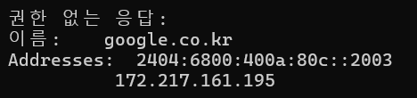

 - 만일 해당 사이트를 한 번도 방문한 적이 없다면 DNS 조회 필요!

 - 최초의 요청 이후 IP는 일정 기간 캐시

 - 이름 서버에 다시 연락하는 대신 캐시에서 IP 주소를 검색해 후속 요청 속도 높임

 - DNS 조회는 보통 호스트 이름 하나당 한 번만 수행

 - 단, 요청된 페이지에서 자원들(글꼴, 이미지, 광고 등)이 다른 호스트 이름을 가지고 있다면 각각 요청하고 모두 수행되어야 함 

    (모바일 네트워크 환경에선 각각의 DNS 조회는 휴대폰 ↔ cell tower ↔ DNS 서버를 거쳐야하기 때문에 지연시간 생길 수 있음)

 

### TCP Handshake - 연결 수립
: 브라우저는 서버와 TCP 3-way handshake를 통해 연결 설정

 -  TCP는 IP 기반 네트워크를 통해 TCP/IP 연결을 설정하고자 TCP 3-way handshake 사용

  > TCP Handshake란?
  >
  > TCP세션을 협상하고 시작하기 위해 전송하는 3개의 메시지 SYN(SYNchronize), SYN-ACK(SYNchronize-ACKnowledgement), ACK(ACKnowledge)
  >
  > - 정보를 주고받기를 원하는 두 호스트가 HTTP 브라우저 요청과 같은 데이터를 전송하기 전 연결 매개변수를 협상할 수 있도록 설계
  >
  > - 브라우저가 TCP SYN 패킷을 서버로 보내면, 서버는 SYN을 수신하고 SYN-ACK를 다시 보냄. 브라우저는 이를 수신하고 ACK를 서버에 다시 보내는데, 이 때 서버가 ACK를 수신하면 TCP 소켓 연결이 설정 됨
  >
  > - DNS 조회 이후 ~ TLS 핸드셰이크 이전에 발생
  >
  > 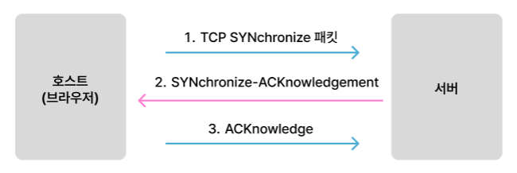

### TLS 협상
: HTTPS을 통해 보안성 있는 연결을 하고자 TLS 협상 이루어짐

  ① 암호화 방식 결정

    - 브라우저와 서버가 사용할 암호화 알고리즘 협상(AES, RSA, ECC)

    - 브라우저가 지원 가능한 암호화 방식 목록을 서버에 전달하면, 서버는 그 중 하나 선택 

  ② 서버 인증

    - 서버가 디지털 인증서(SSL/TLS)를 브라우저에 제공해 신뢰할 수 있는 기관(CA)에 의해 발급되었음 증명

    - 브라우저는 인증서가 신뢰할 수 있는 기관에서 발급되었는지 검증, 도메인과의 일치 여부 확인

  ③ 키 교환 및 세션 키 생성

    - 브라우저와 서버는 대칭키 암호화에 사용할 세션 키 생성

  ④ 보안 연결 완료 및 데이터 전송

    - 합의된 방식으로 암호화된 데이터 주고 받음 => 이후의 모든 HTTP 요청/응답은 TLS를 통해 암호화된 상태로 전송

>  TLS(전송 계층 보안)이란?
>
> 네트워크 상에서 어플리케이션들이 안전하게 통신하기 위해 사용하는 암호화된 보안 프로토콜
>
> 주요 기능
>
> ① 기밀성(Confidentiality) : 데이터가 암호화되어 도청 방지
> 
> ② 무결성(Integrity) : 데이터 변조 방지
>
> ③ 인증(Authentication) : 서버(필요 시 클라이언트)의 신원 검증

이처럼 웹서버로 한 번 연결되면 브라우저는 유저 대신  초기 HTTP (GET) 요청을 보낼 수 있고, 이 요청은 TCP 패킷을 통해 전송

## 2. 응답
서버가 요청 받으면 관련 응답 헤더와 함께 해당 리소스(HTML, CSS 등)를 응답

> **HTTP 요청 메서드란?**
>
>주어진 리소스에 수행하길 원하는 행동
>
> **종류**
>
> - GET : 특정 리소스를 가져오도록 요청(데이터 받기)  
> - HEAD : 특정 리소스를 GET 요청했을 때 돌아올 헤더 요청  
> - POST : 서버로 데이터 전송  
> - PUT : 요청 페이로드(payload)를 사용해 새로운 리소스 생성 또는   대상 리소스를 나타내는 데이터 대체(완전한 교체)  
> - PATCH : 리소스의 부분적인 수정을 할 때  
> - DELETE : 지정한 리소스 삭제  
> - CONNECT : 요청한 리소스에 대해 양방향 연결 시작, 터널 열기 위해 사용될 수 있음  
> - OPTIONS : 주어진 URL / 서버에 대해 허용된 통신 옵션 요청 -> URL 지정 또는 별표(*) 지정해 전체 서버 참조 가능  
> - TRACE : 대상 리소스에 대한 경로를 따라 메시지 루프백 테스트 수행
> 
> 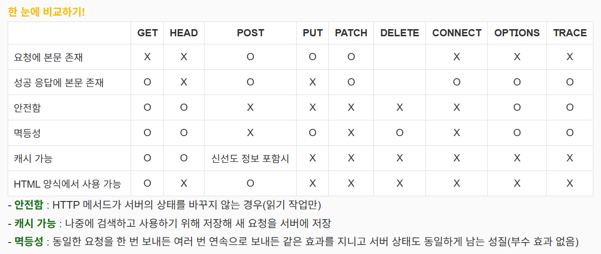

 

 - 초기 요청에 대한 응답은 첫 바이트 데이터 포함

   - TTFB(Time to First Byte) : 브라우저가 페이지를 요청하고 서버로부터 첫번째 정보(바이트)를 받는데 걸린 시간(밀리초)

      - DNS 조회, TCP handshake(TLS handshake)를 사용한 연결 설정 포함됨

   - 첫 데이터는 일반적으로 14kb

### TCP 혼잡 제어 / TCP Slow Start
서버가 HTTP 응답을 전송하고, 브라우저가 응답을 처리하는 과정

 - 응답(및 요청)에 대한 데이터는 TCP에 의해 일정 크기의 세그먼트로 나뉜 후 패킷화 되어 IP를 통해 전송

 - TCP는 패킷의 순서를 보장하며 중간에 손실된 패킷이 있으면 재전송 요청 수행

 - 브라우저는 패킷을 받을 때마다 ACK 패킷을 보내 서버에게 도착 알림

 - 서버는 ACK 패킷 받은 후에만 새로운 패킷 보내기 가능

 - 브라우저는 모든 TCP 패킷이 도착하면 받은 패킷을 조립해 응답 처리

(브라우저가 요청하고 서버가 받을 때도 마찬가지!)

 

**만약 서버가 각 세그먼트마다 ACK를 기다리면?**
  - 클라이언트로부터 빈번하게 ACK이 발생하고 저부하 네트워크 상황에서도 전송 시간 증가할 수 있음  

**만약 서버가 한 번에 너무 많은 세그먼트를 보내면?**
  - 하드웨어 및 네트워크 상태에 따라 연결 용량이 제한되기 때문에 사용량이 많은 네트워크에서는 클라이언트가 세그먼트를 받을 수 없게 되고, 서버는 누락된 ACK에 의해 계속 재전송해야 하는 문제 발생

 

**전송되는 세그먼트 수의 균형을 맞추려면?** TCP Slow Start !

**TCP slow start**

네트워크의 가용 대역폭을 감지하면서 패킷 전송 속도를 점진적으로 증가시키는 혼잡 제어 알고리즘

 - 혼잡 제어 : 네트워크 내에서 패킷이 과도하게 증가하여 트래픽이 몰리는 현상(혼잡)을 방지하고, 최적의 데이터 전송 속도를 유지하기 위한 제어 메커니즘

 

① 초기 전송 (CWND = 1 MSS)

처음에는 한 번에 1개의 세그먼트(MSS: Maximum Segment Size)만 전송  
서버가 ACK를 받으면 CWND(혼잡 윈도우 크기)를 2배씩 증가

② 지수적 증가

매 RTT(Round Trip Time)마다 CWND 크기를 2배씩 증가  
즉, ACK 하나 받을 때마다 CWND가 +1 증가하여, 한 번의 RTT 주기 후 CWND는 이전 크기의 2배가 됨  
예) CWND = 1 → 2 → 4 → 8 → 16 → ...

③ 임계값(SSThresh) 도달

CWND가 네트워크의 수용량을 초과하면 혼잡이 발생할 가능성이 높아짐  
CWND가 임계값(SSThresh, Slow Start Threshold)에 도달하면 증가 방식이 바뀜  
임계값을 넘어서면 지수 증가에서 선형 증가로 변경 (혼잡 회피(Congestion Avoidance) 단계로 전환)

④ 혼잡 발생 시 감속

패킷 손실이 감지되면(= ACK가 오지 않거나 재전송 요청이 발생하면) CWND를 절반으로 줄이고 SSThresh도 업데이트
이후 다시 Slow Start 또는 혼잡 회피 상태로 돌아가서 속도를 조절하며 전송  

**TCP slow start 사용하는 이유**

- 초기에 네트워크 대역폭 알 수 없기 때문 => 한꺼번에 많은 세그먼트 보내면 혼잡 발생 가능성 높음

- 혼잡을 방지하면서 최적의 속도 찾기 위해 => 처음엔 천천히 전송하다가 네트워크의 처리 속도 감지 후 속도 증가

- 혼잡이 발생하면 바로 감속해 문제 해결 => 혼잡 발생 후 다시 적절한 속도로 조정해 패킷 손실 최소화
 

 

## 3. 렌더링
Loader가 서버로부터 HTML 파일을 불러오면 브라우저는 렌더링 엔진 + 자바스크립트 엔진을 통해 화면의 요소 그림

이 때 전송받는 파일은 8비트의 데이터 형태 => 바이트 스트림

 

> 렌더링 엔진 : HTML, CSS 코드를 파싱해 화면에 그림
>
> 자바스크립트 엔진 : 자바스크립트 코드를 읽어 기능을 작동시킴
> 
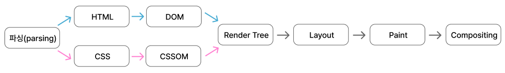

### 파싱(parsing)

: 브라우저가 네트워크를 통해 받은 데이터를 DOM이나 CSSOM으로 바꾸는 단계

 - 브라우저는 데이터를 받는 즉시 구문 분석을 시작하며, HTML이 완전히 다운로드될 때까지 기다리지 않음
 - DOM과 CSSOM을 생성하여 렌더 트리를 만들고, 이를 기반으로 화면에 페이지를 렌더링
 - 웹 성능 최적화를 위해 첫 14KB에 핵심적인 HTML과 CSS를 포함하는 것이 중요
 - 렌더링 전에 HTML, CSS, JavaScript를 반드시 구문 분석해야 함

#### 3-1. DOM 트리 구축  
브라우저는 HTML를 파싱(토큰화)하여 DOM 트리 생성

 - 토큰화 :  HTML을 분석하여 시작 태그, 종료 태그, 속성 이름 및 값을 포함한 토큰(Token)으로 변환

 - 트리 생성 : 토큰을 이용해 문서의 계층 구조를 반영한 DOM 트리 구축

 

**DOM 트리**

: HTML 문서의 계층 구조를 표현하는 트리 구조  
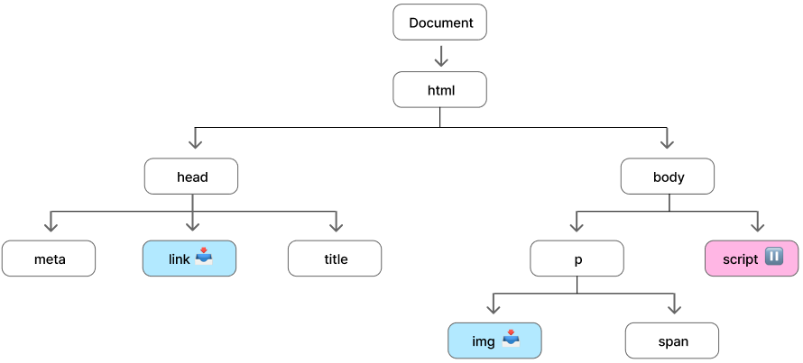  
 - <html> 요소가 루트 노드이며, 다른 태그들은 부모-자식 관계를 가지며 트리 형태로 연결됨

 - DOM 노드 개수가 많아질수록 트리 생성 시간 증가 => HTML이 복잡할수록 렌더링 성능에 영향 줌

 
**파싱할 때**

- 논 블로킹(Non-blocking) 자원(link, img, CSS 등)을 발견하면 즉시 리소스 요청

- `<script>` 태그를 만나면 파싱은 중단, JavaScript 실행 후 다시 파싱 진행

  - `<head>`보다 `<body>` 끝에 위치하는 것을 권장

  - async 또는 defer 속성을 사용하면 렌더링 차단 방지 가능

    - async: HTML 파싱 중 비동기적 다운로드 후 즉시 실행 (실행 순서 보장 X)

    - defer: HTML 파싱 끝난 후 스크립트 실행 (실행 순서 보장 O)

 

**프리로드 스캐너(Preload Scanner) 역할**

- 브라우저가 메인 스레드에서 HTML을 처리하는 동안, 프리로드 스캐너는 백그라운드에서 문서를 분석해 중요한 리소스를 찾음

- `<script>`, `<link>`, `` 등의 태그를 스캔하여 필요한 리소스를 파악

  - 우선순위가 높은 자원(CSS, JavaScript, 웹 폰트, 이미지 등)에 대한 네트워크 요청을 미리 보냄

  - CSS 다운로드는 파싱을 막지 않지만, JavaScript 실행은 기본적으로 HTML 처리를 차단할 수 있음(async 또는 defer 속성을 활용)

  - HTML Parser는 외부 리소스가 필요할 때 이미 다운로드된 리소스 즉시 사용 => 렌더링 속도 빨라짐!

  - 하지만 스크립트가 너무 많으면 여전히 주요한 병목(bottleneck)이 될 수 있음

 

#### 3-2. CSSOM 구축  
브라우저는 CSS를 파싱(토큰화)하여 CSSOM 트리 생성

 - 토큰화 : CSS를 분석하여 선택자, 구조({}), 구분자(:), 속성 및 값을 포함한 토큰으로 변환

 - 스타일 규칙을 적용할 수 있는 스타일 맵(Style Map)으로 변환(상대 단위 em, rem -> 절대 단위 px)

 - 트리 생성

   - CSS 선택자(class, id, tag 등)를 기준으로 부모-자식-형제 관계를 정의하여 트리 구조 생성

     - Cascading : 적용 가능한 가장 일반적인 규칙부터 계산한 후, 더 구체적인 규칙을 재귀적으로 수정하여 적용

   - 브라우저 기본 스타일 시트(User Agent Stylesheet)에 사용자가 정의한 CSS 규칙 추가

   - 모든 CSS 규칙을 병합해 각 요소에 최종적으로 적용할 스타일을 결정하며 CSSOM 트리 완성

 

**CSSOM 트리**

: CSS 규칙을 구조화한 트리, CSS 스타일을 저장하는 독립적인 자료 구조  
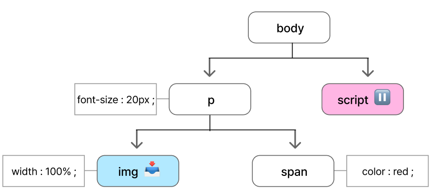  
 - CSSOM 트리 생성은 매우 빠르기 때문에 웹 성능 최적화에서 우선순위가 낮음

 - CSS 선택자가 복잡할수록 즉, CSS 규칙이 구체적일 수록 트리 탐색 비용 증가

 - CSS 축소화 및 미디어 쿼리 최적화 활용

 

 

**기타 작업들**  
***JavaScript 컴파일***

브라우저는 JavaScript를 해석, 컴파일, 파싱 및 실행하여 동작시킴

 ① JavaScript 다운로드

    프리로드 스캐너를 통해 미리 다운(<script> 태그 위치와 속성에 따라 실행 방식이 달라질 수 있음)

 ② JavaScript 파싱 & 추상 구문 트리(AST) 생성

    JavaScript 엔진이 코드를 읽고 파싱하여 추상 구문 트리(AST, Abstract Syntax Tree) 생성

    AST는 JavaScript 코드의 구조를 나타내는 트리 형태의 자료구조

 ③ 바이트코드(Bytecode) 생성 & 실행

     AST가 인터프리터에 의해 해석됨

     이를 브라우저 엔진(V8, SpiderMonkey 등)이 바이트코드로 변환하면 메인 스레드에서 실행됨

 

***접근성 트리(AOM, Accessibility Object Model) 구축 과정***

브라우저는 접근성(A11Y, Accessibility) 지원을 위해 DOM의 의미적 버전을 생성하여 보조 기술이 컨텐츠를 해석할 수 있도록 함

 ① DOM 트리 기반으로 AOM 생성

    브라우저가 DOM을 분석하여 의미적 정보(heading, button, link 등)를 포함한 접근성 트리(AOM) 생성

    CSS가 적용되면서 일부 요소가 접근성 트리에서 제외될 수 있음(예 : display: none;)

    AOM은 DOM과 유사하지만, 의미적 정보(ARIA 속성 등)를 추가한 독립적인 트리 구조

 ② AOM 업데이트

    DOM이 업데이트될 때 AOM 자동 업데이트

    하지만 보조 기술이 직접 접근성 트리를 수정할 수는 없음

 

 ③ 보조 기술(Assistive Technology, AT)에서 활용

    화면 리더기(Screen Reader), 음성 인식 기술, 키보드 네비게이션 등이 접근성 트리를 사용하여 웹 페이지를 해석

    AOM이 완성되기 전까지 보조 기술은 컨텐츠를 읽을 수 없음

 

 

### 렌더(Render)
: 스타일, 레이아웃, 페인트(때로는 합성)하는 단계

 - DOM 트리와 CSSOM 트리를 합성한 렌더 트리는 보이는 요소의 레이아웃을 계산

 - 레이아웃이 완료되면 요소가 페인트되어 화면에 표시

 - 일부 요소는 별도의 레이어로 분리되어 GPU가 처리하여 성능 최적화

 

#### 3-3. 스타일(Style)  
DOM과 CSSOM을 결합해 렌더 트리(Render Tree) 생성

 

**렌더 트리**

- DOM 트리의 루트부터 시작해 눈에 보이는 노드를 순회하면 만들어짐  
  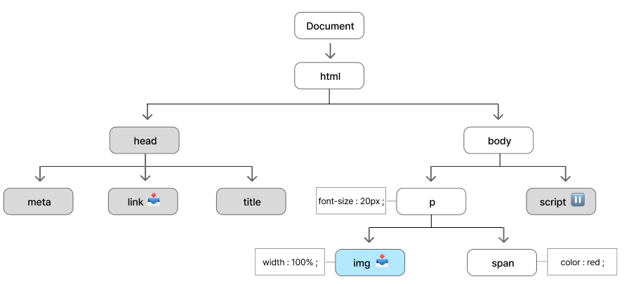
  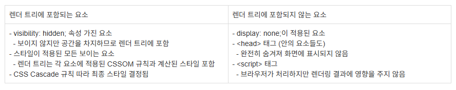

#### 3-4. 레이아웃(Layout)
렌더 트리를 기반으로 각 노드의 크기와 위치 계산

- 크기 관련 속성 : width, height, margin, padding 등

- 위치 관련 속성 : position, left, right, top, bottom 등

- 레이아웃 관련 속성 : display, flex, text-align, vertical-align 등

- 폰트 크기 관련 속성 :  font-family, font-size, font-weight  등

 

**레이아웃 과정**
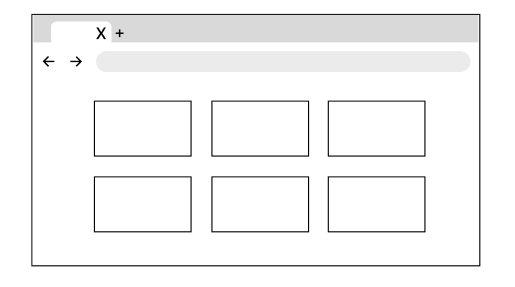
- 렌더 트리(Render Tree) 기반으로 각 요소의 너비, 높이, 위치 계산
- 브라우저는 루트 노드부터 순회하며 모든 요소의 크기와 위치를 결정
- 뷰포트(Viewport) 크기를 고려하여 요소 배치

  - 웹 페이지는 다양한 기기 및 화면 크기에 대응해야 하므로, 브라우저는 뷰포트 크기에 맞춰 박스 모델(Box Model)을 적용하여 레이아웃을 계산
     - 이미지 등의 크기를 알 수 없는 요소는 공간을 남겨두고, 나중에 크기를 결정

 

**리플로우**

: 페이지의 일부분 또는 전체 문서의 크기나 위치를 다시 계산하는 과정

 - 레이아웃이 끝난 후 특정 요소의 크기 또는 위치가 변경되면 다시 계산 필요

 - 예시 : 이미지 크기를 선언하지 않은 경우 => 초기 레이아웃 시, 임시 공간을 배정하고 나중에 이미지 크기를 알게 되면 다시 레이아웃 계산

 

#### 3-5. 페인트(Paint) & 합성(Compositing)  
각 노드를 화면에 페인팅하고, 필요에 따라 합성하는 과정

- 색상 관련 속성 : background-color, color 등

- 테두리 관련 속성 : border-radius, border-style 등

 

**페인팅 과정**
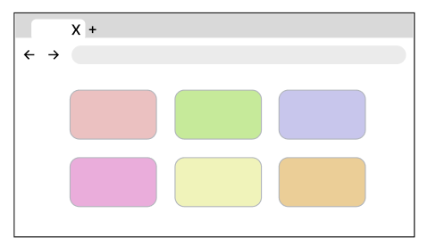
- 페인트는 레이아웃에서 계산된 요소를 실제 픽셀로 변환하는 과정
- 텍스트, 색상, 테두리, 그림자, 버튼, 이미지 등 모든 시각적 요소를 화면에 그림

- 첫 번째 페인팅(First Meaningful Paint, FMP) : 처음 일어난 페인팅

  - 이후 기본 화면 레이아웃 변경, 웹 글꼴 로드

  - 페이지 로드의 작은 차이에도 민감해 일관되지 않은 결과가 발생할 수 있음 => 측정항목이 브라우저별 구현 세부정보에 의존하기 때문에 표준화 할 수 없음

  (Lighthouse 6.0부터 지원되지 않아 LargestContentfulPaint API 사용 고려)

- 부드러운 애니메이션과 스크롤을 위해 메인 스레드는 16.67ms 이하의 처리 시간 필요 (60FPS 기준, 1프레임당 16.67ms 이내)

 

**성능 최적화**

- 요소를 여러 개의 레이어로 분리

- GPU 가속을 활용하여 CPU의 부담을 줄이고 렌더링 속도 향상
  - 자체 레이어를 가지는 요소 (GPU 가속되는 요소)

    - `<video>`, `<canvas>`

    - opacity, 3D transform, will-change 속성이 적용된 요소

- 자손 요소는 부모 레이어와 함께 그려질 수도 있음 (별도의 레이어가 필요하지 않으면 부모와 함께 렌더링됨)

- 레이어는 성능을 향상시키지만, 메모리 사용량이 증가하므로 최적화 필요

 

**합성 과정**
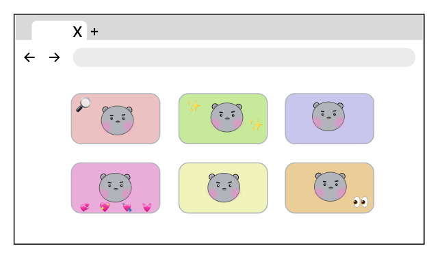  
- 문서의 여러 섹션이 서로 다른 레이어에서 그려질 경우, 이를 올바른 순서로 배치하는 과정
- 레이어를 올바르게 합성하여 화면에 정확한 렌더링을 보장

> **리플로우(Reflow)와 리페인트(Repaint)**
> - 리플로우 : 요소의 크기나 위치가 변경될 때, 레이아웃을 다시 계산하는 과정
> - 리페인트 : 스타일(색상, 배경 등)이 변경될 때, 다시 화면을 그리는 과정
>
> **성능상 차이점**
> - 리플로우 : 부모 노드의 레이아웃 변화는 자식 노드의 레이아웃까지 영향을 미쳐 자식 노드도 리플로우 발생함. 주로 CPU를 활용하여 연산 => CPU 부하가 큰 작업
> - 리페인트 : 부모 노드가 리페인트 되어도 자식 노드는 리플로우, 리페인트 발생 안 됨. GPU 활용
>
>+ 리플로우는 리페인트와 재합성을 일으킬 수 있지만, 반드시 순차적으로 실행되는 것은 아님
>(레이아웃의 영향이 없는 변경은 리플로우 없이 리페인트만 실행)
>
> **최적화 방법**  
> ① 리플로우 유발하는 css 속성 최소화  
>  width, height 등의 속성은 요소의 레이아웃 다시 계산하게 해 리플로우 일으킴. 가능한 미리 css에서 스타일 크기 설정해 초기 로드 시에만 계산 이루어지도록 하여 이후에는 변경 안 하는 것이 좋음  
>
>  ② css 애니메이션 최적화  
>  애니메이션에 transform과 opacity 속성만 사용. GPU 가속을 사용할 수 있어 리플로우 없이 리페인트만 발생시켜 CPU 자원 적게 사용  
>
> ③ will-change 속성 사용  
>  해당 속성을 사용해 브라우저에 특정 요소가 변경될 것임을 미리 언질. 하지만 너무 자주 사용하면 메모리 낭비 발생하므로 필요한 요소에만 적용해야 함

## 4. 상호작용(Interactivity)
페이지가 화면에 표시되었더라도 메인 스레드가 바쁘면 사용자 입력(클릭, 스크롤 등)에 대한 반응이 지연될 수 있음

- 지연된 JavaScript가 다운로드 되거나 onload 이번트 실행 등으로 인해 바쁜 상태

 

**TTI(Time to Interactive)**

: DNS 조회 및 SSL 연결이 이루어진 첫 요청부터 페이지가 사용자와 상호작용할 준비가 될 때까지의 시간을 측정하는 지표
- 첫 번째 콘텐츠가 화면에 표시된 후, 페이지가 50ms 이내로 사용자 입력(클릭, 스크롤 등)에 반응할 수 있을 때 TTI 도달
- JavaScript 실행이 TTI를 지연시키는 주요 원인 중 하나
- 메인 스레드가 파싱, 컴파일, JavaScript 실행에 점유되면 사용자 상호작용이 지연됨

 

**최적화 방법**
- 메인 스레드 점유를 최소화하여 빠른 사용자 상호작용 제공 중요!

  - JavaScript 크기 줄이기(불필요한 코드 제거, 압축)

  - 비동기 실행(async, defer)

  - 코드 스플리팅(Code Splitting)을 통해 필요한 코드만 먼저 실행

  - Web Worker 활용으로 메인 스레드 부하 감소
  - 
  
> **코드 스플리팅(Code Splitting)이란?**
>
>JavaScript 파일을 여러 개의 작은 파일로 나누어 필요한 부분만 로드하는 최적화 기법 => 초기 로딩 속도 개선
>
>동적 임포트 또는 번들러 활용
>
>① 동적 임포트(Dynamic Import)
>
>  import('./module.js').then((module) => { module.default(); });
>
>  특정 동작이 필요할 때만 로드 -> import() 사용하면 필요 시점에 해당 파일만 비동기적으로 가져올 수 있음
>
>② 번들러(Webpack, Vite 등)
>
>  - Webpack - splitChunks 설정
>
>  - React, Vue - Lazy Loading(지연 로딩) : const LazyComponent = React.lazy(() => import('./LazyComponent'));
>
> **Web Worker란?**
>
>브라우저에서 메인 스레드와 별도로 동작하는 백그라운드 스레드
>
>무거운 연산을 별도의 스레드에서 처리해 UI가 멈추는 것을 방지 => 부드러운 사용자 경험 제공
>
>**예시**
>
>- Web Worker 파일(worker.js) 생성
>
>   self.onmessage = function (event) { const result = event.data * 2; self.postMessage(result); };
>
>- 메인 스크립트에서 Web Worker 실행
>
>   const worker = new Worker('worker.js');                               
>   worker.onmessage = function (event) {console.log('Worker result:', event.data); };                
>  worker.postMessage(5);  // Worker에게 5를 보내면, 10을 반환

# Q&A
## 1. 인터넷 창에 www.goole.com을 입력하면 무슨 일이 일어나는지 설명해주세요.
첫번째로 DNS 조회가 일어납니다.  
사용자가 "www.google.com"을 입력하면, 브라우저는 먼저 이 도메인 이름을 IP 주소로 변환해야 합니다. 브라우저는 캐시된 DNS 기록을 먼저 확인하고, 없으면 로컬 DNS 서버에 요청하여 "www.google.com"에 해당하는 IP 주소를 얻습니다.  
두번째로 TCP 연결 수립입니다.  
IP 주소가 확인되면, 브라우저는 서버와 TCP 연결을 수립합니다. TCP는 데이터를 신뢰성 있게 전달하기 위한 프로토콜입니다. 이 과정에서 브라우저는 서버와 3-way handshake를 수행합니다. 즉, 브라우저가 SYN 패킷을 보내고, 서버가 SYN-ACK 패킷을 보내며, 다시 브라우저가 ACK 패킷을 보내는 과정입니다.  
세번째로 HTTP 요청입니다.  
TCP 연결이 수립되면, 브라우저는 HTTP 또는 HTTPS 요청을 보냅니다. 이 요청은 "GET / HTTP/1.1" 같은 형식으로, 웹 페이지를 요청하는 메시지입니다. 만약 HTTPS를 사용할 경우, 이 단계 이전에 SSL/TLS 핸드셰이크도 수행됩니다. 이 과정에서는 브라우저와 서버가 암호화된 연결을 설정하기 위해 보안 인증서를 교환하고, 암호화 키를 협상합니다.  
네번째로 서버의 응답을 받습니다.  
서버는 요청을 받고, 해당 리소스와 관련 응답 코드를 브라우저에게 보냅니다.  
마지막으로 받은 리소스들을 바탕으로 브라우저 렌더링 파이프라인을 진행합니다.  
DOM과 CSSOM을 생성하고, 렌더 트리를 구성한 뒤, 레이아웃과 페인트 단계를 통해 웹 페이지가 화면에 표시됩니다.

## 2. 브라우저 렌더링 파이프라인에 대해서 설명해주세요.
브라우저가 웹 페이지를 화면에 표시하기 위해 거치는 과정으로 DOM, CSSOM 생성, 렌더 트리 생성, 레이아웃, 페인트, 합성이 있습니다.   
첫번째로 DOM 생성입니다.  
브라우저가 HTML 파일을 받으면, 이 파일을 바이트 단위로 읽기 시작합니다. 브라우저의 HTML 파서(Parser)는 이 바이트들을 문자(character)로 변환하고, 이 문자들을 다시 HTML 토큰으로 변환합니다. 이 HTML 토큰들은 각각의 태그와 그 안에 포함된 텍스트, 속성 등을 의미하게 됩니다.  
HTML 토큰이 생성되면, 브라우저는 이를 기반으로 DOM 트리를 생성합니다.

두번째로 CSSOM 생성입니다.  
브라우저는 CSS 파일을 파싱합니다. CSS 파일 역시 바이트로 전송되므로, 브라우저는 이를 문자로 변환한 뒤, CSS 규칙으로 나눕니다. 각 CSS 규칙은 선택자와 선언으로 구성되는데, 선택자는 스타일을 적용할 HTML 요소를 정의하고, 선언은 적용할 스타일을 정의합니다.
브라우저는 이 CSS 규칙들을 기반으로 CSSOM 트리를 생성합니다.

세번째로 렌더 트리 생성입니다.  
앞서 생성한 DOM과 CSSOM을 결합하여 렌더 트리를 생성합니다. 렌더 트리는 화면에 실제로 표시될 요소들로만 구성됩니다. 예를 들어 display: none 속성이 있는 요소는 렌더 트리에 포함되지 않습니다.
렌더 트리의 각 노드는 DOM 트리의 요소와 연결되며, CSSOM 트리에서 해당 요소에 적용된 스타일 정보를 포함합니다.

네번째로 레이아웃입니다.  
렌더 트리를 사용해 각 요소의 정확한 위치와 크기를 계산합니다.  
레이아웃 과정에서는 렌더 트리의 각 노드가 화면의 어디에 위치할지, 그리고 얼마나 큰지를 계산하게 됩니다.
이 계산은 화면의 뷰포트 크기와 같은 정보에 의존합니다.  
만약 화면 크기가 변경되면 브라우저는 레이아웃 과정을 다시 수행해야 하는데, 이를 리플로우라고 합니다.

다섯번째로 페인팅입니다.  
레이아웃이 완료되면, 브라우저는 각 요소를 실제로 화면에 그리는 작업을 시작합니다.  
페인팅 단계에서는 텍스트, 색상, 그림자, 이미지 등 모든 시각적 요소가 화면에 그려집니다.

마지막 단계는 합성입니다.  
화면에 그려질 요소 중 일부 요소는 레이어로 분리되는데, 이 레이어들을 결합하여 최종 화면을 구성합니다. 이 과정에서는 GPU를 활용하여 각 레이어를 빠르게 합성합니다.
transform과 opacity와 같은 속성은 레이아웃이나 페인트 과정을 거치지 않고, 합성 단계에서만 처리됩니다.

## 3. Reflow와 Repaint의 차이점에 대해서 설명해주세요.
먼저 reflow는 브라우저가 페이지의 레이아웃을 다시 계산하는 과정을 말합니다.  
DOM의 구조가 변경되거나 CSS 스타일이 변경되면, 브라우저는 각 요소가 화면에 어떻게 배치될지 다시 계산해야 합니다. 이 과정은 모든 자식 요소와 관련된 부모 요소까지 영향을 주기 때문에 비용이 많이 드는 작업입니다. 예를 들어, CSS에서 요소의 width나 height 속성을 변경하면, 브라우저는 해당 요소뿐만 아니라 연관된 모든 요소의 배치를 다시 계산해야 합니다.

반면에, repaint는 요소의 모양이나 스타일이 변경될 때 발생합니다. 요소의 레이아웃은 그대로이고, 색상이나 배경 등의 스타일만 변경되는 경우를 말합니다. background-color 같은 속성을 예로 들 수 있습니다. 이 경우 브라우저는 요소의 모양만 다시 그리면 되기 때문에 reflow보다는 비용이 덜 들지만, 여전히 성능에 영향을 줄 수 있습니다.
reflow는 레이아웃을 다시 계산하는 과정이고, repaint는 그 계산 결과를 화면에 다시 그리는 과정이라고 할 수 있습니다.

## 4. 브라우저가 서버와 데이터를 주고받는 과정에서 TCP/IP는 어떻게 동작하나요?
브라우저는 서버로 HTTP 요청을 보낼 때, 요청 데이터를 TCP 프로토콜을 통해 세그먼트로 나누고, IP 프로토콜을 통해 패킷화하여 전송합니다.  
서버는 요청을 처리한 후 HTTP 응답을 생성하고, 마찬가지로 세그먼트와 패킷 단위로 클라이언트에 전송합니다. 이 과정에서 TCP는 패킷의 순서를 보장하며, 손실된 패킷이 발생하면 재전송을 수행합니다. 브라우저는 패킷을 받을 때마다 ACK(확인 응답) 패킷을 서버로 전송하여 정상적인 데이터 수신을 알리고, 모든 패킷이 도착하면 데이터를 조립하여 HTML을 해석하고 렌더링을 수행합니다.  

## 5. 혼잡 제어란 무엇이고, 이를 구현하기 위한 알고리즘을 설명해주세요.
혼잡 제어는 네트워크 내에서 데이터 패킷이 과도하게 증가하여 트래픽 병목이 발생하는 것을 방지하고, 최적의 데이터 전송 속도를 유지하기 위한 제어 메커니즘입니다.  
TCP는 신뢰성 있는 데이터 전송을 보장하기 위해 혼잡 제어를 수행하며, 주요 목표는 네트워크의 가용 대역폭을 효율적으로 활용하면서도 패킷 손실을 최소화하는 것입니다.

혼잡 제어를 위한 대표적인 알고리즘 중 하나로 TCP Slow Start가 있습니다.  
이 알고리즘은 네트워크의 가용 대역폭을 초기에 알 수 없기 때문에, 처음에는 작은 전송 속도로 시작하고 네트워크 상태를 감지하면서 점진적으로 속도를 증가시키는 방식입니다.