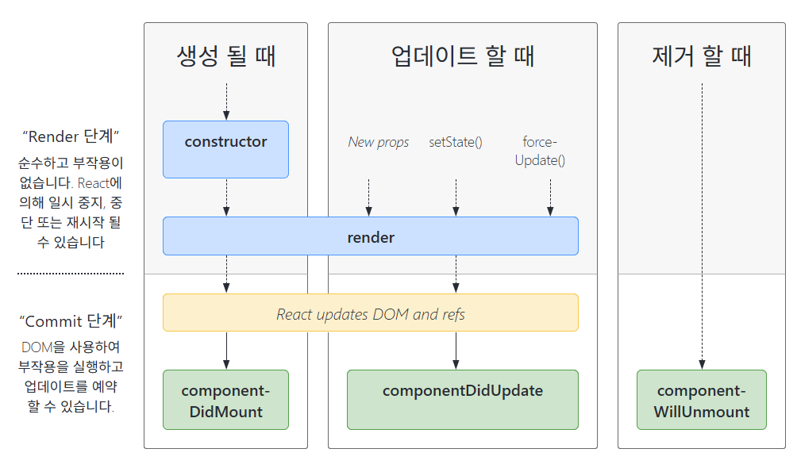

# React 렌더링 과정
- [React 렌더링 과정](#react-렌더링-과정)
  - [1. React에서 렌더링이란?](#1-react에서-렌더링이란)
    - [1-1. Render Phase (렌더링 단계)](#1-1-render-phase-렌더링-단계)
    - [1-2. Commit Phase (커밋 단계)](#1-2-commit-phase-커밋-단계)
  - [2. React에서 렌더링을 어떻게 다룰까?](#2-react에서-렌더링을-어떻게-다룰까)
    - [2-1. React의 Reconciliation(재조정)과 Fiber 아키텍처](#2-1-react의-reconciliation재조정과-fiber-아키텍처)
    - [2-2. 리렌더링과 최적화 기법](#2-2-리렌더링과-최적화-기법)
    - [2-3. 상태 관리와 불변성 원칙](#2-3-상태-관리와-불변성-원칙)
  - [3. React 렌더링 성능 분석 및 최적화](#3-react-렌더링-성능-분석-및-최적화)
    - [3-1. React DevTools Profiler 활용](#3-1-react-devtools-profiler-활용)
    - [3-2. React 렌더링 최적화 전략](#3-2-react-렌더링-최적화-전략)

## 1. React에서 렌더링이란?
컴포넌트에게 현재 props와 state의 상태에 기반하여 UI를 어떻게 구성할 지 요청하는 과정

### 1-1. Render Phase (렌더링 단계)
React가 컴포넌트를 호출하고 업데이트 사항을 파악하는 단계로, 이 과정에서는 실제 DOM을 변경하지 않음

**1-1-1. 컴포넌트를 호출하여 결과값 계산**  
- React는 컴포넌트 트리를 순회하며 `classComponentInstance.render()` (클래스형 컴포넌트) 또는 `FunctionComponent()` (함수형 컴포넌트)를 호출
- 이 호출 결과를 저장하여 새로운 UI 상태를 결정
- React의 JSX 문법은 내부적으로 `React.createElement()` 호출로 변환되어 최종적으로 **React Element 객체**로 변환됨
  - js가 컴파일되고 런타임 시점에 호출
```
# React의 JSX 문법
return <SomeComponent a={42} b="testing">Text here</SomeComponent>

# 중간 과정 - 내부 React.createElement() 호출로 변환
return React.createElement(SomeComponent, {a: 42, b: "testing"}, "Text Here")


# 최종 - React Element 객체
{
  type: SomeComponent,
  props: { a: 42, b: "testing" },
  children: ["Text Here"]
}
```

**1-1-2. Virtual DOM 생성**  
- React Element 객체들을 모아 Virtual DOM을 구성
- Virtual DOM은 실제 DOM의 복제판이 아니라 UI 상태를 값으로 표현한 데이터 구조
- Virtual DOM을 이용하면 변경된 부분만 찾아 효율적으로 업데이트 가능

**1-1-3. 변경된 Virtual DOM 계산 (Diffing)**  
- React는 새로운 Virtual DOM을 생성한 후, 기존 Virtual DOM과 비교하여 변경된 부분을 찾음
- 이 과정은 재조정(Reconciliation) 이라고 하며 성능 최적화를 위해 여러 기법이 적용
- 이 단계에서는 실제 DOM을 변경하지 않고, 어떤 부분이 변경되었는지 분석하는 것에 초점
- 최적화 방법
  - key 속성을 활용해 비교 연산을 최소화
  - `shouldComponentUpdate`(클래스형 컴포넌트) 또는 `React.PureComponent`를 활용해 특정 상황에서만 렌더링 발생하도록 설정
  - Context API 사용 시, 모든 하위 컴포넌트가 리렌더링되지 않도록 useMemo를 활용

### 1-2. Commit Phase (커밋 단계)
Render Phase에서 계산된 변경 사항을 실제 DOM에 반영하는 과정


**1-2-1. 변경된 Virtual DOM을 바탕으로 실제 DOM 업데이트**  
- Render Phase에서 생성된(변경된) Virtual DOM을 기반으로 실제 DOM을 효율적으로 업데이트
  - React는 기존 Virtual DOM과 새로운 Virtual DOM을 비교하는 것이 아니라 **이미 Render Phase에서 계산된 변경 사항(Diffing 결과) 만 적용**하여 성능을 최적화함
- React는 Batching(배치 업데이트) 기법을 사용하여 성능을 최적화
  - 여러 개의 상태 업데이트를 한 번의 커밋에서 처리하여 불필요한 렌더링을 방지
  - React 18부터 Automatic Batching이 도입되어 이벤트 핸들러뿐만 아니라 `setTimeout`, `Promise`, 네트워크 요청 등에서도 여러 상태 업데이트를 자동으로 묶어 처리할 수 있음
- 브라우저 성능 최적화를 위해 requestAnimationFrame 활용 가능
  - `requestAnimationFrame()` : 브라우저가 다음 화면을 그리기 직전에 실행할 함수를 예약하는 API
  - React는 필요에 따라 requestAnimationFrame을 사용하여 최적의 시점에 DOM을 업데이트하여 성능을 향상시킴
  - 이를 통해 불필요한 화면 깜빡임이나 과도한 DOM 변경을 줄일 수 있음

**1-2-2. 커밋 후 참조 업데이트 및 라이프사이클 실행**  
Commit Phase에서 변경된 Virtual DOM을 실제 DOM에 반영한 후 추가 작업

① 참조 업데이트  
- ref를 사용해 DOM 노드를 직접 참조하는 경우, 리액트는 새로운 DOM 노드를 가리키도록 자동 업데이트  
- 클래스 컴포넌트의 this 인스턴스도 변경된 데이터를 반영하여 업데이트

② 라이프사이클 메소드 및 훅 실행  
- 클래스 컴포넌트 `componentDidMount`, `componentDidUpdate` 실행
- 함수형 컴포넌트 `useLayoutEffect`가 동기적으로 실행  
이 단계에서 실행되는 효과는 UI가 브라우저에 표시되기 전에 적용됨

③ Passive Effects (비동기 후처리)  
- 리액트는 커밋 후 짧은 timeout을 설정한 후 이 timeout이 만료되면 useEffect를 실행
- useEffect는 브라우저가 화면을 다시 그린 후 실행되므로 UI 업데이트 과정에는 영향을 미치지 않음

**참고 - React 18 Concurrent Mode(동시 모드)의 핵심 개념**  
- 브라우저가 사용자 이벤트를 원활하게 처리할 수 있도록 렌더링을 조절하는 방식


① 렌더링을 일시 중지 및 재개 가능  
- 기존의 리액트에서는 렌더링이 시작되면 완료될 때까지 중단할 수 없었음
- Concurrent Mode에서는 렌더링 도중 브라우저가 이벤트를 처리할 필요가 있으면 잠시 멈출 수 있음
- 이후 다시 이전 상태에서 렌더링을 이어서 진행하거나
새로운 상태를 반영하여 렌더링을 다시 시작할 수도 있음

② 렌더링 결과가 무효화될 수 있음
- 리액트는 같은 컴포넌트를 여러 번 렌더링할 수 있음
- 하지만 렌더링 도중 새로운 상태 업데이트(setState)가 발생하면 현재 진행 중이던 렌더링 결과는 무효화되고 버려짐
- 즉, 더 이상 사용되지 않을 렌더링 결과는 적용되지 않고 폐기.
이를 통해 불필요한 연산을 줄이고 성능 최적화 가능




## 2. React에서 렌더링을 어떻게 다룰까?
### 2-1. React의 Reconciliation(재조정)과 Fiber 아키텍처
**2-1-1. Reconciliation (재조정)**  
- 기존 Virtual DOM과 새로운 Virtual DOM을 비교하여 변경된 요소만 수정
- `===` 비교를 사용하여 타입이 바뀌었는지 확인
- `key` 속성을 활용하여 리스트 최적화 가능


**2-1-2. Fiber 아키텍처**  
React는 모든 컴포넌트의 상태와 업데이트를 관리하기 위해 "Fiber"라는 데이터 구조를 사용  
(React는 Fiber를 기반으로 useState, useEffect 등의 훅을 관리.
useState 값은 Fiber 내부에서 유지되며 렌더링 시 올바르게 반영됨)

**Fiber 노드의 역할**

- 현재 컴포넌트의 타입, props, state 저장
- 부모, 형제, 자식 컴포넌트에 대한 포인터 저장
- 이전 상태와 비교하여 필요한 경우 업데이트 수행

**Fiber의 장점**

- 비동기 렌더링 가능 → UI가 부드럽게 유지됨
- 작업을 쪼개서 처리 → 렌더링 성능 최적화
- 우선순위 기반 업데이트 → 중요한 업데이트를 먼저 실행


### 2-2. 리렌더링과 최적화 기법
React는 기본적으로 부모 컴포넌트가 리렌더링되면 모든 자식도 리렌더링됨

- `React.memo()` : 동일한 props가 전달되면 이전 결과를 재사용하여 불필요한 렌더링 방지  
- `useMemo, useCallback` : 연산량이 많은 함수나 객체를 재사용하여 리렌더링 최적화, props 참조 최적화 가능능
- `shouldComponentUpdate` 또는 `React.PureComponent` : 클래스형 컴포넌트에서 특정 조건에서만 렌더링을 수행하도록 설정
- `key` 속성을 활용한 리스트 최적화 : 리스트 항목 변경 시 불필요한 DOM 재조작 방지
- `Context API` 최적화 : Context 값 변경 시 불필요한 하위 컴포넌트 리렌더링 방지
  - **Context API** : props를 깊이 전달하지 않고도 상태를 공유할 수 있도록 해주는 기능
    - `<MyContext.Provider value={값}>` 형태로 값을 제공
    - `useContext(MyContext)` 를 통해 값 사용 가능
    - 부모가 리렌더링되면 하위 컴포넌트도 영향을 받음 → 최적화 필요
  - Context.Provider 하위 컴포넌트를 React.memo()로 감싸기
  - useMemo()를 활용하여 Provider 값 관리
    - ```const contextValue = useMemo(() => ({ a, b }), [a, b]); <MyContext.Provider value={contextValue}>```  
    이렇게 하면 a 또는 b가 변경될 때만 Provider가 리렌더링 됨
  - Context 분리 - 자주 변경되는 값과 변경되지 않는 값을 분리하여 성능 최적화
  - 💡 Context API vs 상태 관리 라이브러리  
    | Context API |	Redux/Zustand 등 상태 관리 라이브러리 |  
    | --- |---|
    |간단한 상태 공유|	대규모 상태 관리 최적화|  
    | props drilling 방지| 비동기 상태 관리 가능|  
    | 최적화 필수 (불필요한 리렌더링 방지)|기본적으로 최적화 구조 제공|

### 2-3. 상태 관리와 불변성 원칙
React에서는 상태를 직접 변경하지 않고 새로운 상태를 만들어서 업데이트해야 함  
불변성을 유지하지 않으면 React가 변경 사항을 감지하지 못하고 리렌더링이 발생하지 않을 수 있음

- 불변성 유지 X  
```
todos[3].completed = true;
setTodos(todos); // 동일한 참조를 전달하므로 리렌더링되지 않음
```  

- 불변성 유지 O
```
const newTodos = [...todos];
newTodos[3].completed = true;
setTodos(newTodos); // 새로운 배열을 생성하여 변경 사항을 감지
```


## 3. React 렌더링 성능 분석 및 최적화
### 3-1. React DevTools Profiler 활용
각 컴포넌트의 렌더링 시간 및 횟수를 분석하여 최적화 포인트를 찾음

### 3-2. React 렌더링 최적화 전략
**렌더링 배치(Batching) 활용**  
React 18에서는 여러 setState 호출을 자동으로 배치하여 성능을 향상  

**Strict Mode와 더블 렌더링**  
StrictMode가 활성화되면 개발 환경에서 일부 컴포넌트가 2번 렌더링됨 (실제 동작에는 영향을 주지 않지만, 개발 중에는 신경 써야 함)

**불필요한 상태 업데이트 방지**  
useEffect 내부에서 setState 호출 시 주의해야 함
