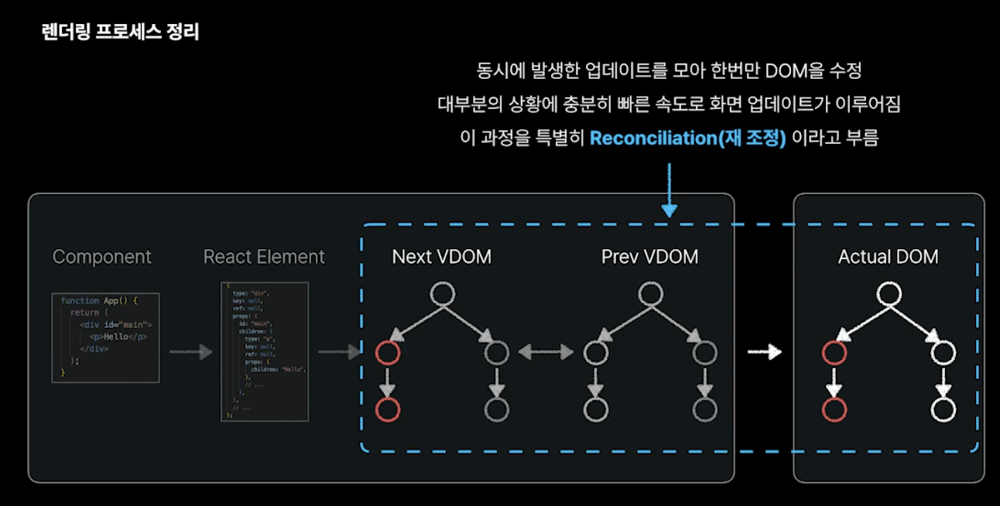
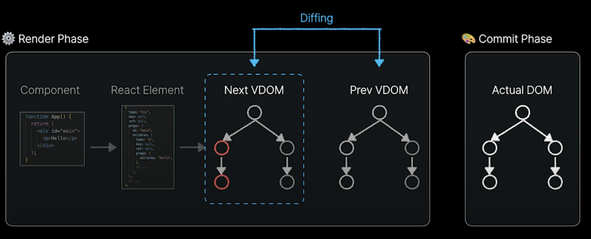

- [리액트 렌더링 과정](#리액트-렌더링-과정)
  - [1. 개요 및 미리보기 (이정환 - React.js의 렌더링 방식 살펴보기)](#1-개요-및-미리보기-이정환---reactjs의-렌더링-방식-살펴보기)
    - [1-1. 웹 브라우저 동작 방식](#1-1-웹-브라우저-동작-방식)
    - [1-2. 리액트의 렌더링 프로세스](#1-2-리액트의-렌더링-프로세스)
  - [2. 상세 (\[번역\] 리액트 렌더링 동작의 (거의) 완벽한 가이드 \[A (Mostly) Complete Guide to React Rendering Behavior\])](#2-상세-번역-리액트-렌더링-동작의-거의-완벽한-가이드-a-mostly-complete-guide-to-react-rendering-behavior)
    - [2-1. 리액트의 렌더링이란 무엇인가?](#2-1-리액트의-렌더링이란-무엇인가)
      - [(1) 전체적인 렌더링 과정](#1-전체적인-렌더링-과정)
    - [2-2. 렌더와 커밋 단계](#2-2-렌더와-커밋-단계)
    - [2-3. 리액트 전체 렌더링 과정 요약](#2-3-리액트-전체-렌더링-과정-요약)
      - [(1) React Element (리액트 엘리먼트)](#1-react-element-리액트-엘리먼트)
      - [(2) 컴포넌트 트리 (Component Tree)](#2-컴포넌트-트리-component-tree)
      - [(3) Virtual DOM (가상 DOM)](#3-virtual-dom-가상-dom)
      - [(4) Fiber 트리 (Fiber Tree, React 16버전 이후)](#4-fiber-트리-fiber-tree-react-16버전-이후)
      - [(5) 실제 DOM 업데이터 (Commit 단계)](#5-실제-dom-업데이터-commit-단계)
      - [(6) 한 줄 요약](#6-한-줄-요약)
    - [2-4. React는 렌더를 어떻게 다룰까?](#2-4-react는-렌더를-어떻게-다룰까)
      - [1. 렌더링 순서 만들기](#1-렌더링-순서-만들기)
      - [2. 표준적인 렌더 동작](#2-표준적인-렌더-동작)
      - [3. React의 렌더링 규칙](#3-react의-렌더링-규칙)
      - [4. 컴포넌트 메타데이터와 Fibers](#4-컴포넌트-메타데이터와-fibers)
      - [5. 컴포넌트 타입과 재조정 (Reconciliation)](#5-컴포넌트-타입과-재조정-reconciliation)
  - [참고 자료](#참고-자료)

# 리액트 렌더링 과정
## 1. 개요 및 미리보기 (이정환 - React.js의 렌더링 방식 살펴보기)
<details>
<summary>
&nbsp 펼쳐서 확인하기
</summary>

### 1-1. 웹 브라우저 동작 방식
- Critical Rendering Path


- 사용자의 이벤트에 대한 업데이트
  - JavaScript가 DOM을 수정하면 업데이트가 발생
  - DOM이 수정되면 Critical Rendering Path가 다시 실행됨

  
  => 이렇게 직접적으로 DOM을 계속 수정하게 되면 Reflow, Repaint를 계속 발생시키게 됨  -> `성능 저하`
  - Reflow (Layout 재계산), Repaint (화면에 실제 픽셀 단위로 표현)은 매우 비싼 연산 과정

<br>

- 그럼 어떻게 자바스크립트를 조작하는게 좋을까?
  - 동시에 발생한 `업데이트를 모아서 한번에 수정`하는게 DOM을 최대한 변경하지 않아 성능에 좋음  
  => 개발이 복잡해질수록 이렇게 `바닐라 자바스크립트를 조작하는게 어려울` 수 있다!  
  - `React JS`에서는 `자동`으로 업데이트된 내용들을 `한번에 모아서` DOM에 `반영`하도록 추상화되어있음
    - 

### 1-2. 리액트의 렌더링 프로세스
- React의 화면 UI 렌더링 과정
  1. Render Phase
     - 컴포넌트를 계산하고 업데이트 사항을 파악하는 단계
       - React 컴포넌트가 렌더링 해야하는 UI를 Virtual DOM이라는 객체 값으로 변환하는 과정
     1. 계산한 업데이트 사항을 React Element 객체로 파악함
          - React Element : 컴포넌트가 렌더링하고자 하는 모든 정보를 담고 있는 객체
          - 
     2. React Element들을 모아 Virtual DOM 생성
          - 
          - Virtual DOM : React Element라고 부르는 객체 값의 모임
            - 실제 DOM은 아니고 `DOM의 복제판`이며 `값으로 표현된 UI(Value UI)`라고 이해하는 게 더 정확함

     - Render Phase 과정 정리
       - 
  2. Commit (확정, 결정) Phase
    - 변경사항을 Virtual DOM을 Actual DOM에 반영함
      - 

<br>

- 리액트 렌더링 프로세스 정리

  - 굳이 이렇게 복잡한 과정을 거쳐서 리액트가 렌더링 되는 이유 : DOM 수정을 최소화해서 대부분의 상황에 충분히 빠른 업데이트를 보장하기 위해서

<br>

- 업데이트 발생 시 재조정(Reconciliation) 발생
  
  1. Render Phase를 처음부터 다시 실행 -> 새로운 Virtual DOM 생성 
     - 
  2. Next Virtual DOM <-> Prev Virtual DOM의 차이점 비교
     - 
  3. 개선된 차이점을 Actual DOM에 한번에 업데이트
     - 

  - Virtual DOM의 단점
    - Virtual DOM의 재조정으로 대부분의 상황에 `충분히 빠른 속도로 업데이트`를 할 수 있지만 `항상 최고의 속도를 보장하는 것은 아님 `
    - Virtual DOM을 생성하고 비교하는데도 `연산이 소요`됨

</details>

## 2. 상세 ([번역] 리액트 렌더링 동작의 (거의) 완벽한 가이드 [A (Mostly) Complete Guide to React Rendering Behavior])
<details open>
<summary>
&nbsp 펼쳐서 확인하기
</summary>

### 2-1. 리액트의 렌더링이란 무엇인가?
- 리액트 렌더링 : React가 컴포넌트에게 현재 Props와 State에 기반하여 UI에서 어떻게 보여지고 싶은지 알려달라고 요청하는 과정

#### (1) 전체적인 렌더링 과정
- 렌더링 과정 동안 React는 컴포넌트 트리의 루트에서부터 시작하여 아래쪽으로 순환하며 업데이트가 필요하다고 표시된 컴포넌트를 전부 찾음
- 업데이트가 필요한 컴포넌트를 찾은 경우 클래스형 컴포넌트인 경우 `classComponentInstance.render()`를 함수형 컴포넌트인 경우 `FunctionComponent()`를 호출하고 렌더 결과물을 저장
- 렌더 결과물은 JSX 구문으로 보통 작성되며 JS가 컴파일 되고 배포 준비가 되는 시점에서 `React.createElement()` 호출로 변환됨
  - `createElement` : 일반적인 JS 객체 형식의 React 엘리먼트를 반환하며 이 엘리먼트는 생성하고자 하는 UI 구조를 설명함

  > 예시 
  > ```JS
  > // 다음과 같은 JSX 문법이:
  > return <SomeComponent a={42} b="testing">Text here</SomeComponent>
  >
  > // 이런 식의 호출로 변환됩니다:
  > return React.createElement(SomeComponent, {a: 42, b: "testing"}, "Text Here")
  > 
  > // 그렇게해서 이런 리액트 엘리먼트 객체가 됩니다:
  > {type: SomeComponent, props: {a: 42, b: "testing"}, children: ["Text Here"]}
  > ```

<br>

- 전체 컴포넌트 트리에서 렌더 결과물을 모두 수집하면 **재조정(Reconciliation)** 을 진행
  - 재조정 : 새로운 객체 트리(Virtual DOM, Value UI)와 비교하여 의도한대로 보여지기 위한 실제 DOM에 적용시켜야 할 모든 변경사항을 수집하며 비교 및 계산 과정을 거침
- 이후 계산된 모든 변경사항을 하나의 동기적 시퀀스(synchoronous sequence)로 실제 DOM에 적용시킴

### 2-2. 렌더와 커밋 단계
- 위의 React 동작 과정을 개념적으로 2단계로 나눔
  1. 렌더 단계 : 컴포넌트를 렌더링하고 **변경 사항을 계산하는 모든 과정**이 이루어지는 단계
  2. 커밋 단계 : 변경 사항을 **실제 DOM에 적용**하는 단계

<br>

- 커밋 이후
  1. 커밋 단계를 거쳐서 DOM을 업데이트하고 나면 React는 요청된 DOM 노드(ref.current)와 컴포넌트 인스턴스(클래스 컴포넌트의 this)를 가르키도록 모든 참조사항을 업데이트함 
  2. 이후 클래스 생명주기 메서드 혹은 useLayoutEffect 훅이 동기적으로 실행됨 
     - 클래스 컴포넌트인 경우 클래스 생명주기 메서드 `componentDidMount`(최초 마운트)와 `componentDidUpdate`(업데이트) 실행됨
       - [클래스 컴포넌트 생명주기 메소드 <image src="클래스 컴포넌트 리액트 생명주기 메소드 다이어그램.png"/>](https://projects.wojtekmaj.pl/react-lifecycle-methods-diagram/)
     - 또는 함수형 컴포넌트인 경우 `useLayoutEffect` 훅을 동기적으로 실행
  3. 이후 React는 짧은 타임 아웃을 세팅하고 타임아웃이 끝나면 `useEffect` 훅을 실행 (= 수동적 효과, Passive Effect)

<br>

- **✨ 알아둘 것**
  1. 렌더링 != DOM 업데이트 
     - 컴포넌트는 가시적인 변화가 없어도 렌더링될 수 있음
     - 직전과 동일한 렌더링 결과물을 반환하는 경우 변경 사항 X
       - Prev Virtual DOM <-> Next Virtual DOM을 비교하는 Diffing 과정을 거쳤을 때 변화가 없는 경우
     - `Concurrent Mode`에서 React는 컴포넌트 렌더링을 여러번 할 수 있지만 다른 업데이트가 현재 작업을 무효화한다면 매번 렌더링 결과물을 폐기함
       - `Concurrent Mode` : 렌더링을 백그라운드에서 여러번 실행할 수 있음 (createRoot()를 통해 설정 가능)  
        => 화면을 그리면서도 더 나은 렌더링을 미리 계산하는 기능이 존재
       - 위 기능을 통해 화면을 그리는 중이더라도 현재 렌더링을 취소하고 새로운 업데이트 요소를 반영한 렌더링을 시작할 수 있음

<details>
<summary>
&nbsp <mark>리액트 전체 렌더링 과정 요약</mark>
</summary>

### 2-3. 리액트 전체 렌더링 과정 요약
#### (1) React Element (리액트 엘리먼트)
- 리액트에서 `가장 기본적인 단위`
- 컴포넌트가 반환하는 UI의 형태를 표현하는 단순한 불변 **객체**
  - 단순한 객체로 부모-자식 관계 같은 구조적 정보가 없음
  - JSX를 JavaScript 객체로 변환한 것
- 어떤 요소를 렌더링할 것인지 확인한 것
  - UI를 어떻게 그릴지 설명하는 **설계도**와 같은 역할
  > 예시 
  > ```JS
  > // 다음과 같은 JSX 문법이:
  > return <SomeComponent a={42} b="testing">Text here</SomeComponent>
  >
  > // 이런 식의 호출로 변환됩니다:
  > return React.createElement(SomeComponent, {a: 42, b: "testing"}, "Text Here")
  > 
  > // 그렇게해서 이런 리액트 엘리먼트 객체가 됩니다:
  > {type: SomeComponent, props: {a: 42, b: "testing"}, children: ["Text Here"]}
  > `

#### (2) 컴포넌트 트리 (Component Tree)
- 리액트의 컴포넌트 계층 구조 `(부모-자식 관계 표현)`
  - React Element들을 부모-자식 관계로 정리한 구조
- 리액트는 이를 기반으로 Virtual DOM을 생성 
- 컴포넌트 트리는 컴포넌트 간의 관계만을 표현하며 UI의 구체적인 정보는 없음
  - State나 DOM 업데이트 정보는 없음

  > 예시
  > ```JS
  > function App() {
  > return (
  >   <div>
  >     <Header />
  >     <Main />
  >     <Footer />
  >   </div>
  > );
  > }
  > 
  > ```
  > 컴포넌트 트리 구조
  > ```JS
  >   App
  > ├── Header
  > ├── Main
  > └── Footer
  > 
  > ```

#### (3) Virtual DOM (가상 DOM)
- Virtual DOM : React의 UI 상태를 나타내는 가상의 DOM 
  - UI를 그릴 요소 + Props 정보
- React Element를 트리 구조로 합성하여 `UI 구조`를 표현한 것
- 각 노드는 React Element를 포함하여 부모-자식 관계가 정의됨 (단순 UI)
  - 컴포넌트 트리의 부모-자식 관계가 반영됨 

#### (4) Fiber 트리 (Fiber Tree, React 16버전 이후)
- 리액트가 `렌더링을 최적화`하기 위해 사용
- 각 컴포넌트의 상태(State), 업데이트 정보, 부모-자식 관계 등을 포함
- 리액트는 `Fiber를 이용해 변경 사항을 감지`하고 최적화된 렌더링을 수행
- Fiber 트리에서 추가된 정보
  - 각 컴포넌트의 상태(State), Props, 부모-자식 관계
  - 이전 렌더링과 비교하기 위한 "alternate" (이전 Fiber 트리 노드)
  - 최적화된 렌더링을 위한 내부 포인터 구조 (부모, 형제, 자식 요소 연결)

> **Virtual DOM → Fiber 트리 변환** 예시
> ```JS
> {
>  type: "div",
>  props: { children: [...] },
>  stateNode: instance, // 클래스 컴포넌트의 경우 인스턴스 저장
>  memoizedState: { count: 0 }, // useState의 값 저장
>  child: firstChildFiber, // 첫 번째 자식 요소
>  sibling: nextSiblingFiber, // 형제 요소
>  return: parentFiber, // 부모 요소
>  alternate: previousFiber, // 이전 렌더링의 Fiber (비교용)
> }
>```

#### (5) 실제 DOM 업데이터 (Commit 단계)
- Fiber 트리를 기반으로 변경 사항을 감지하고 실제 DOM에 반영
- 최소한의 변경만 적용하여 성능 최적화
> Fiber 트리에서 **변경사항 감지**
> ```JS
>{
>  type: "p",
>  memoizedState: { count: 1 }, // 새로운 상태
>  alternate: { count: 0 }, // 이전 상태
>  effectTag: "UPDATE", // 변경 발생
>}
>```
- `effectTag`가 있는 Fiber만 실제 DOM에 반영

#### (6) 한 줄 요약
- React Element → 컴포넌트 트리 → Virtual DOM → Fiber 트리 → 실제 DOM 업데이트 순서로 렌더링한다.
  - 렌더 과정 : React Element → 컴포넌트 트리 → Virtual DOM → Fiber 트리
  - 커밋 과정 : 실제 DOM 업데이트

</details>

### 2-4. React는 렌더를 어떻게 다룰까?
#### 1. 렌더링 순서 만들기
- 최초의 렌더가 끝난 이후 React가 리렌더링을 Queue에 넣도록 하는 방법 (리렌더링을 발생시키는 방법)
  1. 클래스형 컴포넌트 
     - `this.setState()`
     - `this.forceUpdate()`
  2. 함수형 컴포넌트
     - `useState` setters
     - `useReducer` dispathces
  3. 그 외
     - `ReactDOM.render(<App>)`을 다시 호출
       - 루트 컴포넌트에서 `forceUpdate()`를 호출하는 것과 동일 

#### 2. 표준적인 렌더 동작
> React는 기본적으로 부모 컴포넌트가 렌더링되면, 그 안에 있는 **모든 자식 컴포넌트를 재귀적으로 렌더링**함

- 예시
  - 상황 : `A > B > C > D` 컴포넌트 트리 => `B 컴포넌트` 수정
    - 컴포넌트 트리 : React 앱의 컴포넌트 계층 구조를 나타내는 트리 (Virtual DOM 기반)
  - 동작
    - B 컴포넌트에서 setState()가 호출되어 B의 리렌더링이 큐에 들어감
    - React는 트리의 최상단부터 렌더 패스 (Render Pass)를 시작합니다.
      - 렌더 패스 : React가 컴포넌트를 평가하고 Virtual DOM을 생성하는 한 번의 렌더링 과정
    - React는 A에는 업데이트가 필요하다는 마크가 없는 것을 보고 그냥 지나침
    - React는 B에 업데이트가 필요하다는 마크가 있는 것을 보고 렌더링합니다. B는 `<C/>` 를 리턴합니다.
    - C는 업데이트가 필요하다는 마크는 없지만, B가 렌더링되었기 때문에 React는 한 단계 밑으로 내려가서 C까지 렌더링합니다. C는 `<D/>`를 리턴합니다.
    - D 역시도 업데이트가 필요하다는 마크는 없지만, 부모 컴포넌트인 C가 렌더링되었기 때문에 React는 한 단계 밑으로 내려가서 D도 렌더링합니다.

<br>

> 즉, 일반적으로 컴포넌트가 렌더링되면 **그 안에 있는 모든 컴포넌트 역시 렌더링** 됨

> 일반적인 렌더링 과정에서 React는 **Props가 변경되었는지 여부는 신경쓰지 않음**, 부모 컴포넌트가 렌더링되면 무조건 자식 컴포넌트도 렌더링되는 것
- `<App>`컴포넌트에서 `setState()`를 호출하면 컴포넌트 트리 안에 모든 컴포넌트가 렌더링됨  
  => 매번 업데이트할 때마다 애플리케이션 전체를 다시 그리는 것처럼 동작
  - 이렇게 전체를 다시 그린 후 과거 가상돔과 바뀐 가상돔을 비교해서 변경된 부분만 DOM에 반영 
  - React는 계속해서 컴포넌트에게 렌더링을 요청하고 그 결과물을 비교하여 시간과 연산 성능이 필요함

> **렌더링은 React가 DOM에 변화를 줘야 할지 여부를 파악하는 방법**일 뿐 나쁜 것은 아님

#### 3. React의 렌더링 규칙
> React 렌더링의 핵심적인 규칙 : 렌더링은 **순수**해야하며 사이드 이펙트를 만들어서는 안됨
>
> 렌더링 과정은 "**순수 함수(pure function)**"처럼 동작함
> 
> 즉, 외부 상태(현재 컴포넌트 기준)를 변경하지 않고, 같은 입력이 주어지면 **항상 같은 결과**를 반환해야 함.
- 렌더링 로직은 다음과 같은 행위를 해서는 안됨
  - 현재 존재하는 변수와 객체를 변경하는 행위 => 외부 변수 변경 금지
  - `Math.random()` 또는 `Date.now()` 등의 랜덤 값을 만들어내는 행위 => 매번 다른 결과가 나와 불필요한 리렌더링이 발생할 수 있음
  - 네트워크 요청을 만들어내는 행위 => 렌더링할 때마다 요청이 갈 수 있음
  - 상태 업데이트를 Queue에 넣은 행위 => 렌더링 과정 중 상태 업데이트가 있으면 무한 루프에 빠질 수 있음
- 다음과 같은 행위는 괜찮을 수 있음
  - 렌더링 도중 새롭게 만들어진 객체를 변경하는 행위 => 외부 상태를 건드리지 않음
  - 에러를 발생시키는 행위
  - 캐싱된 값처럼 아직 만들어지지 않은 데이터를 "Lazy 초기화"하는 행위

#### 4. 컴포넌트 메타데이터와 Fibers
- Fiber (피버) : 각 컴포넌트를 관리하는 내부 객체로 컴포넌트의 상태, 업데이트 정보, 부모-자식 관계를 연결 리스트로 관리함 (리액트 16부터 사용됨)
  - Fiber는 리액트의 `핵심 렌더링 엔진`
    - 어떻게 화면을 그릴지 결정하고 실제 화면에 반영하는 역할
    - 렌더 단계 : 변경 사항을 계산하는 과정 (Virtual DOM과 비교)
    - 커밋 단계 : 실제 DOM을 업데이트하는 과정

> **Fiber 트리 구조 예시**
> ```JS
>{
>  type: "div",
>  props: { children: [...] },
>   stateNode: instance, // 클래스 컴포넌트의 경우 인스턴스 저장
>   memoizedState: { count: 0 }, // useState의 값 저장
>   child: firstChildFiber, // 첫 번째 자식 요소
>   sibling: nextSiblingFiber, // 형제 요소
>   return: parentFiber, // 부모 요소
>   alternate: previousFiber, // 이전 렌더링의 Fiber (비교용)
> }
> 
> ```

<br>

- Fiber 객체(Fiber Node) 정보
  - 각 Fiber 객체는 `컴포넌트의 메타데이터 (정보)`를 저장함
  - 컴포넌트의 상태와 업데이트 방식을 관리하는 데이터 구조

    | 정보                       | 설명                                                          |
    | :------------------------- | :------------------------------------------------------------ |
    | 컴포넌트 유형              | 이 Fiber가 어떤 컴포넌트인지 (함수형, 클래스형, HTML 태그 등) |
    | Props & State              | 현재 이 컴포넌트의 Props와 State 값                           |
    | 부모-형제-자식 포인터	트리 | 구조를 유지하기 위해 부모, 형제, 자식 Fiber를 가리키는 포인터 |
    | 업데이트 정보              | 이 컴포넌트에서 발생한 변경 사항 (리렌더링 여부)              |
    | 이전 Fiber 정보            | 이전 렌더링 시 사용했던 Fiber 객체 (변경 사항 비교용)         |

<br>

- Fiber의 동작 방식
  - React는 컴포넌트를 렌더링할 때 Fiber 트리를 탐색하면서 업데이트를 수행
  1. 렌더링 단계 (Render Phase)
     - React가 새로운 Virtual DOM을 생성하고 `Fiber 트리를 순회하며 변경 사항을 계산`
     - 새로운 Fiber 트리를 만들고 기존 Fiber 트리와 비교하여 업데이트가 필요한 부분을 찾음
  2. 커밋 단계 (Commit Phase)
     - 변경된 Fiber만 실제 DOM에 반영
     - React는 이전 Fiber와 새로운 Fiber를 비교하여 `변경된 부분만 업데이트`

<br>

- Fiber와 클래스형 & 함수형 컴포넌트 차이
  - 클래스형 컴포넌트에서 Fiber 동작 방식
    - 클래스형 컴포넌트는 인스턴스(this)를 직접 생성해서 관리함
    - new Component(props)를 실행하여 컴포넌트의 인스턴스를 만들고 Fiber 객체에 저장
    > 예시
    ```JS
    const instance = new MyComponent(props); // 클래스 인스턴스 생성
    fiberNode.stateNode = instance; // Fiber가 컴포넌트 인스턴스를 저장
    ```
  - 함수형 컴포넌트에서 Fiber 동작 방식
    - 함수형 컴포넌트는 별도의 인스턴스를 만들지 않음!
    - 대신, 그냥 `함수 실행(YourComponent(props))을 통해 결과를 반환`
    - React는 Fiber 트리에 이 함수의 렌더링 결과를 저장
    > 예시
    ```JS
    fiberNode.stateNode = null; // 함수형 컴포넌트는 인스턴스를 가지지 않음

    ```
    - 대신, Fiber가 훅(useState, useReducer 등)의 상태를 저장함
    - 훅은 Fiber 내부의 "연결 리스트"로 관리됨

<br>

- Fiber와 React Hooks (훅 관리)
  - React의 훅(useState, useEffect 등)은 Fiber 내부에서 `연결 리스트`로 관리됨
  - React가 `함수형 컴포넌트를 렌더링할 때, 이전 Fiber에서 훅 리스트를 가져와 상태를 유지함`

#### 5. 컴포넌트 타입과 재조정 (Reconciliation)
- 리액트는 기존 존재하는 컴포넌트 트리와 DOM 구조를 최대한 재활용해서 효율적으로 리렌더링하려고 함
  - 같은 위치에서 같은 유형(Component Type)의 컴포넌트가 유지되는 이유는 Fiber의 비교 방식 덕분

<br>

1. `컴포넌트의 타입(Type)`을 기준으로 비교 (Diffing)
  - 컴포넌트를 재사용할지, 삭제를 할지 결정할 때 컴포넌트 타입을 우선시 여김
  - 같은 위치에서 같은 유형의 컴포넌트가 있다면 유지 
    - 같은 위치에 있고 같은 유형이지만 Props만 업데이트한 경우 -> Props만 업데이트 
    > 같은 컴포넌트 유지되는 예시
      ```JS
      // 같은 컴포넌트 유지
      function MyComponent({ text }) {
        return <p>{text}</p>;
      }

      function App({ isVisible }) {
        return (
          <div>
            {isVisible ? <MyComponent text="Hello" /> : <MyComponent text="World" />}
          </div>
        );
      }

      // 이전 렌더링
      <MyComponent text="Hello" />

      // 이후 렌더링
      <MyComponent text="World" />

      ```
      - `MyComponent`가 같은 위치에 있고 같은 유형이므로 Props만 업데이트
    
2. 컴포넌트 타입이 바뀌면 기존 트리를 파괴하고 새로 만듦
  - 만약 기존 위치에 완전히 다른 컴포넌트가 렌더링되면 React는 트리를 재사용하지 않음
   - 대신 기존 컴포넌트를 `제거`하고 새로운 컴포넌트를 `생성`함.
    
  > 다른 컴포넌트로 변경 → 트리 삭제 & 새로 생성되는 예시

  ```JS
  function ComponentA() {
    return <p>A Component</p>;
  }

  function ComponentB() {
    return <p>B Component</p>;
  }

  function App({ isToggled }) {
    return (
      <div>
        {isToggled ? <ComponentA /> : <ComponentB />}
      </div>
    );
  }

  // 이전 렌더링
  <ComponentA />

  // 이후 렌더링 (isToggled 변경)
  <ComponentB />

  ```
  - ComponentA와 ComponentB는 다른 타입이므로 React는 ComponentA를 삭제하고, ComponentB를 새로 만듦
  - React가 렌더링 최적화를 위해 같은 위치에서 같은 컴포넌트 유형(Type)이 유지됨

3. 클래스형 컴포넌트의 경우 실제 인스턴스를 유지함
  - 클래스형 컴포넌트에서는 인스턴스(객체)가 생성되므로, 같은 위치에서 같은 컴포넌트가 있으면 인스턴스를 유지함
  > 클래스형 컴포넌트 인스턴스 유지 예시
  ```JS
  class MyComponent extends React.Component {
    componentDidMount() {
      console.log("Mounted!");
    }

    componentDidUpdate() {
      console.log("Updated!");
    }

    render() {
      return <p>{this.props.text}</p>;
    }
  }

  function App({ isVisible }) {
    return (
      <div>
        {isVisible ? <MyComponent text="Hello" /> : <MyComponent text="World" />}
      </div>
    );
  }

  // 처음 마운트 시 콘솔 출력
  Mounted!

  // 이후 Props 변경 시 (text 변경)
  Updated!
  ```
  - 같은 위치에서 같은 타입이면 `this 인스턴스`가 유지되므로 `componentDidUpdate`가 실행됨
  - 클래스형 컴포넌트의 경우 같은 위치에서 같은 유형이면 인스턴스를 유지하며, Props만 변경

4. 함수형 컴포넌트는 인스턴스가 없지만, 같은 위치면 상태를 유지함
   - 함수형 컴포넌트는 클래스형처럼 this 인스턴스가 없지만, 같은 위치라면 내부 상태`(useState)`를 유지
  > 같은 위치라면 `useState` 값 유지 예시
  ```JS
  function Counter() {
    const [count, setCount] = useState(0);
    return <button onClick={() => setCount(count + 1)}>Count: {count}</button>;
  }

  function App({ showCounter }) {
    return (
      <div>
        {showCounter ? <Counter /> : <p>Hidden</p>}
      </div>
    );
  }

  // showCounter가 true일 때
  <Counter /> (count = 0)

  // 사용자가 버튼을 클릭하여 count 증가 → (count = 1)
  // 이후 showCounter를 false로 변경했다가 다시 true로 변경
  <Counter /> (count = 1)  // 같은 위치라서 count 상태 유지됨!

  ```
  - 같은 위치에 같은 유형(Type)이라면 변경된 useState 값도 유지됨 
  - 즉 함수형 컴포넌트는 인스턴스가 없지만 같은 위치에서 렌더링되면 변경된 useState 값도 유지됨!


</details>


## 참고 자료
1. [React.js의 렌더링 방식 살펴보기 - 이정환 | 2023 NE(O)RDINARY CONFERENCE
](https://www.youtube.com/watch?v=N7qlk_GQRJU)
2. [[번역] 리액트 렌더링 동작의 (거의) 완벽한 가이드 [A (Mostly) Complete Guide to React Rendering Behavior]
](https://velog.io/@arthur/%EB%B2%88%EC%97%AD-%EB%A6%AC%EC%95%A1%ED%8A%B8-%EB%A0%8C%EB%8D%94%EB%A7%81-%EB%8F%99%EC%9E%91%EC%9D%98-%EA%B1%B0%EC%9D%98-%EC%99%84%EB%B2%BD%ED%95%9C-%EA%B0%80%EC%9D%B4%EB%93%9C-A-Mostly-Complete-Guide-to-React-Rendering-Behavior)