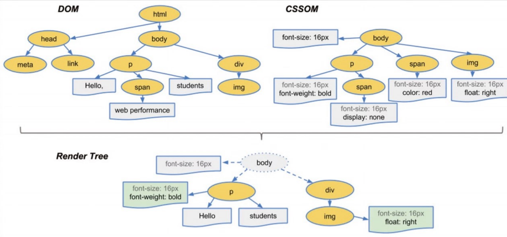
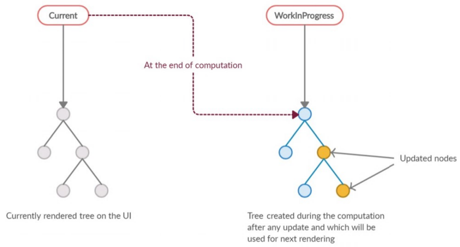
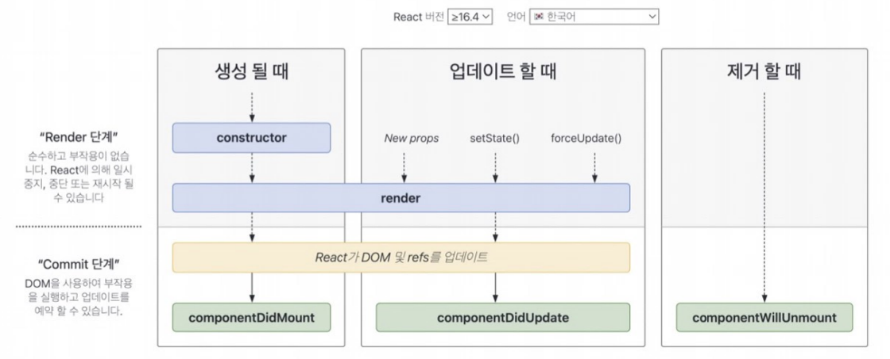
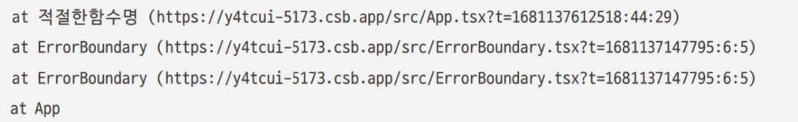

# React 렌더링 과정
- [React 렌더링 과정](#react-렌더링-과정)
  - [React 렌더링 전 알아야 할 개념](#react-렌더링-전-알아야-할-개념)
    - [1. JSX](#1-jsx)
      - [1-1. JSX란?](#1-1-jsx란)
      - [1-2. JSX의 구성](#1-2-jsx의-구성)
      - [1-3. JSX가 자바스크립트로 변환되는 과정](#1-3-jsx가-자바스크립트로-변환되는-과정)
    - [2. 가상 DOM과 리액트 파이버](#2-가상-dom과-리액트-파이버)
      - [2-1. 브라우저 렌더링 과정](#2-1-브라우저-렌더링-과정)
      - [2-2. 가상 DOM 탄생 배경](#2-2-가상-dom-탄생-배경)
      - [2-3. 가상 DOM을 위한 아키텍처, 리액트 파이버(React Fiber)](#2-3-가상-dom을-위한-아키텍처-리액트-파이버react-fiber)
    - [3. 클래식 컴포넌트와 함수 컴포넌트](#3-클래식-컴포넌트와-함수-컴포넌트)
      - [3-1. 클래식 컴포넌트](#3-1-클래식-컴포넌트)
      - [3-2. 함수 컴포넌트](#3-2-함수-컴포넌트)
      - [3-3. 클래스 컴포넌트와 함수 컴포넌트의 차이](#3-3-클래스-컴포넌트와-함수-컴포넌트의-차이)
  - [React 렌더링 과정](#react-렌더링-과정-1)

## React 렌더링 전 알아야 할 개념
### 1. JSX
#### 1-1. JSX란?
- 페이스북(현 메타)에서 개발한 구문
- XML과 유사한 내장형 구문
- 자바스크립트 표준의 일부 아님, 리액트에 종속적이지 않음
- 목표 : 다양한 트랜스파일러에서 다양한 속성을 가진 트리 구조를 토큰화해 자바스크립트(ECMAScript)로 변환
  - HTML, XML 등 다른 구문으로도 확장 가능
  - 최대한 간결하고 친숙하게 작성할 수 있도록 설계

#### 1-2. JSX의 구성
**JSXElement**
- JSX를 구성하는 가장 기본 요소
- HTML의 요소와 비슷한 역할
- JSXElement가 되기 위한 조건 (3개 중 하나의 형태)
  - JSXOpeningElement - JSXClosingElement : `<JSXElement></JSXElement>`, 시작요소와 종료요소가 같은 단계에 선언
  - JSXSelfClosingElement : `<JSXElement/>`, 요소가 시작되고 스스로 종료(내부적으로 자식 포함 못 함)
  - JSXFragment : `<></>`, 아무런 요소가 없는 형태(</>는 불가능)
- 리액트에서 HTML 구문 이외에 사용자가 컴포넌트를 만들어 사용할 때는 **반드시 대문자**로 시작해야함 -> HTML-사용자 태그명을 구분 짓기 위해 
- JSXElementName : JSXElement의 요소 이름으로 쓸 수 있는 것
  - JSXIdentifier : JSX 내부에서 사용할 수 있는 식별자 ($, _, 나머지 특수 문자와 숫자는 시작 불가)
  - JSXNamespacedName : 콜론(:)을 이용해 서로 다른 식별자 이어줄 수 있음 (두 개 이상 불가)
  - JSXMemberExpression : 점(.)을 이용해 서로 다른 식별자 이어줄 수 있음 (:와 함께 사용 불가)

**JSXAttributes**
- JSXElement에 부여할 수 있는 속성
- 필수 아님
- JSXSpreadAttributes : `{...AssignmentExpression}`, 자바스크립트의 전개 연산자와 동일한 역할
- JSXAttribute : `<foo.bar foo:bar="O"></foo.bar>`, 속성을 나타내는 키-값 ("", '', {}, JSXElement, JSXFragment)

**JSXChildren**
- JSXElement의 자식 값
- JSXChild : JSXChildren을 이루는 기본 단위, 0개 이상 가질 수 있음
  - JSXText({,<,>,} 제외한 문자열), JSXElement, JSXFragment, {JSXChildExpressin (optional)}
  
**JSXStrings**
- " ", ' ', JSXText
- HTML과 JSX 사이에 복사/붙여넣기를 쉽게 하기 위함
  - \는 자바스크립트에서 특수문자를 처리할 때 사용되어 `\`를 표현하려면 `\\`로 이스케이프해야 함

#### 1-3. JSX가 자바스크립트로 변환되는 과정
@babel/plugin-trasform-react-jsx 플러그인
- 리액트 17, 바벨 7.9.0 이후 버전은 자동 런타임으로 트랜스파일 가능
- JSXElement를 첫 번째 인수로 선언해 요소를 정의하고, 나머지 구성요소는 이후 인수로 넘겨주어 처리
- JSX 반환값은 React.createElement로 귀결됨

### 2. 가상 DOM과 리액트 파이버
#### 2-1. 브라우저 렌더링 과정
① 브라우저가 사용자가 요청한 주소를 방문해 HTML 파일 다운로드  
② 브라우저 렌더링 엔진은 HTML을 파싱해 DOM 노드로 구성된 트리(DOM) 생성  
    ②-1. 위 과정에서 CSS 파일 만나면 해당 CSS 파일 다운로드  
    ②-2. 브라우저 렌더링 엔진은 CSS 파싱해 CSS 노드로 구성된 트리(CSSOM) 생성  
③ DOM과 CSSOM을 결합해 Render Tree 생성(눈에 보이는 노드만)  
④ 각 노드에 대한 CSS 스타일 정보 적용
    ④-1. 레이아웃 : 각 노드가 브라우저 화면의 어느 좌표에 나타나야 하는 지 계산
    ④-2. 페인팅 : 레이아웃 단계를 거친 노드에 색상과 같은 스타일 적용. 노드가 레이어로 분리되었다면 이후 합성 과정 거침  

#### 2-2. 가상 DOM 탄생 배경
웹페이지를 렌더링하는 과정은 매우 복잡하고 많은 비용이 드는데, 리플로우와 리페인팅 외에도 사용자와의 상호작용을 늘리거나 라우팅이 변경될 경우 DOM의 모든 변경 사항을 추적하는데에 많은 시간과 비용이 듦

가상 DOM : 값을 가지고 있는 UI(Value UI)
- 웹페이지가 표시해야 할 DOM을 일단 메모리에 저장하고 리액트가 실제 변경에 대한 준비가 완료되었을 때 실제 DOM에 반영

#### 2-3. 가상 DOM을 위한 아키텍처, 리액트 파이버(React Fiber)
**리액트 파이버(React Fiber)**
- 리액트에서 관리하는 자바스크립트 객체
    - 하나의 element에 하나 생성(1:1 관계)
        

            
tag : 1:1로 매칭된 정보 가지고 있음

            

            
- FunctionComponent     
            - ClassComponent 
            - IndeterminateComponent 
            - HostRoot / HostPotal / HostComponent (웹 div와 같은 요소) / HostText 
            - Fragment 
            - Mode 
            - ContextConsumer / ContextProvider 
            - ForwardRef 
            - Profiler 
            - SuspenseComponent / SuspenseListComponent 
            - MemoComponent /SimpleMemoComponent 
            - LazyComponent 
            - IncompleteClassComponent 
            - DehydratedFragment 
            - ScopeComponent 
            - OffscreenComponent 
            - LegacyHiddenComponent 
            - CacheComponent 
            - TracingMarkerComponent

            

        

- 가상 DOM을을 관리하는 라이브러리
  - 가상 DOM과 실제 DOM을 비교해 변경 사항 수집
      - 차이가 있다면 변경에 관련된 정보를 가진 파이버를 기준으로 화면에 렌더링 요청
      - 바로 처리하거나 스케줄링 => 유연한 처리
- 파이버 재조정자(fiber reconciler)가 관리
- 실행 시점 : state 변경, 생명주기 메서드 실행, DOM의 변경 필요 등

**파이버의 구현**  
- 파이버는 하나의 작업 단위로 구성
- 렌더 단계에서 작업을 여러 단위로 분할하고 쪼갠 다음 우선순위 매김(비동기)
  - 이러한 작업은 일시 중지하고 나중에 다시 시작하거나 전에 했던 작업을 재사용, 필요하지 않은 경우 폐기 가능
  - 작업 단위를 하나씩 처리하고 finishedWork()로 마무리
- 커밋 단계에서 commitWork()가 실행되어 DOM에 실제 변경 사항을 반영(동기)
- 컴포넌트가 최초로 마운트되는 시점에 생성되어 이후에는 가급적 재사용
    

    
리액트 내부 코드에 작성되어 있는 파이버 객체(리액트 18.2.0 기준)

    

    <pre><code>
    function FiberNode(tag, pendingProps, key, mode) {
        // Instance
        this.tag = tag
        this.key = key
        this.elementType = null
        this.type = null
        this.stateNode = null  // 파이버 자체에 대한 참조 정보(이 참조를 바탕으로 리액트는 파이버와 관련된 상태에 접근)

        // Fiber
        this.return = nul1
        this.child = null     // 하나의 child만 존재
        this.sibling = null   // 나머지는 형제로 구성
        this.index = 0        // 여러 형제들 중 자신의 위치
        this.ref = null
        this.refCleanup = null
        this.pendingProps = pendingProps  // 아직 작업을 처리하지 못한 props
        this.memoizedProps = null  // 렌더링 완료 후 pendingProps를 저장 및 관리
        this.updateQueue = null    // 상태 업데이트, 콜백 함수, DOM 업데이트 등 필요한 작업 담아두는 큐
        this.memoizedState = null  // 함수 컴포넌트의 훅 목록
        this.dependencies = null
        this.mode = mode

        // Effects
        this.flags = NoFlags
        this.subtreeFlags = NoFlags
        this.deletions = null
        this.lanes = NoLanes
        this.childLanes = NoLanes
        this.alternate = null      // 반대편 트리 파이버

        // 이하프로파일러,__DEV__ 코드 생략
    }
    </code></pre>
    

    

**파이버 트리**  
① 현재 모습을 담은 파이버 트리  
② 작업 중인 상태를 나타내는 workInProgress 트리  

**더블 버퍼링** : 리액트가 파이버의 작업이 끝나면 단순히 포인터만 변경해 workInProgress 트리를 현재 트리로 바꿔버리는 기술
  - 불완전한 트리를 보여주지 않기 위해 사용
  - 커밋 단계에서 수행
    - 현재 UI 렌더링을 위해 존재하는 트리인 current를 기준으로 모든 작업 시작 
    - 만약 업데이트 발생하면 새로 받은 데이터로 새로운 workInProgress 트리 빌드
    - 빌드 작업이 끝나면 다음 렌더링에 이 트리 사용
    - 최종적으로 UI에 렌더링되어 반영이 완료되면 current로 변경됨

**파이버의 작업 순서**
- 루트 노드부터 beginWork() 함수를 실행해 파이버 작업 수행(트리 형식으로 더 이상 자식이 없는 파이버를 만날 때까지)
- 자식이 없다면 해당 노드에서 completeWork() 함수 실행해 파이버 작업 완료
- 형제가 있다면 형제로 넘어감
- 형제 노드도 작업이 완료되었다면 return으로 돌아가 자신의 작업이 완료됐음을 알림
  
### 3. 클래식 컴포넌트와 함수 컴포넌트
#### 3-1. 클래식 컴포넌트
- 구조 : class 컴포넌트 extends 만들고 싶은 컴포넌트(React.Component, React.PureComponent)
- 컴포넌트의 일부 구성 요소
  - constructor() : 생성자 함수
    - 컴포넌트 내부에 있다면 컴포넌트가 초기화되는 시점에 호출
        

        

        constructor 없이 state 초기화 가능   
        - ES2022에 클래스 필드(class fields) 추가 : 별도의 초기화 과정 없이 클래스 내부에 필드를 선언할 수 있게 도와줌 
        - ES2022 환경을 지원하는 브라우저에서만 코드 제공 또는 @babel/plugin-proposal-class-properties 사용해 트랜스파일 거쳐야 함
        

        

    - super() : 컴포넌트를 만들면서 상속받은 상위 컴포넌트, 즉 extends 다음 컴포넌트의 생성자 함수를 먼저 호출해 상위 컴포넌트에 접근할 수 있게 도와줌
  - props : 컴포넌트에 특정 속성 전달하는 용도
  - state : 클래스 컴포넌트 내부에서 관리하는 값
    - 항상 객체여야 함
    - 값에 변화가 있을 때마다 리렌더링 발생
  - 메서드 : 렌더링 함수 내부에서 사용되는 함수, 보통 DOM에서 발생하는 이벤트와 함께 사용됨
    - constructor에서 this 바인드 : 일반적인 함수로 메서드를 만들면 this는 전역 객체가 바인딩되어 undefined가 나옴. 따라서 생성된 함수에 bind를 활용해 강제로 this 바인딩 (예시 this.handleClick = this.handleClick.bind(this))
    - 화살표 함수 사용 : 작성 시점에 this가 상위 스코프로 결정되는 화살표 함수 사용
    - 렌더링 함수 내부에서 함수를 새롭게 만들어 전달 : 매번 렌더링 일어날 때마다 새로운 함수를 생성해 할당하므로 최적화 수행 어려움(지양)

**클래스 컴포넌트의 생명주기 메서드**
- 생명주기 메서드가 실행되는 시점
  - **마운트(mount)** : 컴포넌트가 생성되는 시점
  - **업데이트(update)** : 이미 생성된 컴포넌트의 내용이 변경되는 시점
  - **언마운트(unmount)** : 컴포넌트가 더 이상 존재하지 않는 시점
  
- 생명주기 메서드
  - render()
    - 컴포넌트가 UI를 렌더링하기 위한 함수
    - 클래스 컴포넌트의 유일한 필수 값
    - 마운트와 업데이트 과정에서 일어남
    - 항상 순수해야 하며 부수 효과가 없어야 함 (같은 입력값이 들어가면 같은 결과물 반환해야 함)
      - render() 내부에서 state 직접 업데이트하면 안 됨 -> this.state X
      - 최대한 간결 & 깔끔한 코드 작성 유지
  
  - componentDidMount()
    - 컴포넌트가 마운트되고 준비되는 즉시 실행
    - 내부에서 this.setState()로 state 값 변경 가능 -> state 변경 즉시 다시 렌더링
      - 일반적으로 state는 생성자에서 다루는 게 좋음
      - state 값 변경을 허용하는 것은 생성자 함수에서 할 수 없거나 API 호출 후 업데이트, DOM에 의존적인 작업(이벤트 리스너 추가 등) 등을 위함
    - 성능 문제 일으킬 수 있어 꼭 해당 메서드에서 할 수 밖에 없는 작업인지 확인해보고 사용해야 함
  
  - componentDidUpdate()
    - 컴포넌트가 업데이트된 이후 바로 실행
    - state나 props의 변화에 따라 DOM을 업데이트하는 등에 쓰임
    - this.setState를 사용할 수 있으나 적절한 조건문으로 감싸지 않 으면 계속 호출되어 성능상 안 좋음
  
  - componentWillUnmount()
    - 컴포넌트가 언마운트되거나 더 이상 사용되지 않기 직전에 호출
    - 메모리 누수나 불필요한 작동을 막기 위한 클린업 함수를 호출하기 위한 최적의 위치
      - 이벤트를 지우거나 API 호출 취소, setInterval, setTimeout으로 생성된 타이머 지우는 등의 작업에 유용
    - this.setState 호출 불가
  
  - shouldComponentUpdate()
    - state나 props의 변경으로 컴포넌트가 리렌더링되는 것을 막고 싶을 때
      - 컴포넌트에 영향을 받지 않는 변화
    - 특정한 성능 최적화 상황에서만 고려
    - **Component와 PureComponent와의 차이**
      - Component는 해당 값이 변경될 때마다 렌더링 발생
      - PureComponent는 해당 값에 대해 얕은 비교를 수행해 결과가 다를 때만 렌더링 수행
        - 객체와 같이 복잡한 구조의 데이터 변경은 감지 못 함
        - 얕은 비교를 했을 때 일치하지 않은 경우가 많다면 비교 무의미

  - static getDerivedStateFromProps()
    - 다음에 올 props를 바탕으로 현재의 state를 변경하고 싶을 때 
    - render() 호출하기 직전에 호출
    - 사라진 componentWillReceiveProps를 대체하는 메서드
    - static으로 선언되어 this에 접근 불가
    - 반환하는 객체가 있다면 해당 객체의 내용이 모두 state로 들어가고, 없다면(null이면) 아무 일도 안 일어남
  
  - getSnapShotBeforeUpdate()
    - DOM에 렌더링되기 전에 윈도우 크기 조절, 스크롤 위치 조절 등 작업 
    - DOM 업데이트되기 직전에 호출
    - componentWillUpdate()를 대체하는 메서드
    - 반환되는 값은 componentDidUpdate로 전달
      - componentDidUpdate에서 제네릭의 3번째 인수로 snapshot을 넣을 수 있으며, 전달받은 값은 snapshot에서 접근 가능
      - snapshot 값이 있다면 스크롤 위치를 재조정해 기존 아이템이 스크롤에서 밀리지 않도록 도와줌
    - 리액트 훅으로 구현되어 있지 않아 필요하다면 반드시 클래스 컴포넌트 사용해야 함
  
    

    

    
에러 상황에서 실행되는 메서드

    

    
- ErrorBoundary(에러 경계 컴포넌트)를 만들기 위한 목적으로 사용됨  
    - 리액트 애플리케이션 전역에서 처리되지 않은 에러를 처리하기 위한 용도  
    - ErrorBoundary의 경계 외부에 있는 에러는 잡을 수 없으며, 여러 개 선언하여 컴포넌트 별 에러 처리를 다르게 적용할 수 있지만 만약 발견하지 못하면 일반적인 자바스크립트 코드처럼 에러는 throw됨  
    - 아직 리액트 훅으로 구현되어 있지 않아 필요하다면 반드시 클래스 컴포넌트 사용해야 함  
     
    getDerivedStateFromError(error: Error)  
    • 자식 컴포넌트에서 에러가 발생했을 때 호출되는 에러 메서드  
    • static 메서드, error(하위 컴포넌트에서 발생한 에러)를 인수로 받음  
    • 반드시 state 값 반환 -> 하위 컴포넌트에서 에러가 발생했을 경우 어떻게 자식 컴포넌트를 렌더링할지 결정하는 용도로 제공되는 메서드이기 때문  
    • 부수 효과(에러 상태에 따른 state를 반환하는 것 이외에 console.error와 같은 모든 작업) 발생 안 됨 -> 렌더링 과정에 호출되는 메서드이기 때문, 부수 효과를 추가해도 에러는 발생하지 않지만 렌더링 과정을 불필요하게 방해함   
    componentDidCatch(error: Error, info: ErrorInfo)  
    • getDerivedStateFromError에서 에러를 잡고 state를 결정한 이후에 실행되는 메서드  
    • 인수(2) : 동일한 error, 정확히 어떤 컴포넌트가 에러를 발생시켰는지 정보를 가지고 있는 info (info의 componentStack은 Function.name 또는 컴포넌트의 displayName을 따르기 때문에 추적을 용이하게 하기 위해선 기명 함수나 displayName을 쓰는 것이 좋음)  
    
    • 부수 효과 수행 가능 -> 커밋 단계에서 실행되기 때문  
    • 개발 모드에서는 에러가 window까지 전파되어 window.eonerror나 window.addEventListener('error', callback) 메서드가 오류를 잡을 수 있지만, 프로덕션 모드에서는 componentDidCatch에서 잡히지 않은 에러만 window까지 전파됨
    

    

    

**클래스 컴포넌트의 한계**
- 데이터의 흐름을 추적하기 어려움
  - 서로 다른 여러 메서드에서 state의 업데이트가 일어날 수 있고, 코드 작성 시 메서드의 순서가 강제되어 있지 않아 state가 어떤 흐름으로 변경되어 렌더링 여부가 달라지는지 판단하기 어려움
- 애플리케이션 내부 로직의 재사용 어려움
  - 컴포넌트 간 중복되는 로직을 재사용하고 싶을 때 고차 컴포넌트나 props가 많아지는 래퍼 지옥(wrapper hell)에 빠져들 수 있음
- 기능이 많아질수록 컴포넌트의 크기 커짐
- 함수에 비해 상대적으로 어려움
- 코드 크기를 최적화하기 어려움(번들링 최적화하기에 불리한 조건)
- 핫 리로딩 하는데 상대적으로 불리함
  - **핫 리로딩(hot reloading)** : 코드에 변경 사항 발생했을 때 앱을 다시 시작하지 않고서도 해당 코드만 업데이트해 변경 사항을 빠르게 적용하는 기법, 개발 단계에서 많이 사용

#### 3-2. 함수 컴포넌트
리액트 16.8 버전 이전에는 단순히 무상태 컴포넌트를 구현하는 데에 사용  
이후 버전에서는 훅이 등장하며 많은 개발자들이 사용

#### 3-3. 클래스 컴포넌트와 함수 컴포넌트의 차이
| | 클래스 컴포넌트 | 함수 컴포넌트 |  
|---|---|---|
| 생명주기 메서드 | O | X |  
| 렌더링된 값 고정 | X | O |

- 생명주기 메서드의 부재
  - 클래스 컴포넌트 (O)
    - render 메서드가 있는 React.Component를 상속받아 구현하는 자바스크립트 클래스
  - 함수 컴포넌트 (X)
    - props를 받아 단순히 리액트 요소만 반환하는 함수
    - `useEffect` : useEffect 컴포넌트의 state를 활용해 동기적으로 부수 효과를 만드는 메커니즘, 생명주기 메서드(componentDidMount, componentDidUpdate, componentWillUnmount) 비슷하게 구현 가능  

- 렌더링된 값의 고정 여부
  - 클래스 컴포넌트 (X)
    - 시간의 흐름에 따라 변화하는 this를 기준으로 렌더링
    - props의 값을 항상 this로부터 가져옴
    - props는 외부에서 변경되지 않는 이상 불변 값이나 this가 가리키는 객체(컴포넌트의 인스턴스의 멤버)는 변경 가능한 값이기 때문에 부모 컴포넌트가 props를 변경해 리렌더링 되었다면 this.props의 값은 바뀌게 됨
  - 함수 컴포넌트 (O)
    - 렌더링이 일어날 때마다 그 순간의 값인 props와 state를 기준으로 렌더링
    - props를 인수로 받아 컴포넌트는 값을 변경할 수 없고 그대로 사용

## React 렌더링 과정