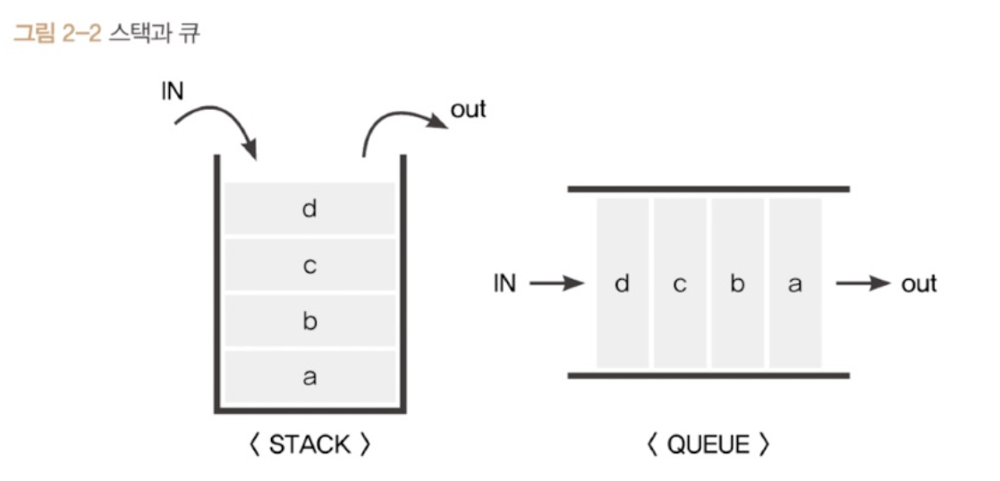

- [코어 자바스크립트](#코어-자바스크립트)
  - [1-5. 불변 객체](#1-5-불변-객체)
    - [1-5-1. 불변 객체를 만드는 간단한 방법](#1-5-1-불변-객체를-만드는-간단한-방법)
      - [(1) 가변 객체와 불변 객체 정의](#1-가변-객체와-불변-객체-정의)
      - [(2) 불변 객체의 필요성](#2-불변-객체의-필요성)
  - [얕은 복사 vs 깊은 복사 비교](#얕은-복사-vs-깊은-복사-비교)
  - [2. 실행 컨텍스트](#2-실행-컨텍스트)
    - [2-1. 실행 컨텍스트란?](#2-1-실행-컨텍스트란)
      - [2-1-1. 실행 컨텍스트와 콜 스택](#2-1-1-실행-컨텍스트와-콜-스택)
      - [2-1-2. 실행 컨텍스트에서 **동일한 환경**이란?](#2-1-2-실행-컨텍스트에서-동일한-환경이란)
      - [2-1-3. 실행 컨텍스트 객체](#2-1-3-실행-컨텍스트-객체)
    - [2-2. VariableEnvironment](#2-2-variableenvironment)
    - [2-3. LexicalEnvironment](#2-3-lexicalenvironment)
      - [2-3-1. environmentRecord와 호이스팅](#2-3-1-environmentrecord와-호이스팅)
      - [(1) 호이스팅 규칙](#1-호이스팅-규칙)
      - [(2) 함수 선언문과 함수 표현식](#2-함수-선언문과-함수-표현식)
      - [2-3-2. 스코프, 스코프 체인, outerEnvironmentReference](#2-3-2-스코프-스코프-체인-outerenvironmentreference)
      - [2-3-3. 지역 변수와 전역 변수](#2-3-3-지역-변수와-전역-변수)
    - [2-4. this](#2-4-this)
    - [2-5. 정리](#2-5-정리)
  - [Q\&A](#qa)
    - [Q1. 자바스크립트에서 호이스팅이 무엇인가요?](#q1-자바스크립트에서-호이스팅이-무엇인가요)
    - [Q2. 함수 선언문과 함수 표현식의 차이점은 무엇인가요?](#q2-함수-선언문과-함수-표현식의-차이점은-무엇인가요)
    - [Q3. 스코프 체인이 무엇이고 어떻게 동작하나요?](#q3-스코프-체인이-무엇이고-어떻게-동작하나요)
    - [Q4.깊은 복사와 얕은 복사의 차이점은 무엇인가요?](#q4깊은-복사와-얕은-복사의-차이점은-무엇인가요)
    - [Q5. Lexical Environment에 대해 설명하세요.](#q5-lexical-environment에-대해-설명하세요)

# 코어 자바스크립트
## 1-5. 불변 객체
### 1-5-1. 불변 객체를 만드는 간단한 방법
#### (1) 가변 객체와 불변 객체 정의
- **가변 객체**
    > **가변 객체 : 객체의 참조는 유지된 상태에서 내부 프로퍼티 값을 변경할 수 있는 객체** <br><br>
    > => 객체의 메모리 참조는 그대로 유지되면서 내부 상태(프로퍼티 값)가 수정될 수 있는 경우

- **불변 객체**
    > **불변 객체 : 객체가 생성된 이후에는 객체의 참조 및 내부 상태가 변경되지 않는 객체** <br><br>
    > => 객체의 값을 수정하려면 새로운 객체를 생성해야 하며, 기존 객체는 변경되지 않음
    - 변경이 필요할 때마다 새로운 객체를 만들어 재할당하거나 자동으로 새로운 객체를 만드는 도구를 활용 => 불변성 확보

#### (2) 불변 객체의 필요성
- 불변 객체는 전달받은 객체에 변형을 가하더라도 원본 객체는 변하지 않아야 할 때 사용

<br>

- **객체의 가변성에 따른 문제점**
  - 예시
    ```JS
    // user 객체 생성
    var user = {
        name: 'Jaenam',
        gender: 'male'
    };

    var changeName = function (user, newName) {
        var newUser = user;
        newUser.name = newName;
        return newUser;
    };

    var user2 = changeName(user, 'Jung');

    if (user !== user2) {
        // user 정보가 변경되면 콘솔 출력
        console.log('유저 정보가 변경되었습니다.');
    }

    console.log(user.name, user2.name); // Jung Jung
    console.log(user === user2); // true

    ```
    - 변경된 내용이 콘솔에 찍히겠지만 참조된 내용이 변경된 것 
    - `참조된 메모리 주소(참조값)가 동일`하기 때문에 변수가 동일하다고 나옴
  - **문제점** 
    - `바뀌기 전의 정보와 바뀐 후의 정보의 차이를 가시적`으로 보여줘야 하는 경우 특정 액션을 해야할 때

<br>

- **객체의 가변성에 따른 문제점의 해결 방법**
1. **함수에서 반환된 값을 새 변수에 할당**
    - 예시 : 함수에서 반환된 값을 새 변수에 할당
        ```JS
        var user = {
            name: 'Jaenam',
            gender: 'male'
        };

        var changeName = function (user, newName) {
            return {
                name: newName,
                gender: user.gender
            };
        };

        var user2 = changeName(user, 'Jung');

        if (user !== user2) {
            console.log('유저 정보가 변경되었습니다.'); // 유저 정보가 변경되었습니다.
        }

        console.log(user.name, user2.name); // Jaenam Jung
        console.log(user === user2); // false

        ```
        - changeName 함수 : 새로운 객체를 반환하도록 수정
        - user, user2가 서로 다른 객체가 되어 변경 전후 비교 가능
    - 문제점 : 변경되지 않는 객체의 `다른 프로퍼티를 하드코딩`으로 입력해야함

<br>

2. **기본 정보를 복사해서 새로운 객체를 반환하는 함수 (얕은 복사)**
    - 예시
        ```JS
        // for in 문법을 통해 result 객체에 target 객체의 프로퍼티들을 복사하는 함수
        var copyObject = function (target) {
            var result = {};
            for (var prop in target) {
                result[prop] = target[prop];
            }
            return result;
        };

        ```
        ```JS
        var user = {
            name: 'Jaenam',
            gender: 'male'
        };

        var user2 = copyObject(user);
        user2.name = 'Jung';

        if (user !== user2) {
            console.log('유저 정보가 변경되었습니다.'); // 유저 정보가 변경되었습니다.
        }

        console.log(user.name, user2.name); // Jaenam Jung
        console.log(user === user2); // false

        ```
        - copyObject 함수를 통해 객체를 복사하고 내용을 수정
    - 문제점 
      - 모든 사람들이 copyObject 함수를 통해 user 객체 내부를 변경해야만 불변 객체가 될 수 있음
      - 누군가 위 규칙을 지키지 않으면 불변 객체가 깨져버림  
      => 시스템적으로 제약을 거는 게 더 안전하여 immutable.js, baobab.js 등의 불변 데이터 타입을 제공하는 라이브러리가 인기

<details>
<summary>
<b>🚫 참고 : 얕은 복사, 깊은 복사</b>
</summary>
- 불변 객체 역시 얕은 복사, 깊은 복사 모두 가능함
## 얕은 복사 vs 깊은 복사 비교

| 구분          | 정의                    | 복사 대상                | 메모리 참조             | 중첩 객체 복사    | 참조값 공유 여부 | 원본 객체 수정 영향           | 복사 방식                                                      |
| ------------- | ----------------------- | ------------------------ | ----------------------- | ----------------- | ---------------- | ----------------------------- | -------------------------------------------------------------- |
| **얕은 복사** | 최상위 값만 복사        | 최상위 값                | 같은 메모리 주소 참조   | ❌ (참조값만 복사) | 공유함           | 중첩 객체 수정 시 원본 수정됨 | `Object.assign()`, `{ ...obj }`                                |
| **깊은 복사** | 중첩 객체까지 모두 복사 | 최상위 값 + 중첩 객체 값 | 새로운 메모리 주소 할당 | ✅ (값까지 복사)   | 공유 안 함       | 원본 객체 영향 없음           | `JSON.parse(JSON.stringify())`, `structuredClone()`, 재귀 함수 |


</details>

<br>

## 2. 실행 컨텍스트
- 실행 컨텍스트 : 실행할 코드에 제공할 환경 정보들을 모아놓은 객체
  - 활성화되는 실행 컨텍스트에 따라 호이스팅, 외부 환경 정보 구성, this 값이 바뀜

### 2-1. 실행 컨텍스트란? 
#### 2-1-1. 실행 컨텍스트와 콜 스택
> - **실행 컨텍스트 : 실행할 코드에 제공할 환경 정보들을 모아놓은 객체** 
>  
>   - **컨텍스트** : 동일한 환경에 있는 코드들을 실행할 때 필요한 환경 정보들을 모아 구성됨

<br>

> - **콜 스택** : 컨텍스트들을 스택 형태로 저장 후 가장 위 컨텍스트와 관련 있는 코드들을 실행하게 됨
>   - 전체 코드의 환경과 순서를 보장함
> <details>
> <summary style="padding-left:32px" ><span style="padding-left:8px">🚫 참고 : 스택과 큐</span></summary>
> <div style="padding-left:32px">
> 
> <ul>
> <li>스택 : 출입구가 하나뿐인 깊은 우물과 같은 데이터 구조</li> 
    > <ul>
    > <li>우물 같은 스택의 구조 상 데이터를 넣은 순서와 반대 순서로 꺼내게 됨</li>
    > <li>크기가 넘어가는 데이터를 넘으면 우물처럼 넘침 => 에러 발생</li>
    > </ul>
> <li>큐 : 한쪽은 입력, 한쪽은 출력만 담당하는 양쪽이 열려 있는 파이프 같은 데이터 구조</li> 
    > <ul>
    > <li>한쪽에서 입력해서 누적되면 그 반대에서 먼저 나가기 때문에 들어온 순서대로 나감</li>
    > </ul>
> </ul>
> </div>
> </details>

<br>

#### 2-1-2. 실행 컨텍스트에서 **동일한 환경**이란?
- 하나의 실행 컨텍스트를 구성할 수 있는 방법
  1. 전역공간
     - 자동으로 생성됨
  2. eval() 함수
     - 악마로 취급됨
  3. `함수` 
     - 개발자가 흔히 실행 컨텍스트를 구성하는 방법
  4. 기타

<br>

- 📌 예제로 알아보기 : 실행 컨텍스트와 콜스택
    ```JS
    // ① 전역 컨텍스트가 콜 스택에 담김  
    var a = 1; // 전역 실행 컨텍스트에 변수 a 등록  

    function outer() {
        function inner() {
            // 호이스팅 발생 → var a가 undefined로 초기화됨
            console.log(a); // undefined  
            var a = 3; // inner 함수의 실행 컨텍스트에서 새로운 변수 a 선언 및 할당  
        }
        inner(); // ➁ inner 함수의 실행 컨텍스트가 콜 스택에 쌓임 → 실행 후 제거  

        console.log(a); // 1  
        // inner 함수의 실행 컨텍스트는 종료되었으므로 outer 함수의 스코프에서 a를 찾아 출력
    }

    outer(); // ➂ outer 함수의 실행 컨텍스트가 콜 스택에 쌓임 → 실행 후 제거  

    console.log(a); // 1  
    // outer 함수의 실행 컨텍스트는 종료되었으므로 전역 컨텍스트에서 변수 a를 찾아 출력


    ```
    

    1. ① 시점에서 전역 컨텍스트가 콜 스택에 담김  
       - 전역 컨텍스트 = 일반적인 실행 컨텍스트와 동일
       - 최상단의 공간은 코드 내부에서 별도의 실행 명령이 없더라도 브라우저에서 자동 실행  
        => 파일이 열리는 순간 `자동으로 전역 컨텍스트 활성화`
       - 전역 컨텍스트 외 다른 덩어리가 없어서 전역 컨텍스트 관련된 코드들을 순차로 진행
    2. ➂ 시점에서 `outer` 함수 호출 => `outer` 함수의 환경 정보를 수집해서 `outer 실행 컨텍스트` 생성하여 콜 스택에 담음 
       - 콜 스택의 맨 위에 `outer` 실행 컨텍스트가 오면 전역 컨텍스트와 관련된 코드의 실행을 일시 중단
       - `outer 실행 컨텍스트`와 관련된 코드 (`outer` 함수 내부 코드) 순차 실행
    3. ➁ 시점에서 `inner` 함수의 실행 컨텍스트가 콜 스택의 가장 위에 담김
       - `outer 컨텍스트` 관련 코드 실행 중단 => `inner` 함수 내부의 코드 순차 진행

    <br>

    - **구조적 특징**
      - 콜 스택의 맨 위에 쌓이는 순간 = 현재 실행할 코드에 관여하게 되는 시점
        - 기존 컨텍스트는 새로 쌓인 컨텍스트보다 아래에 위치할 수 밖에 없음

<br>

#### 2-1-3. 실행 컨텍스트 객체
- 특정 실행 컨텍스트가 활성화될 때 자바스크립트 엔진이 관련된 코드들을 실행에 필요한 환경 정보들을 수집해서 `실행 컨텍스트 객체`에 저장
- 담기는 정보
  
  1. VariableEnvironment : 현재 컨텍스트 내의 식별자들에 대한 정보 + 외부 환경 정보, 선언 시점의 LexicalEnvironment의 스냅샷, `변경 사항 미반영`
  2. LexicalEnvironment : 처음에는 VariableEnvironment와 같지만 변경사항이 실시간으로 반영됨
  3. ThisBinding: this 식별자가 바라봐야 할 대상 객체

### 2-2. VariableEnvironment
- VariableEnvironment VS LexicalEnvironment
  - 공통점 : 동일한 내용을 담음 
    - 구성 요소
      - environmentRecord
      - outer-EnvironmentReference
  - 차이점 : VariableEnvironment은 최초 실행 시의 스냅샷을 유지함

<br>

- 실행 컨텍스트 생성 순서
  - VariableEnvironment 정보를 담음
  - 이를 복사해 LexicalEnvironment를 만듦
  - 이후 LexicalEnvironment를 위주로 활용

### 2-3. LexicalEnvironment
- LexicalEnvironment 
  - 어휘적 환경, 정적 환경, 사전적 환경 등 다양하게 번역됨
  - 사전적 환경 : 현재 컨텍스트를 구성하는 환경 정보들을 사전에서 접하는 느낌으로 모아놓은 것

#### 2-3-1. environmentRecord와 호이스팅 
> **environmentRecord : 현재 컨텍스트와 관련된 코드의 식별자 정보들이 저장됨**
- **식별자 정보** : 컨텍스트를 구성하는 함수에 지정된 매개변수 식별자, 선안한 함수, var로 선언된 변수의 식별자 등
- 컨텍스트 내부 전체를 처음부터 끝까지 훑으며 `순서대로` 수집
- 실행 컨텍스트가 관여할 코드들은 실행되기 전 변수 정보 수집을 모두 마침 
  - 엔진의 실제 동작 방식 대신 `자바스크립트 엔진이 식별자들을 최상단으로 끌어올려놓은 다음 실제 코드를 실행` => 호이스팅 개념 등장

<br>

<details>
<summary style="margin-left:32px"><span style="margin-left:8px">🚫 참고 : 전역 실행 컨텍스트는 변수 객체를 생성하는 대신 자바스크립트 구동 환경이 별도로 제공하는 객체인 <code>전역 객체를 활용</code> </span></summary>
<ul>
<li>전역 객체 : 브라우저 - <code>window</code>, 노드 - <code>global</code></li>
<li>자바스크립트 내장 객체가 아닌 <code>호스트 객체</code></li>
</ul>
</details>

  
#### (1) 호이스팅 규칙
> **호이스팅 (hoisting) : 자바스크립트 엔진이 식별자들을 최상담으로 끌어올린 다음 실제 코드를 실행하는 것**
> - 자바스크립트 엔진이 실제로 식별자의 정보를 최상단으로 끌어올리지는 않지만 변수 정보를 수집하는 과정을 쉽게 이해하기 위한 `가상의 개념`

- 📌 예제로 알아보기 : 매개변수와 변수에 대한 호이스팅 1
  1. 원본 코드
    ```JS
    function a(x) { // 수집 대상 1 (매개변수)
        console.log(x); // (1)
        var x; // 수집 대상 2 (변수 선언)
        console.log(x); // (2)
        var x = 2; // 수집 대상 3 (변수 선언)    
        console.log(x); // (3)
    }

    a(1);

    ```
     - 호이스팅이 되지 않았을 때 예상 값
       (1) 1
       (2) undefined
       (3) 2

  <br>

  1. 매개변수를 변수 선언 / 할당과 같다고 간주해서 변환한 상태
    ```JS
    function a(x) { 
        var x = 1; // 수집 대상 1 (매개변수)
        console.log(x); // (1)
        var x; // 수집 대상 2 (변수 선언)
        console.log(x); // (2)
        var x = 2; // 수집 대상 3 (변수 선언)    
        console.log(x); // (3)
    }

    a();
    ```
    - 호이스팅 처리 : 실행될 컨텍스트의 대상 코드 내 어떤 식별자들이 있는지만 포커스, 값 할당은 신경 X
        - 변수명만 끌어올리고 할당 과정은 그자리에 남겨둠

  3. 호이스팅을 마친 상태
    ```JS
    function a() {
        var x; // 수집 대상 1의 변수 선언 부분
        var x; // 수집 대상 2의 변수 선언 부분
        var x; // 수집 대상 3의 변수 선언 부분
        
        x = 1; // 수집 대상 1의 할당 부분
        console.log(x); // (1)
        
        console.log(x); // (2)
        
        x = 2; // 수집 대상 3의 할당 부분
        console.log(x); // (3)
    }

    a(1);

    ```
    - 코드 실행
    1. 변수 x에 대한 선언하고 메모리 공간을 확보한 후 주소값과 변수 x 연결
    2. 다시 변수 x를 선언하지만 이미 선언된 변수 x가 있어 무시됨
    3. x에 1 할당 => 숫자 1을 메모리에 담고 x와 연결된 메모리 공간에 숫자 1을 가리키는 주솟값을 입력
    4. 두번 출력됨
    5. x에 2 할당 => 숫자 2를 메모리에 담고 x와 연결된 메모리 공간을 숫자 2을 가리키는 주솟값으로 대치
    6. 연결된 메모리의 주솟값인 2를 출력되고 모든 코드가 실행되어 실행 컨텍스트가 콜 스택에서 제거됨

    ```JS
    // 출력 결과
    1 // (1)
    1 // (2)
    2 // (3)
    ```

<br>

- 📌 예제로 알아보기 : 매개변수와 변수에 대한 호이스팅 2
  1. 원본 코드
    ```JS
    function a() {
        console.log(b); // (1)
        var b = 'bbb'; // 수집 대상 1(변수 선언)
        console.log(b); // (2)
        
        function b() { } // 수집 대상 2(함수 선언)
        console.log(b); // (3)
    }

    a();


    ```
    - 호이스팅이 되지 않았을 때 예상 값
        (1) b의 값이 없어 에러 발생 or undefined
        (2) 'bbb'
        (3) b 함수

    2. 호이스팅을 마친 상태
        ```JS
        function a() {
            var b; // 수집 대상 1. 변수는 선언부만 끌어올립니다.
            
            function b() { } // 수집 대상 2. 함수 선언은 전체를 끌어올립니다.
            
            console.log(b); // (1)
            
            b = 'bbb'; // 변수의 할당부는 원래 자리에 남겨둡니다.
            console.log(b); // (2)
            console.log(b); // (3)
        }

        a();

        ```
        1. a 함수 실행 시 실행 컨텍스트 생성
        2. 변수명과 함수 선언의 정보가 호이스팅됨 
            - 변수는 선언부와 할당부를 나누어 선언부만 호이스팅, 함수 선언은 함수 전체 호이스팅
   
   3. 함수 선언문을 함수 표현식으로 바꾼 코드 
        - 호이스팅 이후에는 함수 선언문을 함수명으로 선언한 변수에 함수를 할당한 것처럼 여길 수 있음

        ```JS
        function a() {
            var b;
            var b = function b() { } // - 바뀐 부분
            
            console.log(b); // (1)
            
            b = 'bbb';
            
            console.log(b); // (2)
            console.log(b); // (3)
        }

        a();

        ```
        - 내부 코드 실행
        1. 변수 b 선언한 후 메모리 공간 확보하고 주소값을 변수 b와 연결
        2. b 재선언 후 함수 b를 변수 b에 할당하는 코드지만 이미 선언된 변수 b가 있기에 선언 과정 무시
            - 대신 함수는 별도의 메모리에 담기고 저장된 주솟값을 b와 연결하여 변수 b가 대치됨
        3. 변수 b에 할당된 함수 b 출력
        4. 변수 b에 'bbb' 할당, b와 연결된 메모리 공간에 'bbb'가 담긴 주솟값으로 대치 
        5. (2), (3) 모두 'bbb'가 출력되고 모든 함수 내부의 코드가 실행됐기 때문에 실행 컨텍스트가 콜 스택에서 제거됨

        ```JS
        // 출력 결과
        b함수 // (1)
        'bbb' // (2)
        'bbb' // (3)
        ```
        
#### (2) 함수 선언문과 함수 표현식
> **함수 선언문 : function 정의부만 존재하고 별도의 할당 명령이 없는 함수**  
> - 반드시 함수명이 정의되어야 함  

> **함수 표현식 : 정의한 function을 별도의 변수에 할당하는 함수** 
> - 함수명이 필수가 아님
>   - 기명 함수 표현식 : 함수명을 정의한 함수 표현식
>   - 익명 함수 표현식 : 함수명을 정의하지 않은 표현식

- 예제 : 함수를 정의하는 세가지 방식
    ```JS
    function a() { /* */ } // 함수 선언문. 함수명 a가 곧 변수명.
    a(); // 실행 OK.

    var b = function() { /* */ } // (익명) 함수 표현식. 변수명 b가 곧 함수명.
    b(); // 실행 OK.

    var c = function d() { /* */ } // 기명 함수 표현식. 변수명은 c, 함수명은 d.
    c(); // 실행 OK.
    d(); // 에러!

    ```

<details>
<summary style="margin-left:32px">🚫 참고 : 기명 함수 표현식의 주의점</summary>
<ul>
    <li> 
    <code>기명 함수 표현식</code>의 경우 <code>외부에서 함수명으로 함수를 호출할 수 없음</code>
    </li>
        <ul>
        <li>함수명은 오직 함수 내부에서만 접근</li>
        </ul> 
    <li> 
    기명 함수 표현식에서 함수명 용도
    </li>
        <ul>
        <li> 
        <code>디버깅</code> 시 어떤 함수인지를 추적하기에 익명 함수 표현식보다 유리
        </li>
        </ul>
    <li>c 함수 내부에서는 c(), d() 모두 가능</li>
</ul>
</details>

<br>

- 📌 예제로 알아보기 : 함수 선언문과 표현식
  1. 원본 코드 
    ```JS
    console.log(sum(1, 2)); 
    console.log(multiply(3, 4)); 

    function sum(a, b) { // 함수 선언문 sum
        return a + b;
    }

    var multiply = function (a, b) { // 함수 표현식 multiply
        return a * b;
    }

    ```
  2. 호이스팅을 마친 상태
    ```JS
    var sum = function sum(a, b) { // 함수 선언문은 전체를 호이스팅합니다.
        return a + b;
    };

    var multiply; // 변수는 선언부만 끌어올립니다.

    console.log(sum(1, 2));
    console.log(multiply(3, 4));

    multiply = function (a, b) { // 변수의 할당부는 원래 자리에 남겨둡니다.
        return a * b;
    };

    ```
    - 함수 선언문은 `전체`를 호이스팅함 
    - 함수 표현식은 변수 `선언부`만 호이스팅함
      - 함수를 다른 변수에 값으로써 `할당` => 하나의 값으로 취급

    <br>

    - 내부 코드 실행
    1. 메모리 공간을 확보 후 변수 sum에 주솟값을 연결
    2. 다른 메모리 공간 확보 후 그 공간의 주솟값에 multiply 변수 연결
    3. sum 함수를 또 다른 메모리 공간에 저장하고 주솟값을 앞서 선언한 변수 sum 공간에 할당
    4. sum 실행 => 정상적으로 실행되어 3이 나옴
    5. multiply에는 값이 할당되지 않아 비어 있는 대상을 함수로 여기게 됨 => `multiply is not a function` 에러 발생 => 런타임 종료

<br>

- 📌 예제로 알아보기 : 함수 선언문의 위험성
  - ... 기준으로 한참 뒤에 코드가 작성된 것을 가정
    ```JS
    ...
    console.log(sum(3, 4));

    ...

    function sum(x, y) {
        return x + y;
    }

    ...

    var a = sum(1, 2);

    ...

    function sum(x, y) {
        return x + ' + ' + y + ' = ' + (x + y);
    }

    ...

    var c = sum(1, 2);
    console.log(c);


    ```
    - 전역 컨텍스트가 활성화될 때 전역공간에 선언된 함수들이 모두 가장 상단으로 호이스팅됨
    - 동일한 변수명에 서로 다른 값을 할당할 경우 나중에 할당한 값이 먼저 할당한 값을 덮어씌움 (override)
    - 코드를 실행하는 중 실제로 호출되는 함수는 오직 마지막 할당한 함수 => 맨 마지막에 선언된 함수
    > 함수 선언식 특성 상 동일한 이름의 함수 전체가 호이스팅됐고 동일한 이름의 함수 중 `가장 마지막 함수 내용으로 전체가 적용`되어버림 (이미 상단에 전체가 끌어올려졌기 때문)  
    >
    > => `함수 표현식`으로 정의한 경우 함수를 선언한 코드 이후부터 반영

<br>

- 📌 예제로 알아보기 : 함수 표현식의 상대적 안전성
  - ... 기준으로 한참 뒤에 코드가 작성된 것을 가정
  
    ```JS
    ...
    console.log(sum(3, 4)); // Uncaught TypeError: sum is not a function
    ...

    var sum = function(x, y) {
        return x + y;
    };
    ...

    var a = sum(1, 2);
    ...

    var sum = function(x, y) {
        return x + ' + ' + y + ' = ' + (x + y);
    };
    ...

    var c = sum(1, 2);
    console.log(c);

    ```
    - 함수 표현식의 경우 함수를 선언한 코드에 도달하지 않았는데 호출하는 경우 에러가 남 => 디버깅 용이
    - 원활한 협업을 위해 전역공간에 함수를 선언하거나 동명의 함수를 중복 선언하지 않아야 함

#### 2-3-2. 스코프, 스코프 체인, outerEnvironmentReference
> **스코프 : 식별자에 대한 유효범위**
> - 경계 외부에서 선언한 변수는 경계 내부에서도 접근 가능하지만, 경계 내부에서 선언한 변수는 오직 내부에서만 접근 가능
- ES5까지의 자바스크립트는 전역 공간을 제외하면 `오직 함수에 의해서만 스코프가 생성됨`

<br>

> **스코프 체인 : 식별자의 유효범위를 안에서부터 바깥으로 차례대로 검색해나가는 것**
> - LexicalEnvironment의 두번째 수집자료인 outerEnvironmentReference로 인해 가능
- outerEnvironmentReference는 `현재 호출된 함수가 선언될 당시`의 LexicalEnvironment를 참조
  - 선언한다는 것은 콜 스택 상에서 당시 특정 실행 컨텍스트가 활성화된 상태
  - outerEnvironmentReference는 연결 리스트 형태를 띄며 선언된 시점의 LexicalEnvironment를 계속 찾아 올라가면서 전역 컨텍스트의 LexicalEnvironment까지 확인 가능
    - 현재 실행된 함수가 선언되어 있는 외부 환경을 참조하게 됨
    - 가장 가까운 요소부터 외부로 연결된 순서대로 접근할 수 있고 다른 순서로 접근은 불가능

<br>

- 📌 예제로 알아보기 : 스코프 체인
    ```JS
    var a = 1;

    var outer = function() {
        var inner = function() {
            console.log(a);
            var a = 3;
        };
        
        inner();
        console.log(a);
    };

    outer();
    console.log(a);

    ```
    1. 전역 컨텍스트가 활성화되고 전역 컨텍스트의 environmentRecord에 {a, outer} 식별자 저장
        - 전역 컨텍스트는 선언 시점이 없기 때문에 outerEnvironmentReference에는 아무것도 담기지 않음
        - this: 전역 객체
    2. 변수 a = 1, outer에 함수 할당
    3. outer 함수 호출, 전역 컨텍스트의 코드는 2번에서 임시 중단되고 outer 함수의 실행 컨텍스트가 활성화됨
    4. outer 함수의 실행 컨텍스트의 environmentRecord에 { inner } 식별자를 저장
        - outerEnvironmentReference에는 outer 함수가 선언될 당시의 LexicalEnvironment가 담김
        - outer 함수는 전역 공간에서 선언됐기 때문에 전역 컨텍스트의 LexicalEnvironment를 참조 복사하며 [GLOBAL, { a, outer }]라고 표기
          - GLOBAL : 실행 컨텍스트 이름, { a, outer } : environmentRecord 객체, this : 전역 객체
    5. outer 스코프에 있는 변수 inner에 함수를 할당
    6. inner 함수 호출 => outer 실행 컨텍스트는 임시 중단, inner 실행 컨텍스트 활성화 
    7. inner 실행 컨텍스트의 environmentRecord에 {a} 식별자 저장
        - outerEnvironmentReference에는 inner 함수가 선언될 당시 LexicalEnvironment가 담김
        - inner 함수는 outer 함수 내부에 선언됐기 때문에 outer 함수의 LexicalEnvironment를 참조 => [outer, {inner}]를 참조 복사, this : 전역 객체
    8. 식별자 a에게 접근 => 활성화된 inner 컨텍스트의 environmentRecord에서 a를 검색하지만 아직 할당된 값이 없음
       - undefined 출력
    9. inner 스코프에 있는 변수 a에 3 할당
    10. inner 함수 실행이 종료되고 inner 실행 컨텍스트가 콜 스택에서 제거되고 다시 outer 실행 컨텍스트가 활성화되고 중단했던 코드 다음으로 이동
    11. 식별자 a에 접근하며 자바스크립트 엔진이 활성화된 실행 컨텍스트의 LexicalEnvironment에 접근하며 첫 요소의 environmentRecord에 a를 찾아보고 없으면 outerEnvironmentReference를 찾고 거기서도 못 찾으면 그 안 environmentRecord에서 찾고 없으면 outerEnvironmentReference를 찾는 식으로 거슬러 올라가면서 찾음
        - 예제에서는 전역 LexicalEnvironment에서 확인하고 1을 출력하게 됨
    12. outer 함수 실행이 종료되고 outer 실행 컨텍스트가 콜 스택에서 제거됨 => 바로 아래의 전역 컨텍스트가 다시 활성화되고 중단했던 코드의 다음으로 이동
    13. 식별자 a에 접근하기 위해 활성화된 전역 컨텍스트의 environmentRecord에서 a 검색하고 1 출력 => 모든 코드 실행이 완료되면서 전역 컨텍스트가 콜 스택에서 제거되고 종료됨

    <br>

    
    - 전체 윤곽을 왼쪽에서 오른쪽으로 바라보면 `전역 컨텍스트 outer 컨텍스트 -> inner 컨텍스트` 순으로 점차 규모가 작아지는 반면 스코프 체인을 타고 접근 가능한 변수의 수는 늘어남

<br> 

> **변수 은닉화 : 스코프 체인 상 있는 변수지만 접근 불가능한 변수**

```JS
var a = 1;

var outer = function() {
    var inner = function() {
        console.log(a);
        var a = 3;
    };
    
    inner();
    console.log(a);
};

outer();
console.log(a);
```

- 식별자 a의 경우 전역 공간, inner 함수 내부에서 선언됨
  - inner 함수 내부에서 a에 접근하려면 무조건 스코프 체인 상 첫번째 인자인 inner 스코프의 LexicalEnvironment부터 검색하게 되고 그 안에 a 식별자가 존재하여 이를 반환 => 전역 공간의 동일한 이름 a 변수에 접근 불가능

<br>

- 🚫 참고 : 상위 스코프 정보 콘솔로 확인하기 
    - 현재 실행 컨텍스트를 제외한 상위 스코프 정보는 함수 내부에서 함수를 출력하여 확인 가능
  
    ```JS
    var a = 1;

    var outer = function() {
        var b = 2;

        var inner = function() {
            console.dir(inner);
        };

        inner();
    };

    outer();

    ```
    
    - 함수 내부에서 실제로 호출할 외부 변수들의 정보만 보여줌

    <br>

    ```JS
    var a = 1;

    var outer = function() {
        var b = 2;

        var inner = function() {
            console.log(b);
            console.dir(inner);
        };

        inner();
    };

    outer();

    ```
    

    <br>

    - 스코프 체인을 디버거로 확인하기
    ```JS
    var a = 1;

    var outer = function() {
        var b = 2;

        var inner = function() {
            console.log(b);
            debugger;
        };

        inner();
    };

    outer();

    ```
    

#### 2-3-3. 지역 변수와 전역 변수 
> **지역 변수 : 함수 내부에서 선언된 변수**
> **전역 변수 : 전역 공간에서 선언한 변수**
- 코드의 안전성을 위해 가급적 전역 변수 사용을 최소화해야 함수

### 2-4. this 
- 실행 컨텍스트의 `thisBinding`에는 this로 지정된 객체가 저장됨
- 실행 컨텍스트 활성화 당시에 this가 지정 안되면 `전역 객체`가 저장됨

### 2-5. 정리 
> **실행 컨텍스트 : 실행할 코드에 제공할 환경 정보들을 모아놓은 객체**
> - 전역 컨텍스트, eval 및 함수 실행에 의한 컨텍스트 등이 있음
> - 실행 컨텍스트 객체는 활성화되는 시점에 `VariableEnvironment`, `LexicalEnvironment`, `ThisBinding` 3가지 정보를 수집
> - 실행 컨텍스트를 생성할 때는 VariableEnvironment와 LexicalEnvironment이 동일한 내용으로 구성됨
>   - LexicalEnvironment 함수는 실행 도중 변경되는 사항이 즉시 반영
>   - VariableEnvironment는 초기 상태 유지

<br>

> **LexicalEnvironment : environmentRecord와 outerEnvironmentReference로 구성**
> - environmentRecord : 매개변수명, 변수의 식별자, 선언한 삼수의 함수명을 수집
>   - 호이스팅 : 코드 해석을 수월하게 하기 위해 environmentRecord의 수집 과정을 추상화 => 실행 컨텍스트가 관여하는 코드 집단의 최상단으로 이들을 끌어올린다고 해석
>       - 변수 선언과 값 할당이 동시에 된 경우 선언부만 호이스팅 
>       - 할당 과정은 원래 자리에서 진행  
>       => 함수 선언문과 표현식의 차이 발생
> - outerEnvironmentReference : 직전 컨텍스트의 LexicalEnvironment를 참조

<br>

> **스코프 : 변수의 유효범위**
> - outerEnvironmentReference는 해당 함수가 선언된 위치의 LexicalEnvironment를 참조
>   - 변수에 접근하기 위해 현재 LexicalEnvironment에서 발견되면 그 값을 반환하고 못할 경우 outerEnvironmentReference에 담긴 LexicalEnvironment를 탐색
>   - 전역 컨텍스트의 LexicalEnvironment까지 탐색해도 변수를 찾지 못하면 undefined를 반환

<br>

> **전역 변수 : 전역 컨텍스트의 LexicalEnvironment에 담긴 변수**
> **지역 변수 : 그 밖의 함수에 의해 생성된 실행 컨텍스트의 변수**

<br>

> **this : 실행 컨텍스트를 활성화하는 당시에 지정된 this가 저장됨**
>   - 함수를 호출하는 방법에 따라 그 값이 달라짐
>   - 지정되지 않은 경우 전역 객체 저장

## Q&A 
### Q1. 자바스크립트에서 호이스팅이 무엇인가요?
A1. **호이스팅(Hoisting)**은 자바스크립트 엔진이 변수와 함수의 선언을 코드의 최상단으로 끌어올리는 것처럼 동작하는 현상입니다. 실제로 코드가 물리적으로 이동하는 것은 아니지만, 자바스크립트 엔진이 실행 컨텍스트를 생성할 때 변수와 함수의 선언 정보를 미리 수집하고 메모리에 저장하기 때문에 이런 현상이 발생합니다.

호이스팅은 변수 선언 방식에 따라 작동 방식이 다릅니다.

var로 선언한 변수는 선언이 호이스팅되며, 초기값은 undefined로 설정됩니다. 따라서 변수 선언 전에 접근하면 undefined가 출력됩니다.

let과 const는 선언만 호이스팅되지만 초기화되지 않기 때문에 선언 전에 접근하면 ReferenceError가 발생합니다. 이것은 TDZ(Temporal Dead Zone) 때문인데, TDZ는 변수 선언이 호이스팅된 시점부터 값이 할당되기 전까지의 구간을 의미합니다. 즉, let과 const는 값이 할당되기 전까지 접근할 수 없습니다.

const는 let과 마찬가지로 TDZ가 발생하지만, 한 번 값이 할당되면 값을 변경할 수 없습니다. 따라서 재할당이 불가능하며, 반드시 선언과 동시에 초기화해야 합니다.

함수의 경우에도 선언 방식에 따라 호이스팅 동작이 다릅니다.

함수 선언문은 함수 자체가 메모리에 저장되기 때문에 선언 전에 함수 호출이 가능합니다.

함수 표현식은 변수 선언만 호이스팅되고 값은 할당되지 않기 때문에 함수가 값으로 할당되기 전에는 호출할 수 없습니다. 따라서 함수 표현식에서 선언 전에 함수를 호출하면 TypeError가 발생합니다.

정리하자면, var는 선언과 초기화가 함께 이루어지기 때문에 undefined로 초기화되지만, let과 const는 선언만 호이스팅되고 값은 초기화되지 않기 때문에 초기화되기 전에는 접근할 수 없습니다. 함수 선언문은 함수 자체가 메모리에 저장되기 때문에 선언 전에 호출할 수 있지만, 함수 표현식은 변수 선언만 호이스팅되기 때문에 값이 할당되기 전에는 호출할 수 없습니다.

### Q2. 함수 선언문과 함수 표현식의 차이점은 무엇인가요?
A2. 함수 선언문은 함수 자체가 호이스팅되기 때문에 함수 선언 이전에도 호출이 가능합니다.
반면 함수 표현식은 변수 선언만 호이스팅되고 값은 할당되지 않기 때문에 선언 전에 호출하면 TypeError가 발생합니다.

### Q3. 스코프 체인이 무엇이고 어떻게 동작하나요?
A3. 스코프 체인이란 식별자를 검색할 때 현재 스코프에서 시작해서 상위 스코프를 따라가며 탐색하는 구조를 의미합니다.

함수가 선언될 당시의 LexicalEnvironment가 저장되며, 함수 호출 시 해당 LexicalEnvironment를 통해 상위 스코프에 접근합니다.

현재 스코프에서 식별자를 찾지 못하면 상위 스코프의 outerEnvironmentReference를 따라가며 전역까지 탐색합니다.

### Q4.깊은 복사와 얕은 복사의 차이점은 무엇인가요?
A4. 얕은 복사는 객체의 참조 값(메모리 주소)만 복사하기 때문에 원본이 수정되면 복사본도 수정됩니다.

깊은 복사는 객체의 모든 값을 새로운 메모리 공간에 복사하기 때문에 원본이 수정되더라도 복사본에는 영향을 미치지 않습니다.

### Q5. Lexical Environment에 대해 설명하세요.
A5. Lexical Environment는 자바스크립트에서 변수나 함수의 식별자와 그 값의 관계를 저장하고 관리하는 환경입니다. 함수나 코드 블록이 실행될 때마다 새로운 Lexical Environment가 생성됩니다.

Lexical Environment는 Environment Record와 Outer Environment Reference로 구성됩니다. Environment Record는 현재 스코프에서 선언된 변수와 함수의 정보를 저장하며, Outer Environment Reference는 상위 스코프의 Lexical Environment를 참조합니다.

자바스크립트는 **정적 스코프(Lexical Scope)**를 따르기 때문에 함수가 선언될 당시의 Lexical Environment가 실행 시점에도 유지됩니다. 함수가 호출될 때는 현재 스코프에서 식별자를 먼저 찾고, 없으면 Outer Environment Reference를 따라 상위 스코프로 이동하며 전역까지 탐색합니다. 이렇게 상위 스코프를 따라가는 구조를 **스코프 체인(Scope Chain)**이라고 합니다.

결론적으로, Lexical Environment는 변수와 함수의 유효 범위를 관리하고, 스코프 체인을 통해 상위 스코프의 변수에 접근할 수 있도록 도와주는 역할을 합니다.