*불변 객체와 실행컨텍스트*

- [Chapter 1. 데이터 타입](#chapter-1-데이터-타입)
  - [1-1. 데이터 타입의 종류](#1-1-데이터-타입의-종류)
  - [1-2. 데이터 타입에 관한 배경지식](#1-2-데이터-타입에-관한-배경지식)
    - [1-2-1. 메모리와 데이터](#1-2-1-메모리와-데이터)
    - [1-2-2. 식별자와 변수](#1-2-2-식별자와-변수)
  - [1-3. 변수 선언과 데이터 할당](#1-3-변수-선언과-데이터-할당)
    - [1-3-1. 기본형](#1-3-1-기본형)
    - [1-3-2. 참조형](#1-3-2-참조형)
  - [1-4. 기본형 데이터와 참조형 데이터](#1-4-기본형-데이터와-참조형-데이터)
    - [1-4-1. 불변값과 가변값](#1-4-1-불변값과-가변값)
    - [1-4-2. 변수 복사 비교](#1-4-2-변수-복사-비교)
  - [1-5. 불변 객체](#1-5-불변-객체)
    - [1-5-1. 얕은 복사와 깊은 복사](#1-5-1-얕은-복사와-깊은-복사)
  - [1-6. undefined와 null](#1-6-undefined와-null)
- [Chapter 2. 실행 컨텍스트](#chapter-2-실행-컨텍스트)
  - [2-1. 실행 컨텍스트란?](#2-1-실행-컨텍스트란)
  - [2-2. VarialbeEnvironment](#2-2-varialbeenvironment)
  - [2-3. LexicalEnvironment](#2-3-lexicalenvironment)
    - [2-3-1. environmentRecord와 호이스팅](#2-3-1-environmentrecord와-호이스팅)
    - [2-3-2. 스코프, 스코프 체인, outerEnvironmentReference](#2-3-2-스코프-스코프-체인-outerenvironmentreference)
  - [2-4. this](#2-4-this)
- [Q\&A](#qa)
  - [1. 함수 선언문과 함수 표현식의 차이점은 무엇인가요?](#1-함수-선언문과-함수-표현식의-차이점은-무엇인가요)
  - [2. 실행 컨텍스트란 무엇이고, 실행 컨텍스트 객체가 활성화되는 시점에 어떤 정보를 수집하는 지 말해보세요.](#2-실행-컨텍스트란-무엇이고-실행-컨텍스트-객체가-활성화되는-시점에-어떤-정보를-수집하는-지-말해보세요)
  - [3. 호이스팅이란 무엇인가요?](#3-호이스팅이란-무엇인가요)
  - [4. 스코프란 무엇이고, 코드 상에서 어떤 변수에 접근하려고 할 때 현재 컨텍스트의 LexicalEnvrionment에서 발견하지 못하면 어떻게 하나요?](#4-스코프란-무엇이고-코드-상에서-어떤-변수에-접근하려고-할-때-현재-컨텍스트의-lexicalenvrionment에서-발견하지-못하면-어떻게-하나요)
  - [5. 안전한 코드 구성을 위해 실행 컨텍스트 내에서 할 수 있는 게 어떤 것이 있나요?](#5-안전한-코드-구성을-위해-실행-컨텍스트-내에서-할-수-있는-게-어떤-것이-있나요)

# Chapter 1. 데이터 타입
> 목표 : 기본형 타입과 참조형 타입이 서로 다르게 동작하는 이유 이해 및 활용
## 1-1. 데이터 타입의 종류
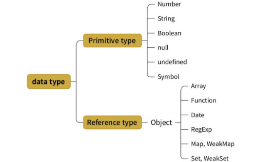
**기본형(원시형)**
  - 숫자, 문자열, 불리언, null, undefined 등
  - ES6에서 심볼 추가
  - 불변성 띔
  - ✨ 값이 담긴 주솟값을 바로 복제

**참조형**
  - 객체, 배열, 함수, 날짜, 정규표현식 등
  - ES6에서 객체 하위 분류에 Map, WeakMap, Set, WeakSet 등 추가
  - ✨ 값이 담긴 주솟값들로 이루어진 묶음을 가리키는 주솟값 복제

## 1-2. 데이터 타입에 관한 배경지식
### 1-2-1. 메모리와 데이터 
- **비트(bit)** : 0 또는 1만 표현할 수 있는 하나의 메모리 조각
  - 각 비트는 고유한 식별자를 통해 위치 확인 가능
  - 비트 단위로 위치를 확인하면 비효율적, 많은 비트를 한 단위로 묶으면 검색 시간을 줄일 수 있고, 표현할 수 있는 데이터의 개수도 늘어나지만 낭비되는 비트도 생김
- **바이트(byte)** : 8개의 비트, 2^8개의 값 표현 가능
  - 정적 타입 언어(C/C++, JAVA 등)는 메모리 낭비를 최소화하기 위해 데이터 타입별 할당 메모리 영역 정해둠
    - 허용된 값 이상 입력하면 오류나거나 잘못된 값이 저장되어 사용자가 직접 형변환
  - 자바스크립트는 메모리 용량이 커진 상황에서 등장 -> 메모리 공간 넉넉히 할당
  - 바이트도 **시작하는 비트의 식별자(메모리 주솟값)**로 위치 파악 가능
    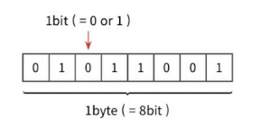

### 1-2-2. 식별자와 변수
- **변수(variable)** : 변할 수 있는 데이터
  - 변경 가능한 데이터가 담길 수 있는 공간/그릇
- **식별자(identifier)** : 어떤 데이터를 식별하는 데 사용하는 이름, 변수명

## 1-3. 변수 선언과 데이터 할당
### 1-3-1. 기본형
**변수 선언**
```JavaScript
var a;
```
컴퓨터는 메모리에서 비어있는 공간 하나 확보(예시 1003번)  
공간의 이름(식별자)를 a로 지정  
(이후 사용자가 a에 접근하려고 하면 컴퓨터는 메모리에서 a라는 이름을 가진 주소를 검색해 해당 공간의 데이터 반환)

**데이터 할당**
```JavaScript
var a;
a = 'abc';

var a = 'abc';
```
데이터를 저장하기 위한 별도의 메모리 공간을 확보해 값을 저장하고, 그 주소를 변수 영역에 저장
- 데이터 변환을 자유롭게 하고 메모리를 효율적으로 쓰기 위해
- 어떤 변환을 가하든 무조건 새로운 별도의 공간에 값을 저장하고 연결
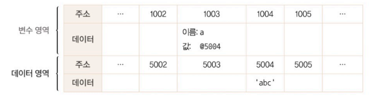
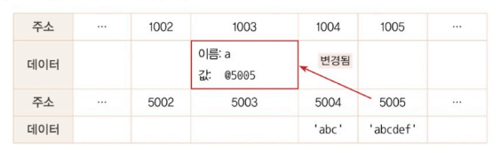

### 1-3-2. 참조형
**변수 선언**
```JavaScript
var obj1 = {
    a: 1,
    b: 'bbb'
};
```
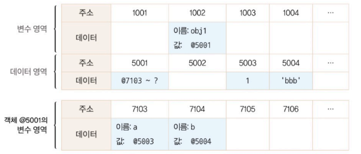
컴퓨터는 빈 공간(@1002)을 확보한 후 그 주소의 이름을 obj1로 지정  
임의의 데이터 저장 공간(@5001)에 저장할 데이터는 여러 개로 이루어져 있어 별도의 변수 영역을 마련한 후 그 영역의 주소를 저장
각 영역의 주소에 a, b 변수명을 지정
값이 들어가 있는 메모리 공간이 없으므로 임의의 공간(@5003, @5004)에 각각 저장하고 이 주소를 @7103, @7104에 각각 저장
- 객체의 변수(프로퍼티) 영역이 별도로 존재

## 1-4. 기본형 데이터와 참조형 데이터
### 1-4-1. 불변값과 가변값
**불변값**
- 기본형 데이터(숫자, 문자열, boolean, null, undefined, Symbol)
- 한 번 만든 값을 바꾸거나 변경할 수 없음
  - 변경은 새로 만드는 동작을 통해서만 이루어짐
- **변경 가능성**으로 변수와 상수(constant) 구분 => 불변값 ≠ 상수

**가변값**
- 참조형 데이터(가변값인 경우가 많으나 변경 불가능, 불변값일 수도 있음)  
- **참조형 데이터의 프로퍼티 재할당**
    ```JavaScript
    var obj1 = {
        a: 1,
        b: 'bbb'
    };

    obj1.a = 2;
    ```
    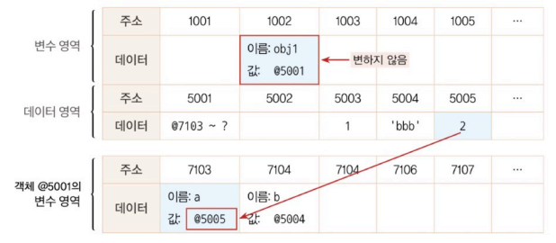
    컴퓨터는 해당 값에 대한 메모리 공간이 없으므로 빈 공간인 @5005에 저장, 이 주소를 @7103에 저장
    - 기존 객체 내부의 값만 바뀜
- 참조형 데이터의 프로퍼티에 다시 참조형 데이터를 할당하는 경우(중첩 객체)
    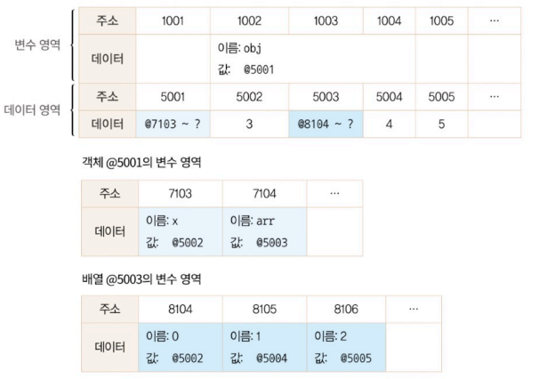
    - **여기에서 재할당하면?** 참조 카운트가 0인 메모리 주소는 가비지 컬렉터에 의해 수거됨
      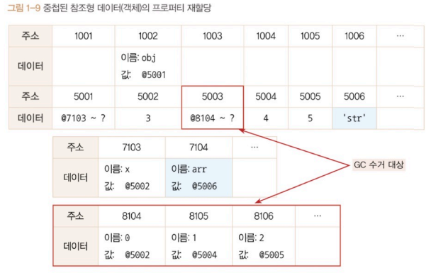
      - **참조 카운트** : 어떤 데이터에 대해  자신의 주소를 참조하는  변수의 개수
      - **가비지 컬렉터** : 런타임 환경에 따라 특정 시점이나 메모리 사용량이 포화 상태에 임박할 때마다 자동으로 수거 대상들을 수거함
        - 수거된 메모리는 다시 새로운 값을 할당할 수 있는 빈 공간이 됨

### 1-4-2. 변수 복사 비교
- 변수를 복사하게 되면 기본형 데이터와 참조형 데이터 모두 같은 주소를 바라봄
- 이후 객체의 프로퍼티를 변경했을 때
  - 기본형 데이터는 서로 다른 주소를 바라보나, 참조형 데이터는 같은 객체를 바라봄
  - 어떤 데이터 타입이든 변수에 할당하기 위해서는 주솟값을 복사해야하기 때문에 자바스크립트의 모든 데이터 타입은 참조형 데이터이나, 기본형은 주솟값을 한 번, 참조형은 최소 두 번 복사하게 됨
  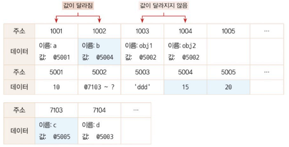
- 이후 객체 자체를 변경했을 때
  - 메모리의 새로운 공간에 새 객체가 저장되고 그 주소를 저장
    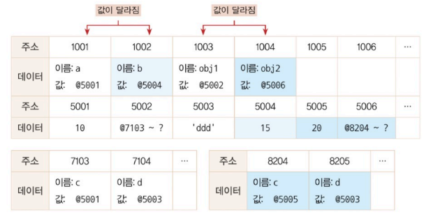

✨ 즉, 참조형 데이터가 '가변값'일 때는 참조형 데이터 자체를 변경할 경
우가 아니라 **그 내부의 프로퍼티를 변경할 때!**

## 1-5. 불변 객체
- 한 번 만든 후 내부 값을 바꿀 수 없는 객체
- `immutable.js`, `baobab.js` 등의 라이브러리 사용
    - 라이브러리 자체에서 불변성을 지닌 별도의 데이터 타입과 그에 따른 메서드 제공
- 값의 안정성 유지, 코드 예측 가능성 향상, 상태 관리에서 오류 줄이는 데 도움

### 1-5-1. 얕은 복사와 깊은 복사
**얕은 복사(shallow copy)**
- 한 단계 아래 값만 복사
- 내부에 객체나 배열이 있으면 주솟값만 복사
- 원본과 복사본이 동일한 참조형 데이터 주소 가리킴  
- 한 쪽 수정 시 다른 쪽도 함께 바뀌는 문제 발생  

**깊은 복사(deep copy)**
- 내부의 모든 값까지 전부 복사  
- 중첩된 참조형 데이터도 재귀적으로 복사  
- 원본과 완전히 독립된 객체 생성 
- 깊은 복사 방식
  - ES5 : `hasOwnProperty` 메서드 활용(프로토타입 체이닝을 통해 상속된 프로퍼티 복사하지 않게 가능)
    - getter/setter는 복사 불가능
  - ES6이후
    - `Object.getOwn PropertyDescriptor` -> 한 개의 프로퍼티의 정보 가져 옴
    - `Object.getOwnPropertyDescriptors` -> 객체 전체 프로퍼티의 속성 정보 가져 옴
      - getter, setter 포함
  - JSON 이용
    - 객체를 JSON 문법으로 표현된 문자열로 전환 -> 다시 JSON 객체로 바꿈
      - 메서드(함수), `__proto__`(숨겨진 프로퍼티), getter/setter 등과 같이 JSON으로 변경할 수 없는 프로퍼티들은 모두 무시
      - httpRequest로 받은 데이터를 저장한 객체를 복사할 때 등 순수한 정보만 다룰 때 활용하기 좋은 방법
    ```Js
    const deepCopy = JSON.parse(JSON.stringify(originalObject));
    ```
    <details>
    <summary>getter와 setter</summary>
    getter : 속성값을 가져오는 함수형 프로퍼티 <br/>

    - 특정 프로퍼티에 접근할 때 자동으로 실행 <br/>
    ```js
    const user = {
        firstName: 'John',
        lastName: 'Doe',
        get fullName() {
            return `${this.firstName} ${this.lastName}`;
        }
        };

        console.log(user.fullName); // 'John Doe'
     ```

    setter : 속성값을 설정할 때 실행되는 함수형 프로퍼티 <br/>

    - 특정 프로퍼티에 값을 대입할 때 자동으로 실행
    ```js
    const user = {
        firstName: 'John',
        lastName: 'Doe',
        set fullName(name) {
            [this.firstName, this.lastName] = name.split(' ');
        }
        };

        user.fullName = 'Jane Smith';
        console.log(user.firstName); // 'Jane'
        console.log(user.lastName);  // 'Smith'
    ```
    </details>

## 1-6. undefined와 null
- **undefined** : 어떤 변수에 값이 존재하지 않는 경우
  - 사용자가 명시적으로 부여한 경우
    - undefined는 그 자체로 값(순회 가능)
  - 자바스크립트 엔진이 자동으로 부여하는 경우
    - 값을 대입하지 않은 변수(데이터 영역의 메모리 주소를 지정하지 않은 식별자)에 접근할 때
    - 객체 내부의 존재하지 않는 프로퍼티에 접근하려고 할 때
    - return문이 없거나 호출되지 않는 함수의 실행 결과
    - ✨ ES6 : let, const는 undefined를 할당하지 않기 때문에 특정 값을 할당하기 전에는 해당 변수에 접근 불가
- **null** : 의도적으로 '비어있음'을 나타내는 값
  - undefiend인지 null인지 알려면 일치 연산자(===) 사용

<br/>

---

<br/>

# Chapter 2. 실행 컨텍스트
**실행 컨텍스트(execution context)** : 실행할 코드에 제공할 환경 정보들을 모아놓은 객체

## 2-1. 실행 컨텍스트란?
**실행 컨텍스트의 활성화 및 실행**
- 동일한 환경에 있는 코드들을 실행할 때 필요한 환경 정보를 모아 컨텍스트 구성
  - 동일한 환경 : 하나의 실행 컨텍스트를 구성할 수 있는 방법 (전역 공간, eval(), 함수, 블록 등)
- 콜 스택(call stack)에 쌓아 올리면 가장 위에 위치한 실행 컨텍스트 활성화
- 자바스크립트 엔진은 해당 컨텍스트에 관련된 코드를 실행하는데 필요한 환경 정보를 수집해 실행 컨텍스트 객체에 저장
  - VariableEnvironment : 현재 컨텍스트 내의 식별자들에 대한 정보 + 외부 환경 정보(변경 사항 반영X)
  - LexicalEnvironment : 처음엔 VariableEnvironment와 같지만 변경 사항이 실시간으로 반영됨
  - ThisBinding: thils 식별자가 바라봐야 할 대상 객체
- 가장 위에 쌓여있는 컨텍스트와 관련 있는 코드를 실행  
=> 전체 코드의 환경과 순서 보장

**예시로 보는 콜 스택**
```JavaScript
// --------------------------- (1)

var a = 1;
function outer() {
    funtion inner() {
        console.log(a) // undefined
        var a = 3;
    }
    inner(); // ------------- (2)
    console.log(a);   // 1
}
outer(); // ----------------- (3)
console.log(a);       // 1
```
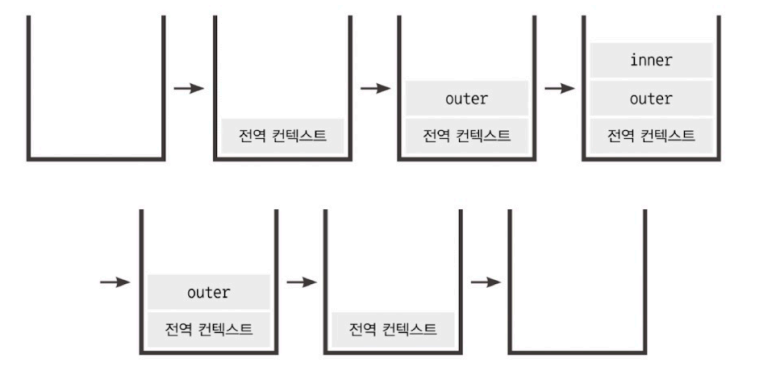

① 전역 컨텍스트가 콜 스택에 담김  
- 별도의 실행 명령 없이 브라우저에서 자동 실행 및 활성화
- 전역 컨텍스트는 일반적인 실행 컨텍스트와 동일  
- 전역 컨텍스트는 전역 공간을 관여하기 때문에 인자가 없음  

② (3)에서 outer 함수 호출  
- 자바스크립트 엔진은 outer에 대한 환경 정보를 수집해 outer 실행 컨텍스트 생성 -> 콜 스택에 담음  
- 전역 컨텍스트와 관련된 코드 실행 일시 중단
- outer 함수 내부의 코드 순차 실행  

③ (2)에서 inner 함수 호출  
- ② 순서 반복  
- inner 함수 실행이 종료되면 콜 스택에서 inner 실행 컨텍스트 제거  

④ 이후 outer 실행 컨텍스트, 전역 컨텍스트 제거


## 2-2. VarialbeEnvironment
`environmentRecord`(현재 컨텍스트 내의 식별자들에 대한 정보, 매개변수명, 변수의 식별자, 선언한 함수의 함수명 등) + `outerEnvironment`(외부 환경 정보, 바로 직전 컨텍스트의 LexicalEnvironment 정보 참조)
- LexicalEnvironment와 같은 내용 담기나 최초 실행 시의 스냅샷 유지
- 실행 컨텍스트를 생성할 때 VariableEnvironment에 정보를 먼저 담은 후, 그대로 복사해 LexicalEnvironment를 만들고, 주로 LexicalEnvironment 활용

## 2-3. LexicalEnvironment
어휘적 환경, 정적 환경...

### 2-3-1. environmentRecord와 호이스팅
**environmentRecord**  
현재 컨텍스트와 관련된 코드의 **식별자** 정보들이 저장되며, 컨텍스트 내부 자체를 처음부터 끝까지 순서대로 수집함
  - 컨텍스트를 구성하는 함수에 지정된 매개변수 식별자
  - 선언한 함수가 있을 경우 그 함수 자체
  - var로 선언된 변수의 식별자 등
    <details>
    전역 실행 컨텍스트는 변수 객체를 생성하는 대신 전역 객체(자바스크립트 구동 환경이 별도로 제공하는 객체, 호스트 객체(브라우저의 window, Node.js의 global 객체 등)) 활용
    </details>
코드가 실행되기 전이지만 자바스크립트 엔진은 이미 해당 환경에 속한 코드의 변수명 모두 알고 있게 됨

<br/>

**호이스팅 규칙**  
'끌어올리다(hoist)' + ing  
자바스크립트 엔진이 식별자들을 최상단으로 끌어올린 다음 실제 코드를 실행한다고 간주

**예시로 보는 호이스팅**
```js
function a () {
  console.log(b);   // (1)
  var b = 'bbb';    // 수집 대상 1 (변수 선언)
  console.log(b);   // (2)
  function b () { } // 수집 대상 2 (함수 선언)
  console.log(b);   // (3)
}

a();
```
a 함수를 실행하면 a 함수의 실행 컨텍스트가 생성되고, 변수명(선언부)과 함수 선언의 정보를 위로 끌어올림(수집)
```js
funtion a () {
  var b;            // 수집 대상 1. 변수는 선언부만 끌어올립니다.
  function b () { } // 수집 대상 2. 함수 선언은 전체를 끌어올립니다.

  console.log(b);   // (1)
  b = 'bbb';        // 변수의 할당부는 원래 자리에 남겨둡니다.
  console.log(b);   // (2)
  console.log(b);   // (3)
}

a();
```

① 변수 b 선언 : 메모리에서는 저장할 공간 미리 확보, 확보한 공간의 주솟값을 변수 b에 연결  
② 함수 b는 `var b = function b () {}`로, 이미 변수 b가 선언되어 있어 이 과정 무시, 함수는 별도의 메모리에 담고 그 함수가 저장된 주솟값을 b와 연결된 공간에 저장 => 변수 b는 함수 가리킴  
③ (1) 변수 b에 할당된 함수 b 출력  
④ 변수 b에 문자열 'bbb'가 담긴 주솟값으로 덮어씀  
⑤ (2), (3) 모두 변수 b에 할당된 'bbb' 출력  
⑥ 함수 내부의 모든 코드가 실행되었으므로 실행 컨텍스트가 콜 스택에서 제거됨

**함수 선언문과 함수 표현식**
- **함수 선언문** : function 정의부만 존재하고 별도의 할당 명령 없음
  - 반드시 함수명 정의 되어있어야 함
  - 호이스팅에 적합
- **함수 표현식** : 정의한 function을 별도의 변수에 할당하는 것
  - 함수명 정의 없어도 됨 -> 익명 함수 표현식 vs 기명 함수 표현식
    - 기명 함수 표현식은 외부에서 함수명으로 함수를 호출할 수 없음(함수 내부에서만 접근 가능, 재귀 호출용)
    - 과거에 익명 함수 표현식의 경우 undefined/unnamed 값이 나와 디버깅 시 기명 함수 표현식이 더 유리했음
    - 그러나 이제는 모든 브라우저가 익명 함수 표현식의 변수명을 함수의 name 프로퍼티에 할당함
  
```js
// 함수 선언문, 함수명 a가 곧 변수명
function a () { /* ... */ }
a(); // 실행 OK.

// (익명) 함수 표현식, 변수명 b가 곧 함수명
var b = function() { /* ... */ } 
b(); // 실행 OK.

// 기명 함수 표현식, 변수명은 c, 함수명은 .
var c = function d() { /* ... */ } 
c(); // 실행 OK
d(); // 에러!
```
### 2-3-2. 스코프, 스코프 체인, outerEnvironmentReference
**스코프(scope)**
- 식별자에 대한 유효범위
- 어떤 경계 A의 외부에서 선언한 변수는 A의 외내부 모두 접근 가능하나, A의 내부에서 선언한 변수는 오직 A의 내부에서만 접근 가능
- ES5까지는 전역 공간을 제외하면 오직 함수에 의해서만 스코프가 생성되었으나, ES6에서는 블록에 의해 스코프 경계가 발생하게 함
  - var로 선언한 변수를 제외한 let, const, class, strict mode에서의 함수 선언 등에 대해서만 범위로서의 역할 수행(함수 스코프, 블록 스코프로 구분)

<br/>

**스코프 체인(scope chain)**  
식별자의 유효범위를 안에서부터 바깥으로 차례로 검색해나가는 것
- `outerEnvironmentRecference` : 현재 호출된 함수가 선언될 당시의 LexicalEnvironment 참조
  - 연결리스트 형태를 띰
  - 오직 자신이 선언된 시점의 LexicalEnvironment를 참조해 가장 가까운 요소부터 차례대로만 접근 가능
  - 여러 스코프에서 동일한 식별자를 선언한 경우, 무조건 스코프 체인 상에서 가장 먼저 발견된 식별자에만 접근 가능  
  
- **예시로 알아보는 스코프 체인**
  ```js
  var a = 1;
  var outer = function () {
    var inner = function () {
      console.log(a);
      var a = 3;
    };
    inner();
    console.log(a);
  };
  outer();
  console.log(a);
  ```
  ① 전역 컨텍스트 활성화
    - 전역 컨텍스트의 `environmentRecord`에 {a, outer} 식별자 저장
    - 선언 시점 없으므로 전역 컨텍스트의 `outerEnvironmentRecference`에는 아무 것도 없음(this : 전역 객체)  
     
  ② 변수 a, outer에 각각 1, 함수 할당  
  ③ outer 함수 호출
    - 전역 컨텍스트는 10번째 줄에서 임시 중단
    - outer 실행 컨텍스트가 활성화되어 2번째 줄로 이동
  
  ④ outer 실행 컨텍스트의 `environmentRecord`에 {inner} 식별자 저장, `outerEnvironmentRecference`에 outer 함수가 선언될 당시의 LexicalEnvironment가 담김
  - outer 함수는 전역 공간에서 선언되어 전역 컨텍스트의 LexicalEnvironment 참조복사 => [GLOBAL, {a, outer}](실행 컨텍스트의 이름, environmentRecord 객체)(this : 전역 객체)
  
  ⑤ outer 스코프에 있는 변수 inner에 함수 할당 -> inner 함수 호출
    - outer 실행 컨텍스트의 코드는 7번째 줄에서 임시 중단
    - inner 실행 컨텍스트가 활성화되어 3번째 줄로 이동
  
  ⑥ inner 실행 컨텍스트의 `environmentRecord`에 {a} 식별자 저장, `outerEnvironmentRecference`에 inner 함수가 선언될 당시의 LexicalEnvironment가 담김
  - inner 함수는 outer 함수 내부에서 선언되어 outer 함수의 LexicalEnvironment 참조복사 => [outer, {inner}](this : 전역 객체)
  
  ⑦ 식별자 a에 접근하기 위해 현재 활성화 상태인 inner 컨텍스트의 `environmentRecord`에서 검색하니 a가 발견되었으나 할당된 값 없음(undefined 출력)
    - inner 스코프에 있는 변수 a에 3 할당
    - inner 함수 실행 종료 -> 콜 스텍에서 제거, 바로 아래의 outer 실행 컨텍스트 다시 활성화
  
  ⑧ 식별자 a에 접근하기 위해 활성화된 실행 컨텍스트의 LexicalEnvironment에 접근
    - 첫 요소인 `environmentRecord`에 있는지 찾아보고 없으면 `outerEnvironmentReference`에 있는 `environmentRecord`에서 찾아보는 식으로 계속 검색
    - 예제에서는 전역 LexicalEnvironment에 a가 있으니 저장된 값 1 반환(1 출력)
    - outer 함수 실행 종료 -> 콜 스택에서 제거, 바로 아래의 전역 컨텍스트 다시 활성화

  ⑨ 식별자 a에 접근하기 위해 현재 활성화된 상태인 전역 컨텍스트의 `environmentRecord`에서 a 검색(1 출력)
    - 모든 코드의 실행 완료 => 콜 스택에서 제거 및 종료

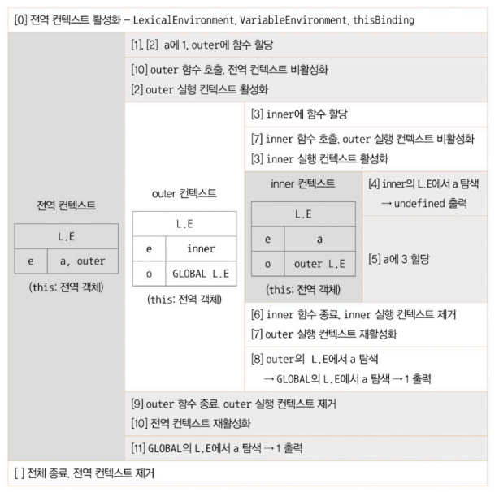
접근하는 컨텍스트 규모는 점차 작아지는 반면, 스코프 체인을 타고 접근 가능한 변수의 수는 늘어남
- 그러나 스코프 체인 상에 있는 변수라고 해서 무조건 접근 가능하진 않음
  - **변수 은닉화** : 스코프 체인 상 가까운 곳부터 검색할 수 밖에 없어 다른 공간(참조 변수 이외의 공간)에서 선언한 동일한 이름의 변수에는 접근할 수 없음

<br/>

**전역변수와 지역변수**
- **전역변수** : 전역 공간에서 선언한 변수(a, outer)
  - 코드의 안정성을 위해 가급적 전역변수 사용을 최소화해야 함
- **지역변수** : 함수 내부에서 선언한 변수(inner, a)

## 2-4. this
thisBinding에 this로 지정된 객체 저장  
실행 컨텍스트 활성화 당시 this가 지정되지 않은 경우 this에는 전역 객체가 저장되고, 그 외의 경우는 함수를 호출하는 방법에 따라 this에 저장되는 대상이 다름


# Q&A
## 1. 함수 선언문과 함수 표현식의 차이점은 무엇인가요?
함수 선언문은 선언 전에 호출할 수 있으며(호이스팅 발생), 함수명이 필수입니다. 함수 표현식은 함수를 변수에 할당하는 방식으로, 변수 선언 이후에만 호출 가능하며 주로 익명 함수 형태로 사용합니다.

## 2. 실행 컨텍스트란 무엇이고, 실행 컨텍스트 객체가 활성화되는 시점에 어떤 정보를 수집하는 지 말해보세요.
코드 실행 시 필요한 환경 정보를 담는 객체로, 전역이나 함수 실행 시 생성됩니다. 활성화 시 변수와 함수 선언 정보를 VariableEnvironment, 스코프 정보는 LexicalEnvironment, this 값은 ThisBinding에 저장합니다.

## 3. 호이스팅이란 무엇인가요?
변수 및 함수 선언이 코드 실행 전에 최상단으로 끌어올려지는 현상입니다. 예를 들어, console.log(a); var a = 1; 실행 시 undefined가 출력됩니다.

## 4. 스코프란 무엇이고, 코드 상에서 어떤 변수에 접근하려고 할 때 현재 컨텍스트의 LexicalEnvrionment에서 발견하지 못하면 어떻게 하나요?
변수의 유효 범위를 의미합니다. 현재 컨텍스트에서 찾지 못하면 상위 컨텍스트의 LexicalEnvironment를 따라가며 탐색하며, 끝까지 못 찾으면 ReferenceError가 발생합니다.

## 5. 안전한 코드 구성을 위해 실행 컨텍스트 내에서 할 수 있는 게 어떤 것이 있나요?
호이스팅 방지를 위해 함수 표현식을 사용하고, 전역 변수 사용을 최소화해 예기치 않은 충돌과 사이드 이펙트를 줄이는 것이 좋습니다.

<details>
<summary>사이드 이펙트(side effect)란?</summary>
함수나 코드 블록이 자신의 외부 상태(외부 변수, 전역 객체, 화면, 콘솔 등)를 변경하거나 영향을 주는 행위

- 전역 변수 값 조정
- DOM 조작
- 콘솔 출력
- 파일/DB에 쓰기
- 네트워크 요청 보내기 등

```js
let count = 0;
function increment() {
  count++;  // 외부 변수 count의 값을 바꾸고 있음
}
```

최소화 해야하는 이유 : 예측이 어렵고, 테스트가 힘들며 버그가 발생하기 쉽기 때문!
</details>