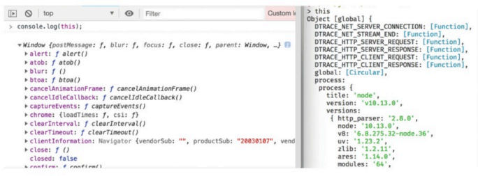

*this*

- [Chapter 3. this](#chapter-3-this)
  - [3-1. 상황에 따라 달라지는 this](#3-1-상황에-따라-달라지는-this)
    - [3-1-1. 전역 공간에서의 this - 전역 객체](#3-1-1-전역-공간에서의-this---전역-객체)
    - [3-1-2. 메서드로 호출할 때 그 메서드 내부에서의 this](#3-1-2-메서드로-호출할-때-그-메서드-내부에서의-this)
    - [3-1-3. 함수로서 호출할 때 그 함수 내부에서의 this](#3-1-3-함수로서-호출할-때-그-함수-내부에서의-this)
    - [3-1-4. 콜백 함수 호출 시 그 함수 내부에서의 this](#3-1-4-콜백-함수-호출-시-그-함수-내부에서의-this)
    - [3-1-5. 생성자 함수 내부에서의 this](#3-1-5-생성자-함수-내부에서의-this)
  - [3-2. 명시적으로 this를 바인딩하는 방법](#3-2-명시적으로-this를-바인딩하는-방법)
    - [3-2-1. call 메서드](#3-2-1-call-메서드)
    - [3-2-2. apply 메서드](#3-2-2-apply-메서드)
    - [3-2-3. call/apply 메서드의 활용](#3-2-3-callapply-메서드의-활용)
    - [3-2-4. bind 메서드](#3-2-4-bind-메서드)
    - [3-2-5. 화살표 함수의 예외사항](#3-2-5-화살표-함수의-예외사항)
    - [3-2-6. 별도의 인자로 this를 받는 경우(콜백 함수 내에서의 this)](#3-2-6-별도의-인자로-this를-받는-경우콜백-함수-내에서의-this)
- [Q\&A](#qa)
  - [1. 자바스크립트에서 this가 다른 객체지향 언어와 다르게 작동하는 이유는 무엇인가요?](#1-자바스크립트에서-this가-다른-객체지향-언어와-다르게-작동하는-이유는-무엇인가요)
  - [2. 함수로 호출한 경우와 메서드로 호출한 경우 this가 어떻게 달라지나요?](#2-함수로-호출한-경우와-메서드로-호출한-경우-this가-어떻게-달라지나요)
  - [3. 메서드 내부의 중첩 함수에서 this가 의도와 다르게 전역 객체를 가리키는 문제를 어떻게 해결할 수 있나요?](#3-메서드-내부의-중첩-함수에서-this가-의도와-다르게-전역-객체를-가리키는-문제를-어떻게-해결할-수-있나요)
  - [4. 콜백 함수에서 this가 달라지는 이유가 무엇인가요?](#4-콜백-함수에서-this가-달라지는-이유가-무엇인가요)
  - [5. 생성자 함수를 호출하는 방법은 무엇이고, 또 this는 어떤 객체를 가리키게 되나요?](#5-생성자-함수를-호출하는-방법은-무엇이고-또-this는-어떤-객체를-가리키게-되나요)
  - [6. call, apply, bind의 차이점은 무엇인가요?](#6-call-apply-bind의-차이점은-무엇인가요)
  - [7. 화살표 함수에서의 this는 일반 함수와 어떻게 다른가요?](#7-화살표-함수에서의-this는-일반-함수와-어떻게-다른가요)
  - [8. 콜백 함수에서 this가 의도와 다르게 동작할 때 해결 방법은 무엇인가요?](#8-콜백-함수에서-this가-의도와-다르게-동작할-때-해결-방법은-무엇인가요)
  - [9. 유사 배열 객체에 배열 메서드를 적용하려면 어떻게 해야하나요?](#9-유사-배열-객체에-배열-메서드를-적용하려면-어떻게-해야하나요)
  - [10. 생성자 함수 내부에서 다른 생성자의 로직을 재사용하고 싶다면 어떻게 해야하나요?](#10-생성자-함수-내부에서-다른-생성자의-로직을-재사용하고-싶다면-어떻게-해야하나요)

# Chapter 3. this
다른 객체지향 언어에서의 this : 클래스로 생성한 인스턴스 객체
- 클래스에서만 사용할 수 있어 혼란의 여지가 없거나 많지 않음

**자바스크립트에서의 this는?**  
어디든 이용 가능  
함수와 객체(메서드)의 구분이 느슨하기 때문에 이를 구분하기 위한 유일한 기능이기도 함

## 3-1. 상황에 따라 달라지는 this
'함수를 어떤 방식으로 호출하느냐'에 따라 값이 달라짐
- this는 기본적으로 **실행 컨텍스트가 생성될 때** 함께 결정됨
- 실행 컨텍스트는 **함수를 호출할 때** 생성됨

<br/>

### 3-1-1. 전역 공간에서의 this - 전역 객체
전역 컨텍스트를 생성하는 주체 : 전역 객체
- **전역 객체** : 자바스크립트 런타임 환경에 따라 다른 이름 및 정보 가짐
- 브라우저 환경(window), Node.js 환경(global)
  
  <details>
  <summary>전역 공간에서만 발생하는 성질</summary>

  전역 변수를 선언하면 자바스크립트 엔진은 이를 전역 객체의 프로퍼티로 할당
  - 자바스크립트의 모든 변수는 특정 객체(실행 컨텍스트의 LexicalEnvironment)의 프로퍼티로서 동작하기 때문
    - 어떤 변수를 호출하면 LexiclaEnvironment를 조회해 일치하는 프로퍼티가 있으면 해당 값 봔환
    - GlobalEnv가 전역 객체를 참조하는데, 전역 컨텍스트의 LexicalEnvironment가 이 GlobalEnv를 참조(전역 객체 그대로 참조)
    ```js
    var a = 1;
    console.log(a);        // 1
    console.log(window.a); // 1
    console.log(global.a); // 1
    console.log(this.a);   // 1
    ```
    - var로 선언하지 않고 window의 프로퍼티에 직접 할당해도 똑같이 동작하나 삭제 할 때 다름
    - ✨ 전역 변수로 선언한 경우 삭제 안 됨 : 사용자가 의도치 않게 삭제하는 것을 방지하기 위해 → 해당 프로퍼티의 configurable 속성(변경 및 삭제 가능성)을 false로 정의
      - ES6의 const, let은 전역 객체의 프로퍼티로 할당 조차 안 됨
    ```js
    var a = 1;
    delete window.a;                  // false
    console.log(a, window.a, this.a); // 1 1 1
    
    var b = 2;
    delete b;                         // false
    console.log(b, window.b, this.b); // 2, 2, 2

    window.c = 3;
    delete window.c;                  // true
    console.log(c, window.c, this.c); // ReferenceError: c 정의 안 됨

    window.d = 4;
    delete d;                         // true
    console.log(d, window.d, this.d); // ReferenceError: d 정의 안 됨
    ```

  </details>

<br/>

### 3-1-2. 메서드로 호출할 때 그 메서드 내부에서의 this
**함수 vs 메서드**  
- 공통점 : 미리 정의한 동작을 수행하는 코드 뭉치
- 차이점 : 독립성 유무
  - 함수 : 그 자체로 독립적인 기능 수행
  - 메서드 : 자신을 호출한 대상 객체에 관한 동작 수행
    - 점 또는 대괄호를 사용해 함수 이름(프로퍼티) 앞에 객체가 명시된 경우
    - ✨ this는 마지막에 명시된 직전의 객체
    ```js
    // 함수로서 호출
    var func = function (x) {
        console.log(this, x)
    };
    func(1);          // window {...} 1

    // 메서드로서 호출
    var obj = {
        method: func
    };
    obj.method(2);    // {method: f} 2
    obj['method'](2); // {method: f} 2
    ```
<br/>

### 3-1-3. 함수로서 호출할 때 그 함수 내부에서의 this
**함수 내부에서의 this - 전역 객체**  
어떤 함수를 함수로서 호출할 경우 **this가 지정되지 않음**  
- this는 호출한 주체에 대한 정보가 담김
- 함수로서 호출은 호출 주체를 명시하지 않은 것이기 때문에 정보를 알 수 없음
- 더불어 스코프 체인상 최상위 객체인 전역 객체를 가리키게 됨
<br/>

**메서드의 내부함수에서의 this**  
```js
var obj1 = {
    outer : function () {
        console.log(this);       // (1)
        var innerFunc = function () {
            console.log(this);   // (2) (3)
        }
        innerFunc();

        var obj2 = {
            innerMethod : innerFunc
        };
        obj2.innerMethod();
    }
};
obj1.outer()
```
① 객체를 생성(내부엔 outer 프로퍼티가 있고 익명함수 연결됨)해 변수 obj1에 할당  
② obj1.outer() 호출  
- obj1.outer 함수의 실행 컨텍스트가 생성되면서 호이스팅, 스코프 체인 정보 수집, this 바인딩
- outer 앞에 .이 있었기 때문에 메서드로 호출 → this에 obj1 바인딩
- (1) : obj1 객체 정보 출력  

③ 호이스팅된 innerFunc은 지역변수로 outer 스코프 내에서만 접근 가능, 익명함수 할당  
④ innerFunc() 호출
- innerFunc 함수의 실행 컨텍스트가 생성되면서 호이스팅, 스코프 체인 정보 수집, this 바인딩
- 함수명 앞에 .이 없으므로 함수로서 호출 → this 지정 안 됨, 스코프 체인상 최상위 객체인 전역 객체(window) 바인딩
- (2) : window 객체 정보 출력

⑤ 호이스팅된 변수 obj2도 지역변수, innerFunc와 연결된 innerMethod가 프로퍼티로 있는 객체 할당  
⑥ obj2.innerMethod() 호출
- obj2.innerMethod 함수의 실행 컨텍스트가 생성
- 함수명 앞에 .이 있었기 때문에 메서드로 호출 → this에 obj2 바인딩
- (3) : obj2 객체 정보 출력  

<br/>

**메서드의 내부함수에서의 this를 우회하는 방법** 
호출 주체가 없을 때 자동으로 전역 객체를 바인딩 하지 않고 호출 당시 주변 환경의 this를 그대로 상속받기 위한 방법
- ES5까지는 내부함수에 this 상속할 방법 없음
- 변수 활용 : self, _this, that, _ 등
  - 상위 스코프의 this를 저장해 내부함수에서 활용하려는 수단
```js
var obj = {
    outer : function () {
        console.log(this);       // (1) {outer: f}
        var innerFunc1 = function () {
            console.log(this);   // (2) Window {...}
        }
        innerFunc1();

        var self = this;
        var innerFunc2 = function () {
            console.log(self)    // (3) {outer: f}
        };
        innerFunc2();
    }
};
obj.outer()
```

<br/>

**this를 바인딩하지 않는 함수 - 화살표 함수**   
ES6에서는 함수 내부에서 this가 전역 객체를 바라보는 문제를 보완하고자 화살표 함수 도입
- **화살표 함수** : 실행 컨텍스트를 생성할 때 this 바인딩 과정 자체가 빠짐 → 상위 스코프의 this를 그대로 활용
```js
var obj = {
    outer : function () {
        console.log(this);       // (1) {outer: f}
        var innerFunc = () => {
            console.log(this);   // (2) {outer: f} 
        }
        innerFunc();
    }
};
obj.outer()
```
<br/>

### 3-1-4. 콜백 함수 호출 시 그 함수 내부에서의 this
**콜백 함수** : 제어권을 다른 함수(또는 메서드)에게 넘겨주는 함수
- 콜백 함수는 다른 함수의 내부 로직에 따라 실행
- ✨ this도 기본적으로 전역 객체를 참조하나 제어권을 받은 함수에서 별도로 this가 될 대상을 지정하면 그 대상을 참조하게 됨
```js
setTimeout(function () {console.log(this);}, 300);  // (1)

[1, 2, 3, 4, 5].forEach(function (x) {              // (2)
    console.log(this, x)
})

document.body.innerHTML += '<button id="a">클릭</button>';
document.body.querySelector('#a')
    .addEventListener('click', function (e) {        // (3)
        console.log(this, e);
    })
```
(1) : setTimeout 함수는 300ms만큼 시간 지연 뒤에 콜백 함수 실행 → 0.3초 뒤 전역 객체 출력  
(2) : forEach 메서드는 배열의 각 요소를 차례대로 하나씩 꺼내어 그 값을 콜백 함수의 첫번째 인자로 삼아 함수 실행 → 전역 객체와 배열의 각 요소가 총 5회 출력  
(3) : addEventListener는 지정한 HTML 엘리먼트에 'click' 이벤트가 발생할 때마다 그 이벤트 정보를 콜백 함수의 첫 번째 인자로 삼아 함수 실행 → 버튼을 클릭하면 지정한 엘리먼트와 클릭 이벤트에 관한 정보가 담긴 객체 출력
- (1), (2)의 내부에서는 콜백 함수를 호출할 때 대상이 될 this를 지정하지 않기 때문에 전역 객체 참조
- (3)은 자신의 this를 상속하도록 되어 있어 . 앞부분이 this가 됨

<br/>

### 3-1-5. 생성자 함수 내부에서의 this
**생성자 함수** : 어떤 공통된 성질을 지니는 객체를 생성하는 데 사용하는 함수
- 객체지향 언어에서의 생성자(🎨클래스, class), 클래스를 통해 만든 객체(🐟인스턴스, instance)
- 프로그래밍적으로 생성자는 구체적인 인스턴스를 만들기 위한 틀
- 자바스크립트에서는?
  - **생성자** :`new` 명령어 + 함수
  - **인스턴스** : 생성자 함수로 호출되어 그 내부에서의 this
  - 생성자 함수를 호출하면 생성자의 prototype 프로퍼티를 참조하는 `__proto___`(프로퍼티 있는 인스턴스) 만들고, 미리 준비된 공통 속성 및 개성을 해당 객체(this)에 부여 
    ```js
    var Cat = function (name, age) {
        this.bark = '미야옹';
        this.name = name;
        this.age = age;
    };
    var choco = new Cat('초코', 3);
    var cheeze = new Cat('치즈', 5);
    console.log(choco, cheeze);

    /*
    결과
    Cat {bark: '미야옹', name: '초코', age: 3};
    Cat {bark: '미야옹', name: '치즈', age: 5};
    */
    ```
*정리*  
생성자(클래스) = 팔레트, 붕어빵 틀 / 객체(인스턴스) = 짠 물감, 붕어빵 

## 3-2. 명시적으로 this를 바인딩하는 방법
this에 별도의 대상을 바인딩하는 방법

### 3-2-1. call 메서드
메서드의 호출 주체인 함수를 즉시 실행하도록 하는 명령어
```js
Function.prototype.call(thisArg[, arg1[, arg2[, ...]]])
```
- call 메서드의 첫 번째 인자를 this로 바인딩
- 함수의 매개변수 : 이후의 인자(들)
- ✨ 함수/메서드를 그냥 실행(호출)하면 this는 전역 객체(객체)를 참조하나, call 메서드를 이용하면 **임의의 객체를 this로 지정 가능**  
- **예시로 보는 call 메서드**
  ```js
  var func = function (a, b, c) {
    console.log(this, a, b, c);
  };

  func(1, 2, 3);              // Window{...} 1 2 3
  func.call({x: 1}, 4, 5, 6); // {x: 1} 4 5 6

  var obj = {
    a: 1,
    method: function (x, y) {
        console.log(this.a, x, y);
    }
  };

  obj.method(2, 3);               // 1 2 3
  obj.method.call({a: 4}, 5, 6);  // 4 5 6
  ```
### 3-2-2. apply 메서드
메서드의 호출 주체인 함수를 즉시 실행하도록 하는 명령어(call 메서드와 기능 동일)
```js
Function.prototype.apply(thisArg[, argsArray])
```
- apply 메서드의 첫 번째 인자를 this로 바인딩
- 함수의 매개변수 : 이후의 인자(들)을 배열로 받음
- ✨ 함수/메서드를 그냥 실행(호출)하면 this는 전역 객체(객체)를 참조하나, call 메서드를 이용하면 **임의의 객체를 this로 지정 가능**  
- **예시로 보는 apply 메서드**
  ```js
  var func = function (a, b, c) {
    console.log(this, a, b, c);
  };

  func.apply({x: 1}, [4, 5, 6]); // {x: 1} 4 5 6

  var obj = {
    a: 1,
    method: function (x, y) {
        console.log(this.a, x, y);
    }
  };

  obj.method.apply({a: 4}, [5, 6]);  // 4 5 6
  ```

<br/>

### 3-2-3. call/apply 메서드의 활용
**유사배열객체**에 배열 메서드 적용  
```js
// 유사배열객체에 배열 메서드 적용
var obj = {
    0: 'a',
    1: 'b',
    2: 'c',
    length: 3
};

Array.prototype.push.call(obj, 'd');
console.log(obj);  // {0: 'a', 1: 'b', 2: 'c', 3: 'd', length: 4}

var arr = Array.prototype.slice.call(obj);
consol.log(arr);  // ['a', 'b', 'c', 'd']


// arguments, NodeList에 배열 메서드 적용
function a () {
    var argv = Array.prototype.slice.call(arguments);
    argv.forEach(function (arg) {
        console.log(arg);
    });
};
a(1, 2, 3);

document.body.innerHTML = '<div>a</div><div>b</div><div>c</div>';
var nodeList = document.querySelectorAll('div');
var nodeArr = Array.prototype.slice.call(nodeList);
nodeArr.forEach(function (node) {
    console.log(node);
});


```
- 객체에는 배열 메서드를 직접 적용할 수 없음
- 배열의 구조와 유사한 객체(유사배열객체 : 키가 0 또는 양수인 프로퍼티가 존재하고, length 프로퍼티의 값이 0 또는 양수인 객체)의 경우 call/apply를 통해 배열 메서드를 차용할 수 있음
  - push : 프로퍼티에 요소 추가
  - slice : 시작값 ~ 마지막값 - 1 부분까지 배열 요소를 추출하나 매개변수를 넘기지 않으면 원본 배열의 얕은 복사본 반환
- 인덱스와 length 프로퍼티를 지니는 문자열도 적용할 수 있음
  - 단, 문자열은 length가 읽기 전용이므로 원본 문자열이 변경되는 메서드(push, pop, shift, unshift, splice 등)은 에러남
  - concat처럼 대상이 반드시 배열이여야 하는 경우 에러는 안 나나 제대로 된 결과 얻을 수 없음
    ```js
    var str = 'abc def';

    Array.prototype.push.call(str, ', push string'); // Error: length가 읽기 전용임
    Array.prototype.concat.call(str, 'string'); // [String {"abc def"}, "string"]
    Array.prototype.every.call(str, function(char) {return char !== ' ';}); // false
    Array.prototype.some.call(str, function(char) {return char !== ' ';}); // true

    var newArr = Array.prototype.map.call(str, function(char) {return char + '!';});
    
    console.log(newArr);  // ['a!', 'b!', 'c!', ' !', 'd!', 'e!', 'f!']

    var newStr = Array.prototype.reduce.apply(str, [function(string, char, i) {return string + char + i;}, ''
    ]);
    
    console.log(newArr);  // "a0b1c2 3d4e5f6"


    // ES6의 Array.from 메서드 : 유사배열객체 또는 순회 가능한 모든 종류의 데이터 타입을 배열로 전환
    var obj = {
    0: 'a',
    1: 'b',
    2: 'c',
    length: 3
    };

    var arr = Array.from(obj);
    console.log(arr);  // ['a', 'b', 'c']
    ```
<br/>

**생성자 내부에서 다른 생성자를 호출**
생성자 내부에 다른 생성자와 공통된 내용이 있을 경우 call/apply를 이용해 다른 생성자를 호출하면 반복 줄일 수 있음
```js
function Person(name, gender) {
    this.name = name;
    this.gender = gender;
}

function Student(name, gender, school) {
    Person.call(this, name, gender);
    this.school = school;
}

function Employee(name, gender, company) {
    Person.apply(this, [name, gender]);
    this.company = company;
}

var gn = new Student('가나', 'female', '단국대');
var dr = new Employee('다라', 'male', '구골');
```

<br/>

**여러 인수를 묶어 하나의 배열로 전달하고 싶을 때 - apply 활용**
```js
// 최대/최솟값 구하기
var numbers1 = [10, 20, 3, 16, 45];
const numbers2 = [10, 20, 3, 16, 45];
// 1. 직접 구현
var max = min = numbers1[0];
numbers1.forEach(function(number) {
    if (number > max) {
        max = number;
    }
    if (number < min) {
        min = number;
    }
});
console.log(max, min) // 45 3

// 2. apply 적용
var max = Math.max.apply(null, numbers1);
var min = Math.min.apply(null, numbers1);
console.log(max, min) // 45 3

// 3. ES6 펼치기 연산자 활용
const max = Math.max(...numbers2);
const min = Math.min(...numbers2);
console.log(max, min) // 45 3
```
<br/>

**요약**
- **장점** : 명시적으로 별도의 this를 바인딩하면서 함수/메서드를 실행
- **단점** : this를 예측하기 어렵게 만들어 코드 해석 방해

<br/>

### 3-2-4. bind 메서드
ES5에서 추가된 기능  
념겨 받은 this 및 인수들을 바탕으로 새로운 함수를 반환하는 메서드  

```js
Function.prototype.bind(thisArg[, arg1[, arg2[, ...]]])
```
- 목적
  - 함수에 this 미리 적용
  - 부분 적용 함수 구현
    - 다시 새로운 함수를 호출할 때 인수를 넘기면 그 인수들은 **기존 bind 메서드를 호출할 때 전달했던 인수들 뒤에 이어서 등록됨**
- **예시로 보는 bind 메서드**
  ```js
  var func = function (a, b, c) {
    console.log(this, a, b, c);
  };

  func(1, 2, 3);              // Window{...} 1 2 3

  var bindFunc1 = func.bind({x: 1});
  bindFunc1(4, 5, 6)          // {x: 1} 4 5 6
  
  var bindFunc2 = func.bind({x: 1}, 4);
  bindFunc(5, 6);             // {x: 1} 4 5 6
  bindFunc(7, 8);             // {x: 1} 4 7 8
  ```
<br/>

**name 프로퍼티**
bind 메서드를 적용해 새로 만든 함수는 name 프로퍼티에 bound(bind의 수동태) 접두어가 붙음
- call/apply보다 코드 추적하기 수월
```js
var func = function (a, b, c) {
    console.log(this, a, b, c);
};

var bindFunc = func.bind({x: 1}, 4);
console.log(func.name);          // func
console.log(bindFunc.name);      // bound func
```

<br/>

**✨ 상위 컨텍스트의 this를 내부함수나 콜백 함수에 전달하기**
```js
// 1. call
var obj = {
    outer: function () {
        console.log(this);
        var innerFunc = function () {
            console.log(this);
        };
        innerFunc.call(this);
    }
};
obj.outer();

// 2. bind
var obj = {
    outer: function () {
        console.log(this);
        var innerFunc = function () {
            console.log(this);
        }.bind(this);
        innerFunc();
    }
};
obj.outer();

// bind 메서드를 사용해 this 바꾸기
var obj = {
    logThis: function () {
        console.log(this);
    },
    logThisLater1: function () {
        setTimeout(this.logThis, 500);
    },
    logThisLater2: function () {
        setTimeout(this.logThis.bind(this), 1000);
    }
};
obj.logThisLater1(); // Window {... }
obj.logThisLater2(); // obj { logThis: f, ...}
```

<br/>

### 3-2-5. 화살표 함수의 예외사항
ES6에 새롭게 도입된 화살표 함수는 실행 컨텍스트 생성 시 this 바인딩과정이 제외됨
- 함수 내부에 아예 this가 없고, 접근하고자 하면 스코프체인상 가장 가까운 this에 접근하게 됨
```js
var obj = {
    outer: function () {
        console.log(this);        // obj {...}
        var innerFunc = () => {
            console.log(this);
        };
        innerFunc();              // obj {...}
    }
};

obj.outer();
```

<br/>

### 3-2-6. 별도의 인자로 this를 받는 경우(콜백 함수 내에서의 this)
콜백 함수를 인자로 받는 메서드 중 일부는 `thisArg`(추가로 this로 지정할 객체)를 인자로 지정할 수 있음 → 콜백 함수 내부에서 this를 원하는 대로 변경 가능
- 배열 메서드
- ES6의 Set, Map 등의 메서드
  - 여러 내부 요소에 같은 동작을 반복 수행할 경우 유용
```js
// 예시 - forEach 메서드
var report = {
    sum: 0,
    count: 0,
    add: function () {
        var args = Array.prototype.slice.call(arguments);
        args.forEach(function (entry) {
            this.sum += entry;
            ++this.count;
        }, this);
    },
    average : function () {
        return this.sum / this.count;
    }
};

report.add(60, 85, 95);
console.log(report.sum, report.count, report.average()); // 240 3 80
```

**콜백 함수와 함께 thisArg를 인자로 받는 메서드**  
```js
Array.prototype.forEach(callback[, thisArg])
Array.prototype.map(callback[, thisArg])
Array.prototype.filter(callback[, thisArg])
Array.prototype.some(callback[, thisArg])
Array.prototype.every(callback[, thisArg])
Array.prototype.find(callback[, thisArg])
Array.prototype.findIndex(callback[, thisArg])
Array.prototype.flatMap(callback[, thisArg])
Array.prototype.from(arrayLike[, callback[, thisArg]])
Set.prototype.forEach(callback[, thisArg])
Map.prototype.forEach(callback[, thisArg])
```
---
> 📜 **정리**
> - 명시적 this 바인딩이 없어도 **늘 성립하는 경우**
>   - 전역 공간에서의 this : 전역 객체(브라우저 - window, Node.js - glbal) 참조
>   - 어떤 함수를 메서드로서 호출한 경우의 this : 메서드 호출 주체(메서드명 앞의 객체) 참조
>   - 어떤 함수를 함수로서 호출한 경우의 this : 전역 객체 참조(메서드의 내부 함수에서도 동일)
>   - 콜백 함수 내부에서의 this : 해당 콜백 함수의 제어권을 넘겨받은 함수가 정의한 바(정의하지 않은 경우엔 전역 객체 참조)
>   - 생성자 함수에서의 this : 생성될 인스턴스 참조
> 
> - **명시적 this 바인딩**
>   - call, apply 메서드 : this를 명시적으로 지정 + 함수/메서드 호출
>   - bind 메서드 : this 및 함수에 넘길 인수를 일부 지정해 새로운 함수 만듦
>   - 요소를 순회하면서 콜백 함수를 반복 호출하는 내용의 일부 메서드 : 별도의 인자로 this 받기도 함

---

# Q&A
## 1. 자바스크립트에서 this가 다른 객체지향 언어와 다르게 작동하는 이유는 무엇인가요?
자바스크립트에서는 함수와 객체의 구분이 느슨하고, 클래스 기반이 아닌 프로토타입 기반 언어이기 때문에 this가 더 유연하게 설계되었습니다.  
다른 언어에서는 this가 주로 클래스의 인스턴스를 가리키지만, 자바스크립트에서는 함수 호출 방식에 따라 this가 결정됩니다.  
(예를 들어 같은 함수라도 전역 공간에서 호출하면 전역 객체를 가리키고, 객체의 메서드로 호출하면 해당 객체를 가리키는 등 동적 바인딩을 따릅니다.)

## 2. 함수로 호출한 경우와 메서드로 호출한 경우 this가 어떻게 달라지나요?
함수로 호출한 경우에는 this가 전역객체를 가리킵니다.  
브라우저에서는 window, node.js에서는 global을 가리키게 됩니다.  
반면, 메서드로 호출할 경우 this는 그 메서드를 호출한 객체를 가리킵니다. 함수명 앞에 점이나 대괄호를 통해 객체가 명시되어있느냐에 따라 this의 바인딩 대상이 달라집니다.

## 3. 메서드 내부의 중첩 함수에서 this가 의도와 다르게 전역 객체를 가리키는 문제를 어떻게 해결할 수 있나요?
변수를 사용하거나 화살표 함수를 통해 해결할 수 있습니다.  
ES5에선 상위 스코프의 this를 변수에 할당하고, ES6에선 화살표 함수를 사용해 상위 스코프의 this를 상속받을 수 있습니다.

## 4. 콜백 함수에서 this가 달라지는 이유가 무엇인가요?
콜백 함수는 제어권을 넘겨 받은 함수의 로직에 따라 this를 바인딩 하기 때문입니다.  
setTimeout이나 forEach와 같이 호출자가 명확하지 않다면 기본적으로 전역 객체를 가리키게 됩니다.  
반면, 이벤트 리스너나 일부 메서드와 같이 호출 시에 this를 명확히 지정해 준다면 그 대상을 참조하게 됩니다.

## 5. 생성자 함수를 호출하는 방법은 무엇이고, 또 this는 어떤 객체를 가리키게 되나요?
생성자 함수를 호출할 때는 new 키워드를 사용합니다.
new를 붙여 호출하면 자바스크립트는 내부적으로 새로운 객체를 생성하고, 생성자 함수 내부의 this는 그 새로 생성된 객체를 가리키게 됩니다.

## 6. call, apply, bind의 차이점은 무엇인가요?
세 메서드는 모두 this를 명시적으로 바인딩할 수 있도록 해줍니다.  
call은 함수를 즉시 실행하며, 인자를 하나씩 나열합니다.  
apply는 call과 기능은 같지만 인자를 배열로 전달합니다.  
bind는 함수를 즉시 실행하지 않고, this와 일부 인자를 고정한 새 함수를 반환합니다.  

## 7. 화살표 함수에서의 this는 일반 함수와 어떻게 다른가요?
화살표 함수는 자신만의 this를 가지지 않고 상위 스코프의 this를 그대로 사용합니다.  
따라서 내부 함수나 콜백에서 this를 유지해야 할 때 유용하며, bind와 call로 바인딩해도 this가 바뀌지 않습니다.

## 8. 콜백 함수에서 this가 의도와 다르게 동작할 때 해결 방법은 무엇인가요?
콜백 함수에서 this가 바뀌는 경우 3가지 방법으로 해결할 수 있습니다.  
첫 번째로는 bind를 사용해 this를 고정한 새 함수를 생성합니다.  
두 번째로는 화살표 함수를 사용해 상위 스코프의 this를 그대로 사용하면 됩니다.  
마지막으로 배열일 경우 forEach의 두 번째 인자인 thisArg를 활용해 this를 전달하는 방법도 있습니다.

## 9. 유사 배열 객체에 배열 메서드를 적용하려면 어떻게 해야하나요?
유사 배열 객체는 배열처럼 보이지만 배열 메서드를 직접 사용할 수 없습니다.  
이 때 call이나 apply를 통해 배열 메서드를 빌려 쓰거나 ES6의 Array.from()을 사용해야 합니다.

## 10. 생성자 함수 내부에서 다른 생성자의 로직을 재사용하고 싶다면 어떻게 해야하나요?
공통 로직이 있는 생성자가 있다면 다른 생성자에서 call이나 apply를 사용해 this를 넘겨서 실행하면 됩니다. 이는 코드 중복을 줄일 수 있다는 장점이 있습니다.
