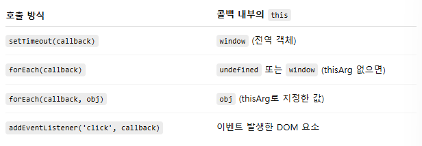
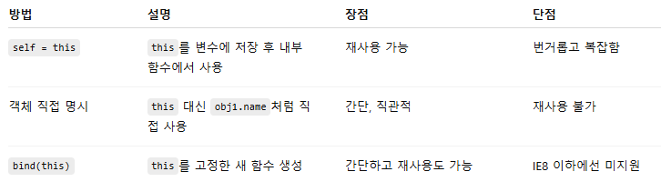
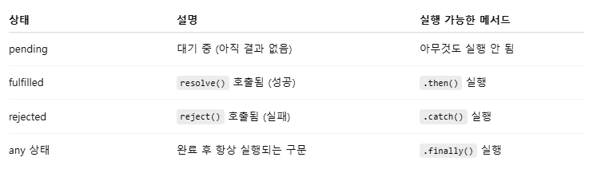

# Chapter 4. 콜백 함수
- [Chapter 4. 콜백 함수](#chapter-4-콜백-함수)
  - [4-1. 콜백 함수(callback function)란?](#4-1-콜백-함수callback-function란)
  - [4-2. 제어권](#4-2-제어권)
    - [4-2-1. 호출 시점](#4-2-1-호출-시점)
    - [4-2-2. 인자](#4-2-2-인자)
    - [4-2-3. this](#4-2-3-this)
  - [4-3. 콜백 함수는 함수다](#4-3-콜백-함수는-함수다)
  - [4-4. 콜백 함수 내부의 this에 다른 값 바인딩하기](#4-4-콜백-함수-내부의-this에-다른-값-바인딩하기)
    - [4-4-1. 전통적인 방식](#4-4-1-전통적인-방식)
    - [4-4-2. this를 안 쓰고 객체를 직접 지정](#4-4-2-this를-안-쓰고-객체를-직접-지정)
    - [4-4-3.  func 함수 재활용](#4-4-3--func-함수-재활용)
    - [4-4-4. bind 메서드 활용 (권장)](#4-4-4-bind-메서드-활용-권장)
  - [4-5. 콜백 지옥과 비동기 제어](#4-5-콜백-지옥과-비동기-제어)
    - [4-5-1. 동기(Synchronous) vs 비동기(Asynchronous)](#4-5-1-동기synchronous-vs-비동기asynchronous)
    - [4-5-2. 콜백 지옥(Callback Hell)](#4-5-2-콜백-지옥callback-hell)
    - [4-5-3. 콜백 지옥을 해결하는 방법](#4-5-3-콜백-지옥을-해결하는-방법)
  - [4-6. 정리](#4-6-정리)
- [Q \& A](#q--a)

## 4-1. 콜백 함수(callback function)란?
- **콜백 함수** : 다른 코드(함수나 메서드)의 **인자로 전달되는 함수**
  - 전달받은 쪽이 **콜백 함수의 호출 시점**을 스스로 결정
  - 즉, 언제 실행할지를 호출자가 판단한다는 뜻 => “호출 시점에 대한 제어권”을 넘김
  - 대표적인 예
    - setTimeout, setInterval → 지정한 시간 후에 호출
    - addEventListener → 사용자의 이벤트 발생 시 호출
    - 비동기 함수 (fetch().then(...)) → 응답이 도착했을 때 호출

> 🤓 참고 
>  
> call(부르다, 호출하다) + back(뒤돌아오다, 되돌다) → '되돌아 호출해달라' 명령
>
> 어떤 함수 X를 호출하면서 '특정 조건일 때 함수 Y를 실행해 본인에게 알려달라' 요청
>
> 함수 X는 해당 조건이 갖춰졌는지 판단 후 Y 호출

## 4-2. 제어권
### 4-2-1. 호출 시점
*콜백 함수 예제 - setInterval*
```js
var intervalID = scope.setInterval(func, delay[, param1, param2, ...]);
```
- scope : window 객체 또는 Worker의 인스턴스
  - 두 객체 모두 setInterval 메서드 제공하기 때문
  - 일반적으로 브라우저 환경에서는 window를 생략해 함수처럼 사용 가능
- 매개변수
  - func : 함수
  - delay : 밀리초(ms) 단위 숫자
  - 나머지(선택적) : func 함수 실행 시 매개변수로 전달할 인자
- 동작 과정
  - 지정한 함수(func)를 지정한 시간 간격(delay)마다 반복 실행
  -  반복 작업을 식별할 수 있는 고유한 ID(타이머 ID)를 반환
  - 이 타이머 ID를 변수에 저장해두면
→ clearInterval(타이머 ID)를 사용해 중간에 실행을 멈출 수 있음

```js
var count = 0;
var cbFunc = function () {
    console.log(count);
    if (++count > 4) clearInterval(timer);
};
var timer = setInterval(cbFunc, 300);

// -- 실행 결과 --
//0 (0.3초)
// 1 (0.6초)
// 2 (0.9초)
// 3 (1.2초)
// 4 (1.5초)
```
- cbFunc();
    - 사용자가 직접 cbFunc를 호출
    - 호출 시점과 실행 흐름에 대한 제어권은 사용자에게 있음
- setInterval(cbFunc, 300);
  - cbFunc를 setInterval의 인자로 전달
    - 제어권은 setInterval에게 넘어감
    - setInterval이 0.3초마다 스스로 판단해 cbFunc를 호출함
  - ✨ 콜백 함수 호출 시점에 대한 제어권은 setInterval이 가짐

### 4-2-2. 인자
*콜백 함수 예제 - Array.prototype.map*
```js
Array.prototype.map(callback[, thisArg])
callback: function(currentValue, index, array);
```
- map
  - 메서드의 대상이 되는 배열의 모든 요소를 처음부터 끝까지 꺼내어 콜백 함수 반복 호출
  - 콜백 함수의 실행 결과들을 모아 새로운 배열 만듦
- callback 함수
  - currentValue : 배열 요소 중 현재값
  - index : 현재값의 인덱스
  - array : map 메서드의 대상이 되는 배열 자체
- thisArg
  - 콜백 함수 내부에서 this로 인식할 대상 특정
  - 생략 시 전역객체 바인딩

```js
var newArr = [10, 20, 30].map(function  (currentValue, index) {
    console.log(currentValue, index);
    return currentValue + 5;
});
console.log(newArr);

// -- 실행 결과 --
// 10 0
// 20 1
// 30 2
// [15, 25, 35]


var newArr2 = [10, 20, 30].map(function (index, currentValue) {
    console.log(index, currentValue);
    return currentValue + 5;
});
console.log(newArr2);

// -- 실행 결과 --
// 10 0
// 20 1
// 30 2
// [5, 6, 7]
```
- 같은 로직에 인자의 순서를 임의로 바꾼다면?
  - 컴퓨터는 **순서**에 의해서 각각 구분 및 인식
  - 변수명과 상관없이 전혀 다른 결과 나옴
  - 원하는 배열을 받기 위해선 해당 메서드에 정의된 규칙에 따라 작성해야 함
    - 콜백 함수의 인자로 넘어올 값들 및 순서 포함
- ✨ 콜백 함수의 제어권을 넘겨받은 코드는 콜백 함수를 호출할 때 인자에 어떤 값들을 어떤 순서로 넘길 것인지에 대한 제어권을 가짐

### 4-2-3. this
- 콜백 함수에서 this는 누가 호출하느냐에 따라 달라짐
- 함수가 호출될 때, 그 함수의 this는 누가 호출했느냐에 따라 자동으로 결정됨
- 단, .call(), .apply(), .bind()를 사용하면 명시적으로 this를 지정할 수 있음

> 🤓 call, apply, bind 요약 정리
>
> ① call(thisArg, ...args)
> - 함수 즉시 실행
> - 첫 번째 인자 : this로 사용할 객체
> - 나머지 : 함수에 넘길 인자들
> - func.call(대상this, 인자1, 인자2, ...)
>
> ② apply(thisArg, [args])
> - call과 거의 동일하지만, 인자를 배열로 전달
> - func.apply(대상this, [인자1, 인자2, ...])
>
> ③ bind(thisArg, ...args)
> - 함수를 즉시 실행하지 않고, this와 인자를 미리 고정한 새 함수 반환
> - const newFunc = func.bind(대상this, 인자1);
newFunc(); // 나중에 실행

<br/>

*콜백 함수 예제 - Array.prototype.map 구현*
```js
Array.prototype.map = function(callback, thisArg) {
  var mappedArr = [];
  for (var i = 0; i < this.length; i++) {
    var mappedValue = callback.call(thisArg || window, this[i], i, this);
    mappedArr[i] = mappedValue;
  }
  return mappedArr;
};
```
- callback.call()
  - thisArg : thisArg로 넘긴 값
    - ✨ 콜백 함수 안에서는 thisArg로 지정한 값이 this
  - this[i] : 현재 순회 중인 배열 요소 값
  - i : 현재 인덱스
  - this : 원본 배열 전체
  
*콜백 함수 예제 - 차이 비교*
```js
setTimeout(function () {
  console.log(this); // (1)
}, 300);

[1, 2, 3].forEach(function (x) {
  console.log(this); // (2)
});

document.body.innerHTML += '<button id="a">클릭</button>';
document.querySelector('#a').addEventListener('click', function (e) {
  console.log(this); // (3)
});
```
(1)
- setTimeout()은 내부적으로 콜백.call(window)처럼 동작함
- this === window  
  
(2)
- forEach는 this를 인자로 넘겨주지 않으면 기본적으로 undefined (strict mode) 또는 window (non-strict mode)
- 따로 thisArg를 넘기지 않았기 때문에 this === window

(3)
- addEventListener에서 this는 이벤트를 받은 DOM 요소 (#a 버튼)
- 내부적으로 콜백.call(버튼요소)처럼 실행됨
- this === 버튼 요소




## 4-3. 콜백 함수는 함수다
- 메서드로 호출될 때만 this가 그 객체를 가리킴
- 메서드를 다른 함수에 콜백으로 넘기면?
  - ✨ 객체의 메서드도 결국 함수이기 때문에 this가 바뀜

<br />

*예시를 통해 살펴보기*
```js
var obj = {
  vals: [1, 2, 3],
  logValues: function(v, i) {
    console.log(this, v, i);
  }
};

obj.logValues(1, 2);           // (A)
[4, 5, 6].forEach(obj.logValues); // (B)
```
(A) 직접 메서드 호출
- this === obj
- { vals: [1, 2, 3], logValues: f } 1 2

(B) 콜백으로 전달
- obj.logValues는 함수의 **참조값**(함수 자체)만 넘긴 것
- 호출은 forEach가 함 + 별도로 this 지정 인자 지정 안 함
- this는 전역 객체(window) (또는 undefined, strict 모드면)
- Window { ... } 4 0  
Window { ... } 5 1  
Window { ... } 6 2
    <details>
    <summary>[4, 5, 6].forEach(obj)는?</summary>

    - TypeError: obj is not a function
    - forEach는 내부적으로 콜백 함수를 기대하고 실행
    - obj는 함수가 아닌 객체
  
    </details>

> 🤓 this가 바뀌는 걸 막고 싶다면?
>
> ① bind()로 this 고정
> - [4, 5, 6].forEach(obj.logValues.bind(obj));
> 
> ② 화살표 함수로 감싸기
> - [4, 5, 6].forEach((v, i) => obj.logValues(v, i));

## 4-4. 콜백 함수 내부의 this에 다른 값 바인딩하기
### 4-4-1. 전통적인 방식
```js
var obj1 = {
  name: 'obj1',
  func: function () {
    var self = this; // ① this를 self에 저장
    return function () {
      console.log(self.name); // ② self를 통해 this처럼 사용
    };
  }
};

var callback = obj1.func();      // ③ 내부 함수 반환
setTimeout(callback, 1000);      // ④ 1초 후 "obj1" 출력
```
- this를 직접 쓰지 않고, self라는 변수에 따로 저장해 사용
- 장점: 나중에 다른 객체에도 재사용 가능
- 단점: 번거롭고, 코드가 지저분해짐


### 4-4-2. this를 안 쓰고 객체를 직접 지정
```js
var obj1 = {
  name: 'obj1',
  func: function () {
    console.log(obj1.name);
  }
};

setTimeout(obj1.func, 1000); // "obj1" 출력
```
- 장점 : 코드가 간결하고 this 관련 혼란 없음
- 단점: 이 함수는 오직 obj1에서만 동작. 다른 객체에 복사하거나 재사용 불가

### 4-4-3.  func 함수 재활용
```js
var obj1 = {
  name: 'obj1',
  func: function () {
    var self = this;
    return function () {
      console.log(self.name);
    };
  }
};

var obj2 = {
  name: 'obj2',
  func: obj1.func
};

var callback2 = obj2.func(); // this는 obj2
setTimeout(callback2, 1500); // → "obj2"

var obj3 = { name: 'obj3' };
var callback3 = obj1.func.call(obj3); // this는 obj3
setTimeout(callback3, 2000); // → "obj3"
```
- 장점
  - this를 쓰기 때문에 다른 객체에 재사용 가능
  - 실행 시점마다 다른 객체를 바라볼 수 있음
- 단점
  - 코드가 조금 복잡하고, self = this 같은 우회 방식 필요


### 4-4-4. bind 메서드 활용 (권장)
```js
var obj1 = {
  name: 'obj1',
  func: function () {
    console.log(this.name);
  }
};

setTimeout(obj1.func.bind(obj1), 1000); // "obj1"
```
- bind(obj1)을 통해 this를 obj1로 고정
- 함수는 즉시 실행되지 않고, this가 고정된 새로운 함수가 반환됨
- 장점 : 간결 + 재사용 가능



## 4-5. 콜백 지옥과 비동기 제어
### 4-5-1. 동기(Synchronous) vs 비동기(Asynchronous)
- 동기(Synchronous)
    - 현재 실행 중인 코드가 완료된 후에 다음 코드를 실행하는 방식
    - 대부분의 계산, 변수 처리, 함수 호출 등은 동기 처리됨
- 비동기
  - 현재 실행 중인 코드와 무관하게 다음 코드를 실행하는 방식
  - 특정 작업은 나중에(지연되어) 실행됨
  - 주로 시간이 오래 걸리는 작업 (타이머, 서버 요청, 이벤트 대기 등)에 사용  
    - 별도의 요청, 실행 대기, 보류 등과 관련된 코드

=> 자바스크립트는 기본적으로 '동기적'이지만, 특정 처리에서 비동기로 동작

### 4-5-2. 콜백 지옥(Callback Hell)
- 비동기 작업이 순서대로 실행되도록 하기 위해 콜백 안에 콜백을 넣는 구조가 생김
- **콜백 지옥** : 콜백 함수를 익명 함수로 계속 중첩해서 작성하다 보면 들여쓰기가 감당하기 힘들 정도로 깊어지는 현상
- 코드는 작동하지만 가독성↓, 유지보수 어려움↑
```js
setTimeout(function (name) {
  console.log(name); // 에스프레소
  setTimeout(function (name) {
    console.log(name); // 아메리카노
    setTimeout(function (name) {
      console.log(name); // 카페모카
    }, 500, '카페모카');
  }, 500, '아메리카노');
}, 500, '에스프레소');

```

### 4-5-3. 콜백 지옥을 해결하는 방법
익명의 콜백 함수를 모두 기명함수로 전환하거나 비동기 제어를 통해 해결

① Promise
- ES6에서 도입
- 비동기 작업의 성공/실패를 표현할 수 있는 객체
- 동작 원리
  - `new Promise()`로 Promise 객체 생성
    - 생성 시, 내부에 전달한 콜백 함수는 즉시 실행
  - `resolve()` 또는 `reject()` 호출
    - resolve() : 성공 시 실행
    - reject() : 실패 시 실행
    - 호출하지 않으면 대기(pending) 상태로 머무름
  - 상태에 따라 `.then()` 또는 `.catch()`로 연결
    - 작업의 완료 이후 로직을 체이닝 방식으로 연결  

- 장점
  - 가독성 향상
  - 상태 추적 가능
  - 예외 처리 통합(catch())
  - 비동기 흐름 연결 → 여러 비동기 작업을 순차/병렬로 구성 가능 (Promise.all, Promise.race)
- 단점
  - 체이닝이 길어지면 복잡함
  - 로직 분기 어려움
  - 예외 처리 분산
  - 중첩 사용 시 지저분
- 언제 사용하면 좋을까?
    - 콜백 기반 비동기 코드를 개선하고 싶을 때
    - 비동기 작업을 순차적으로 실행해야 할 때
    - 여러 비동기 작업을 동시에 실행하고 모두 기다려야 할 때
    - 기본적인 비동기 컨트롤을 적용하고 싶은데 async/await은 아직 사용하지 못하는 환경일 때

<br/>

```js
var addCoffee = function (name) {
    return function (prevName) {
        return new Promise(function (resolve) {
            setTimeout(function () {
                var newName = prevName ? (prevName +','+ name) : name;
                console.log(newName);
                resolve(newName);
            }, 500);
        });
    };
};

addCoffee('에스프레소') ()
    .then (addCoffee('아메리카노'))
    .then (addCoffee('카페모카'))
    .then (addCoffee('카페라떼'))
```
② Generator
- ES6에서 도입
- 호출하면 Iterator(반복자) 객체를 반환하는 함수
- 동작 원리 
  - `function*` 키워드로 선언
  - 반환된 Iterator 객체는 `.next()` 메서드를 가짐
    - `.next()` 호출 시, Generator 함수는 `yield`까지 실행되고 **멈춤**
    - 다음 `.next(value)` 호출 시, 그 value가 **이전 yield 표현식의 결과로 들어감**
  - `yield`는 **중간 정지 지점**이자, **값을 주고받는 교환 포인트**
- 장점
  - 비동기 흐름을 순차적 코드처럼 작성 가능
  - 콜백 함수 중첩 없이 깔끔하게 처리 가능
  - 외부에서 .next()로 흐름을 정밀하게 제어할 수 있음
- 단점
  - next()를 외부에서 직접 호출해야 한다는 번거로움
  - Promise, async/await보다 사용이 복잡하고 직관성이 떨어질 수 있음
  - 자동 실행을 위해서는 추가 도구(co, redux-saga 등) 필요
- 언제 사용하면 좋을까?
  - 순차적인 비동기 단계 처리가 필요할 때
  - 비동기 흐름을 “중단했다가 재개”하는 구조가 필요할 때

<br/>

```js
// 비동기 함수: 0.5초 후 다음 단계로 진행
function addCoffee(prevName, name) {
  setTimeout(() => {
    const result = prevName ? `${prevName}, ${name}` : name;
    coffeeMaker.next(result); // yield에 결과 전달
  }, 500);
}

// Generator 함수: 단계별로 yield
function* coffeeGenerator() {
  const espresso = yield addCoffee('', '에스프레소');
  console.log(espresso); // → "에스프레소"

  const americano = yield addCoffee(espresso, '아메리카노');
  console.log(americano); // → "에스프레소, 아메리카노"

  const mocha = yield addCoffee(americano, '카페모카');
  console.log(mocha); // → "에스프레소, 아메리카노, 카페모카"

  const latte = yield addCoffee(mocha, '카페라떼');
  console.log(latte); // → "에스프레소, 아메리카노, 카페모카, 카페라떼"
}

// 실행
const coffeeMaker = coffeeGenerator();
coffeeMaker.next(); // 첫 yield(addCoffee)까지 실행
```
- coffeeGenerator() 실행 → Generator 객체 반환 (coffeeMaker)
- coffeeMaker.next() 호출 → 첫 yield(addCoffee)까지 실행되고 정지
- addCoffee()의 setTimeout에서 0.5초 후 coffeeMaker.next(value) 실행
- value가 이전 yield의 결과가 되어 다음 줄부터 실행 계속
- 다음 단계 반복 → yield → next(value) → yield → next(value) ...

③ async / await
- ES2017(ES8)에서 도입
- Promise 기반 문법을 동기 코드처럼 간결하게 작성할 수 있게 해줌
  - `async` : **Promise를 반환하는 함수**를 정의
  - `await` : 그 내부에서 **Promise가 처리(resolve)될 때까지 기다림**
- 동작 원리
  - `async function`은 항상 Promise를 반환
    - 명시적으로 `Promise`를 반환하지 않아도 return 값이 자동으로 `Promise.resolve(value)`로 감싸짐
  - `await` 키워드는 **Promise가 처리될 때까지 함수 실행을 일시 중지**
    - 처리된 결과 값을 기다려서 **그 값을 변수에 할당**하고 다음 줄로 넘어감
    - `await` 뒤에는 반드시 **Promise 객체가 오거나 Promise를 반환하는 함수**여야 함
- 장점
  - 가독성 및 유지보수 좋음
  - 예외 처리 용이(try - catch)
  - Promise 기반 호환
    - 기존의 then() 구조의 코드를 await로 쉽게 전환 가능
- 단점
  - 순차 처리만 가능
    - 병렬로 실행하려면 Promise.all() 등 추가 로직 필요
  - await 남용 위험
  - 비동기 컨텍스트 필요
- 언제 사용하면 좋을까?
  - 비동기 작업이 순서대로 일어나야 할 때
  - Promise의 .then().then().catch() 체인이 길어지는 경우
  - 비동기 작업 중 예외 처리까지 통합적으로 처리하고 싶을 때
  - UI 로직이나 흐름 제어가 중요한 클라이언트 측 코드

<br/>

```js
// 비동기 함수 (0.5초 후 완료되는 Promise)
function addCoffee(name) {
  return new Promise((resolve) => {
    setTimeout(() => resolve(name), 500);
  });
}

// async/await로 작성한 순차적 비동기 처리
const coffeeMaker = async function () {
  let coffeeList = '';

  const _addCoffee = async function (name) {
    coffeeList += (coffeeList ? ', ' : '') + await addCoffee(name);
    console.log(coffeeList);
  };

  await _addCoffee('에스프레소');
  await _addCoffee('아메리카노');
  await _addCoffee('카페모카');
  await _addCoffee('카페라떼');
};

coffeeMaker();
```
- coffeeMaker() 함수는 async로 정의되어 Promise를 반환
- _addCoffee(name) 함수 내부에서 await addCoffee(name)이 0.5초 뒤에 완료될 Promise를 기다림
- 이전 작업이 끝난 뒤 다음 작업으로 순차 진행
- 결과: 에스프레소 → 에스프레소, 아메리카노 → ... 순차 출력됨

## 4-6. 정리
- 콜백 함수 : 다른 코드에 인자로 넘겨줌으로써 그 제어권도 함께 위임한 함수
- 제어권을 넘겨받은 코드는 다음과 같은 제어권을 가짐
  - 콜백 함수를 호출하는 시점을 스스로 판단해서 실행합
  - 콜백 함수를 호출할 때 인자로 넘겨줄 값들 및 그 순서가 정해짐(이 순서를 따르지 않고 코드를 작성하면 엉뚱한 결과를 얻게 됨)
  - 콜백 함수의 this가 무엇을 바라보도록 할지가 정해져 있는 경우도 있음(정하지 않은 경우에는 전역객체를 바라봄)
    - 사용자 임의로 this를 바꾸고 싶을 경우 bind 메서드 활용
- 어떤 함수에 인자로 메서드를 전달하더라도 이는 결국 함수로서 실행됨
- 비동기 제어를 위해 콜백 함수를 사용하다 보면 콜백 지옥에 빠지기 쉬움
  - 최근의 ECMAScript에는 Promise, Generator, async/await 등 콜백 지옥에서 벗어날 수 있는 방법 있음
---
# Q & A
**1. 콜백 함수란 무엇이며, 제어권이란 어떤 의미인가요?**  
콜백 함수는 다른 코드의 인자로 전달되는 함수로, 실행 시점의 제어권을 넘긴 함수입니다. 예를 들어 setTimeout(cb, 1000)에서 cb는 사용자가 정의했지만, 실제로 언제 실행할지는 setTimeout이 정합니다. 즉, 콜백 함수의 호출 시점이나 인자, this 바인딩 등을 제어하는 주체가 호출자가 된다는 의미에서 '제어권을 넘긴다'고 표현합니다.

**2. 콜백 함수 내부의 this는 어떤 원리로 결정되나요?**  
콜백 함수 내부의 this는 기본적으로 그 함수를 누가 호출했느냐에 따라 결정됩니다. 예를 들어, 객체의 메서드를 콜백으로 넘기면 메서드로서의 this를 잃고 전역 객체를 참조하게 되는데, 이를 방지하려면 .bind()를 사용해 명시적으로 this를 고정하거나, 화살표 함수로 감싸서 lexical this를 유지할 수 있습니다.

**3. 콜백 지옥(Callback Hell)이란 무엇이며, 이를 해결하기 위한 방법은 무엇인가요?**  
콜백 지옥은 비동기 작업을 순차 처리하기 위해 콜백 함수가 중첩되면서 들여쓰기와 복잡도가 증가하는 현상입니다. 이를 해결하기 위해 Promise를 사용해 .then() 체이닝을 하거나, Generator로 흐름을 yield로 나누고, 최근에는 async/await를 통해 동기 코드처럼 순차적으로 작성하는 방식이 가장 많이 사용됩니다.

**4. Promise의 상태 흐름과 resolve, reject의 역할을 설명해주세요.**  
Promise는 pending → fulfilled 또는 pending → rejected로 상태가 전이됩니다. resolve()는 작업이 성공했을 때 호출되어 fulfilled 상태로 전환되고, .then()을 통해 이후 작업을 실행합니다. 반대로 reject()는 실패 시 호출되며, .catch()에서 에러를 처리할 수 있습니다. 비동기 작업이 완료될 때까지 대기 상태를 유지하며, 상태가 전이되면 연결된 핸들러가 실행됩니다.

**5. async/await의 동작 원리와 언제 사용하면 좋은지 설명해주세요.**  
async 함수는 항상 Promise를 반환하며, await는 Promise가 처리(resolve)될 때까지 실행을 중단하고 결과를 기다립니다. 이를 통해 비동기 작업을 마치 동기 코드처럼 순차적으로 작성할 수 있어 가독성과 유지보수성이 높아집니다. try...catch로 예외 처리도 통일되므로, 복잡한 비동기 로직이나 UI 흐름 제어에 적합합니다. 단, 병렬 처리에는 Promise.all()을 함께 사용하는 것이 좋습니다.
