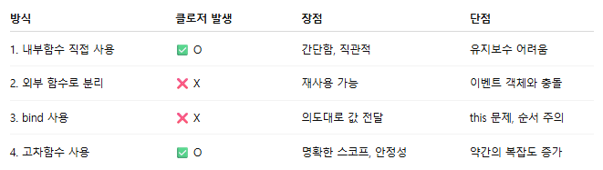
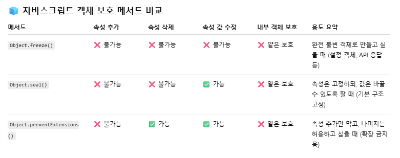
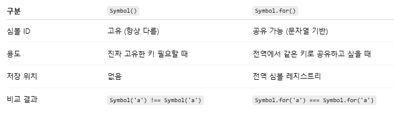
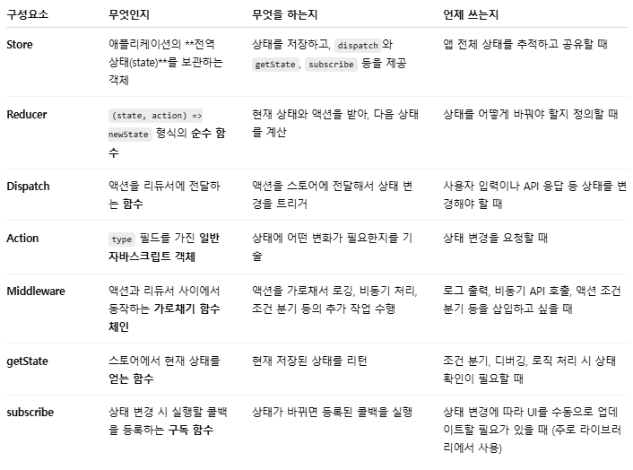

# Chapter 5. 클로저

- [Chapter 5. 클로저](#chapter-5-클로저)
  - [5-1. 클로저의 의미 및 원리 이해](#5-1-클로저의-의미-및-원리-이해)
  - [5-2. 클로저와 메모리 관리](#5-2-클로저와-메모리-관리)
  - [5-3. 클로저 활용 사례](#5-3-클로저-활용-사례)
    - [5-3-1. 콜백 함수 내부에서 외부 데이터를 사용하고자 할 때](#5-3-1-콜백-함수-내부에서-외부-데이터를-사용하고자-할-때)
    - [5-3-2. 접근 권한 제어(정보 은닉)](#5-3-2-접근-권한-제어정보-은닉)
    - [5-3-3. 부분 적용 함수](#5-3-3-부분-적용-함수)
    - [5-3-4. 커링 함수](#5-3-4-커링-함수)
  - [5-4. 정리](#5-4-정리)
- [Q \& A](#q--a)

## 5-1. 클로저의 의미 및 원리 이해
**클로저(Closure)**
- 함수가 선언될 당시의 **스코프(Lexical Environment)를 기억**해 외부 함수가 종료된 이후에도 해당 변수에 접근할 수 있는 현상
  - 자바스크립트는 함수가 생성될 때 자신이 선언된 위치의 스코프 기억함
  - 그 스코프 안의 지역 변수를 참조하는 내부 함수가 외부로 전달되면, 외부 함수의 실행 컨텍스트가 종료되더라도 해당 변수는 GC(가비지 컬렉터)에 의해 제거되지 않고 유지됨
    <details>
    <summary>📌 Lexical Environment 되짚기</summary>

    **Lexical Environment란?**
    - 자바스크립트 엔진이 **식별자(변수, 함수 등)** 를 **어디서, 어떻게 찾을지** 결정하는 구조
    - 지금 이 시점에서 어떤 변수들을 접근할 수 있는지 정의
    
    **구성 요소**  
    ① Environment Record
     - 현재 스코프의 변수와 함수 저장소
     - `{ a: 1, b: function() {} }` 같은 형태의 키-값 쌍

    ② Outer Environment Reference
     - **외부 렉시컬 환경을 가리키는 참조**
     - 한 단계 바깥의 스코프(예: 외부 함수나 전역 컨텍스트)를 가리킴
     - 이것이 **스코프 체인**을 형성
    </details>
        <details>
    <summary>📌 가비지 컬렉션(Garbage Collection, GC)</summary>

    **가비지 컬렉션이란?**
    - 더 이상 사용되지 않는 메모리를 **자동으로 해제**해주는 메커니즘
    - 자바스크립트는 명시적으로 메모리를 해제하지 않아도 되는 자동 메모리 관리 언어
      - 사용하지 않는 객체를 자동으로 탐지하여 메모리에서 제거
    - 제거 대상 : 아무도 참조되지 않는 값
      - 어떤 값을 참조하는 변수가 하
나라도 있다면 그 값은 수집 대상에 포함시키지 않음
    - 실행 시기 : 주기적/특정 조건 하에 자동 실행
      - 자바스크립트 엔진(V8 등)의 내부 결정
      - 개발자가 직접 호출할 수 없음
    
    *예시*
    ```js
    function outer() {
        let a = 10;
        function inner() {
            console.log(a);
        }
        inner(); // 호출하고 끝
    }
    outer(); // outer와 inner 모두 종료
    ```  
    - outer 함수의 실행 컨텍스트가 종료되면 LexicalEnvironment에 저장된 식
별자들(a, inner)에 대한 참조 지움
    - inner가 외부로 전달되지 않음
    - a를 참조하는 함수가 더 이상 존재하지 않음 → GC 가능
    </details>

**기본 구조**
```js
function outer() {
  let count = 0; // 외부 함수의 지역 변수
  return function inner() {
    return ++count; // 지역 변수를 참조
  };
}

const counter = outer();
console.log(counter()); // 1
console.log(counter()); // 2
```
- inner는 outer의 지역 변수 count를 계속 기억하고 사용
- outer()가 실행 마쳐도 inner()가 count를 참조하고 있어 수집되지 않음

<br/>

> 🤔 클로저가 아닌 예시
>
> ```js
> function outer() {
>   let a = 1;
>   function inner() {
>     console.log(++a);
>   }
>   inner(); // outer 내에서만 inner 실행
> }
> outer(); // a는 외부로 전달되지 않아 GC 대상
> ```
> - inner가 외부로 반환되지 않아 a는 클로저가 되지 않고 메모리에서 제거됨
>

<br/>

**클로저의 핵심 조건**  
① 내부 함수가 외부 함수의 지역 변수 참조  
② 내부 함수가 외부 함수 실행 종료 이후에도 접근 가능  
③ 단순 return 뿐 아니라 이벤트 핸들러, 타이머, 콜백 등에 전달된 경우도 포함 → 외부로 전달
<details>
<summary>다양한 클로저 예시</summary>

*1. setInterval*
```js
(function () {
  let a = 0;
  let intervalId = setInterval(function () {
    if (++a >= 5) clearInterval(intervalId);
    console.log(a);
  }, 1000);
})();
```
- 지역 변수 a를 참조하는 내부 함수가 setInterval로 외부에 전달됨 → 클로저
  
*2. 이벤트 리스너*
```js
(function () {
  let count = 0;
  const btn = document.createElement('button');
  btn.innerText = 'Click me';
  btn.addEventListener('click', function () {
    console.log(++count, 'clicked');
  });
  document.body.appendChild(btn);
})();
```
- click 이벤트가 발생할 때마다 count에 접근 → 클로저 발생
</details>

## 5-2. 클로저와 메모리 관리
클로저는 **의도적으로** 외부 함수의 **지역 변수**를 **함수 외부에서 계속 참조**하도록 만듦  
- 클로저는 메모리 누수를 일으킨다?! ❌
  - 메모리를 더 오래 유지하도록 함
  - GC가 수거하지 않는 이유는 여전히 참조 중이기 때문
  - 누수인지 의도된 유지인지는 개발자의 설계에 따라 다름

**메모리 누수란?**  
- 참조되지 않아야 할 값이 계속 참조되고 있어 GC 대상이 되지 못하는 상태
  - 대표적인 사례: 순환 참조, 제거하지 않은 이벤트 리스너, 타이머 등
  - 최근의 브라우저(특히 Chrome의 V8 엔진)에서는 대부분의 자동 GC 문제 개선됨
- ✨ 참조를 끊어주어 해당 메모리가 수거되도록 해야 함
  - 식별자에 null 또는 undefined 할당
    <details>
    <summary>클로저 해제 예시</summary>

    *1. return에 의한 클로저 메모리 해제*
    ```js
    var outer = (function () {
      var a = 1;
      var inner = function () {
        return ++a;
      };
      return inner;
    })();
    console.log(outer()); // 2
    console.log(outer()); // 3
    outer = null; // ❗참조 해제 → 메모리 회수 가능
    ```
    *2. setInterval에 의한 클로저 해제*
    ```js
    (function () {
      var a = 0;
      var intervalId = null;
      var inner = function () {
        if (++a >= 10) {
          clearInterval(intervalId); // 타이머 해제
          inner = null;              // ❗함수 참조 해제
        }
        console.log(a);
      };
      intervalId = setInterval(inner, 1000);
    })();
    ```
    *3. addEventListener에 의한 클로저 해제*
    ```js
    (function () {
      var count = 0;
      var button = document.createElement('button');
      button.innerText = 'click';

      var clickHandler = function () {
        console.log(++count, 'times clicked');
        if (count >= 10) {
          button.removeEventListener('click', clickHandler); // 이벤트 해제
          clickHandler = null; // ❗참조 해제
        }
      };

      button.addEventListener('click', clickHandler);
      document.body.appendChild(button);
    })();
    ```
    </details>
## 5-3. 클로저 활용 사례
### 5-3-1. 콜백 함수 내부에서 외부 데이터를 사용하고자 할 때
*이벤트 리스너 예시*
```js
var fruits = ['apple', 'banana', 'peach'];
var $ul = document.createElement('ul');

fruits.forEach(function (fruit) {  // A 콜백 함수
  var $li = document.createElement('li');
  $li.innerText = fruit;
  $li.addEventListener('click', function () { // B 콜백 함수
    alert('your choice is ' + fruit);
  });
  $ul.appendChild($li);
});
document.body.appendChild($ul);
```
- fruit는 외부 변수지만, click 이벤트의 콜백 함수 내부에서 사용되고 있음
- 이 콜백 함수는 클로저를 형성하여, 외부 변수 fruit를 기억
- forEach가 호출될 때마다 별개의 실행 컨텍스트가 만들어지고, 각각의 fruit 값이 클로저에 저장됨
- 결과 - "your choice is apple... "

✔️ B가 콜백 함수에 국한되지 않는 경우라면?
  - 외부로 분리

*콜백 함수 분리 시 생기는 문제*
```js
var alertFruit = function (fruit) {  // ① 함수 선언
  alert('your choice is ' + fruit);
};

fruits.forEach(function (fruit) {
  var $li = document.createElement('li');
  $li.innerText = fruit;
  $li.addEventListener('click', alertFruit); // ② 콜백 등록만
  $ul.appendChild($li);
});

alertFruit(fruits[1]); // ③ 함수 직접 호출 "your choice is banana" 출력
```
- fruit를 인자로 받아 출력하는 형태로 분리
- addEventListener는 콜백 함수에 **이벤트 객체**를 첫 번째 인자로 자동 전달
  - 콜백 함수의 인자에 대한 제어권 → addEventListener
  - 클릭 시 브라우저 내부에서는 `alerFruit(event);`
  - 즉 자동으로 MouseEvent 객체 넣어 호출
- 결과 - "your choice is [object MouseEvent]"

✔️ 문제 해결1 - bind
```js
fruits.forEach(function (fruit) {
  var $li = document.createElement('li');
  $li.innerText = fruit;
  $li.addEventListener('click', alertFruit.bind(null, fruit));
  $ul.appendChild($li);
});
```
- alertFruit은 fruit을 첫 번째 인자로 받아 실행됨
  - bind(null, fruit)
    - this : 새로 바인딩할 this, 생략 불가능 → null 처리
    - ...args : ① fruit로 고정, ② MouseEvent는 다음 인자로 넘어오나 사용하지 않기 때문에 무시
- 클로저는 발생하지 않지만, this 바인딩 문제와 인자 순서 제약 존재

✔️ 문제 해결2 - 고차함수
- **고차함수** : 함수를 인자로 받거나 함수를 리턴하는 함수
```js
var alertFruitBuilder = function (fruit) {
  return function () {
    alert('your choice is ' + fruit);
  };
};

fruits.forEach(function (fruit) {
  var $li = document.createElement('li');
  $li.innerText = fruit;
  $li.addEventListener('click', alertFruitBuilder(fruit));
  $ul.appendChild($li);
});
```
- alertFruitBuilder(fruit)를 실행하면 클로저를 가진 새 함수가 생성됨
- 이 함수는 fruit 값을 기억하고 있다가 클릭 시 해당 값을 출력
- 이벤트 객체와 충돌 없음, this도 문제 없음
- 유지보수성과 명확성 확보



### 5-3-2. 접근 권한 제어(정보 은닉)
**정보 은닉(Information Hiding)**
- 외부에서 내부 로직이나 상태를 직접 수정하지 못하도록 막는 것(결합도↓, 유연성↑)
- 접근 권한을 통해 설계자가 허용한 방법만으로 객체 수정
  - 객체지향 언어 - 'private', 'public', 'protected' 키워드
    - private : 내부에서만 사용, 외부 노출 안 됨
    - public : 외부 접근 가능
- ✨ 자바스크립트는 변수 자체에 접근 권한을 직접 부여하도록 설계X → 클로저로 우회 가능
  - ① 함수에서 지역변수 및 내부 함수 등 생성
  - ② return을 통해 접근 권한 부여(공개 멤버)
    - 대상이 하나 초과일 때 - 객체/배열
    - 대상이 하나일 때 - 함수

*자동차 경주 게임 예시*
```js
var car = {
  fuel: 20,         // 연료
  power: 5,         // 연비
  moved: 0,         // 이동거리
  run: function () {
    var km = Math.ceil(Math.random() * 6);
    var wasteFuel = km / this.power;
    if (this.fuel < wasteFuel) {
      console.log('이동불가');
      return;
    }
    this.fuel -= wasteFuel;
    this.moved += km;
    console.log(`${km}km 이동 (총 ${this.moved}km)`);
  }
};

/*
기존 객체는 속성 조작 가능
car. fuel = 10000;
car.power = 100;
car.moved = 1000;
*/
```

✔️ 클로저로 보호하기
```js
var createCar = function () {
  var fuel = 20;
  var power = 5;
  var moved = 0;

  // var publicMembers = {
  return {
    get moved() {
      return moved;
    },
    run: function () {
      var km = Math.ceil(Math.random() * 6);
      var wasteFuel = km / power;
      if (fuel < wasteFuel) {
        console.log('이동불가');
        return;
      }
      fuel -= wasteFuel;
      moved += km;
      console.log(`${km}km 이동 (총 ${moved}km). 남은 연료: ${fuel}`);
    }
  };
  // Object.freeze(publicMembers); // 🔒 외부에서 run 덮어쓰기 방지
  // return publicMembers;
};

var car = createCar();

/*
① 변수에 접근하는 경우
car.run(); // 3km 이동(총 3km). 남은 연료: 17.4
console.log(car.moved); //3
console.log(car.fuel); // undefined
console.log(car.power); // undefined

② 어뷰징 가능
car.fuel = 1000;
console.log(car.fuel); // 1000
car.run); // 1km 이동(총 4km). 남은 연료: 17.2
*/
```
- createCar 함수 실행하여 객체 생성
  - fuel, power 변수 - 비공개 멤버, 외부에서 접근 불가 
  - moved 변수 - getter 부여, 읽기 전용 속성
- 외부에서는 `car.run()` 실행, 현재 moved 값 확인만 가능 
  - car.fuel, car.power에 접근하면 undefined 반환
  - 아직 해당 변수를 다른 값으로 덮는 어뷰징 가능
  - 필요 시 `.freeze()`를 통해 외부 조작 막기 

<details>
<summary>객체 보호 메서드</summary>

1. Object.freeze()  
객체를 동결시켜 더 이상 수정되지 않도록 만드는 메서드
- 속성 추가, 삭제, 수정 모두 금지
```js
const obj = { a: 1 };
Object.freeze(obj);
obj.a = 2;         // ❌ 변경되지 않음
obj.b = 3;         // ❌ 새로운 속성 추가도 안 됨
delete obj.a;      // ❌ 삭제도 안 됨
console.log(obj);  // { a: 1 }
```

2. Object.seal()  
객체에 새로운 속성을 추가 및 삭제할 수는 없으나, 기존 속성값은 수정 허용하는 메서드  
```js
const user = {
  name: "Alice"
};

Object.seal(user);

user.age = 30;       // ❌ 추가 안 됨
delete user.name;    // ❌ 삭제 안 됨
user.name = "Bob";   // ✅ 수정 가능

console.log(user);   // { name: "Bob" }
```

3. Object.preventExtensions()  
객체에 새로운 속성 추가만 막고, 기존 속성값은 삭제, 수정 허용하는 메서드  
```js
const obj = {
  name: 'Alice'
};

Object.preventExtensions(obj);

obj.age = 30;        // ❌ 추가 안 됨
delete obj.name;     // ✅ 삭제 가능
obj.name = 'Bob';    // ✅ 값 수정 가능

console.log(obj);    // {}

// 객체가 확장 가능한지 확인하는 법
Object.isExtensible(obj); // false 또는 non-extensible
```


> 🤔 참고!
>
> 자바스크립트는 기본적으로 얕은 보호만 지원
>   - 객체 구조가 복잡하거나 순환 참조가 있을 수 있기 때문
> - 깊은 동결이 필요하면 재귀적으로 구현
> ```js
> function deepFreeze(obj) {
>   Object.freeze(obj);
>   Object.getOwnPropertyNames(obj).forEach(function (prop) {
>     if (
>       typeof obj[prop] === 'object' &&
>       obj[prop] !== null &&
>       !Object.isFrozen(obj[prop])
>     ) {
>       deepFreeze(obj[prop]);
>     }
>   });
>   return obj;
> }
>```
</details>

### 5-3-3. 부분 적용 함수
**부분 적용 함수**  
N개의 인자를 받는 함수에 일부 인자 M개만 미리 고정시켜 저장해두고, 나중에 나머지 (N-M)개의 인자를 넘겨 최종 실행하는 함수
- 클로저를 이용해 미리 받은 인자 기억
- bind()도 일종의 부분 적용 함수 생성 도구

*1. bind()로 만든 부분 적용 함수*
```js
var add = function () {
  var result = 0;
  for (var i = 0; i < arguments.length; i++) {
    result += arguments[i];
  }
  return result;
};

var addPartial = add.bind(null, 1, 2, 3, 4, 5);
console.log(addPartial(6, 7, 8, 9, 10)); // 👉 55
```
- this가 없기 때문에 bind 사용해도 문제 없음

*2. 직접 구현한 partial()*
```js
var partial = function () {
  var originalPartialArgs = arguments; // ② [add, 1, 2, 3, 4, 5]
  var func = originalPartialArgs[0];   // ③ add 함수

  if (typeof func !== 'function') throw new Error('첫 번째 인자가 함수가 아닙니다.');

  return function () {                 // ④ 내부 함수 생성 후 반환
    var partialArgs = Array.prototype.slice.call(originalPartialArgs, 1); // ⑤-1 [1, 2, 3, 4, 5]
    var restArgs = Array.prototype.slice.call(arguments);                 // ⑤-2 [6, 7, 8, 9, 10]
    return func.apply(this, partialArgs.concat(restArgs));               // ⑥ add.apply(this, [1, 2, 3, 4, 5, 6, 7, 8, 9, 10])
  };
};

var add = function () {
  var result = 0;
  for (var i = 0; i < arguments.length; i++) {
    result += arguments[i];
  }
  return result;
};

var addPartial = partial(add, 1, 2, 3, 4, 5); // ① partial 호출
console.log(addPartial(6, 7, 8, 9, 10)); // ⑤ 실행
```
- return function () {} 선언 시점 → 클로저 생성(상위 스코프 기억)
- 부분 적용 함수에 넘길 인자를 반드시 앞부터 차례로 전달

<br/>

> 🤔 return function() {...} 이 헷갈린다?!
>
> ① partial 호출
> - partial 함수가 실행되고, 내부에서 return funtion() {...}를 **선언만** 하고 반환
> - 이 때, `originalPartialArgs`, `func` 등 변수는 클로저로 기억 됨
>  - 결과 - addPartial은 함수가 됨
>
> ⑤ addPartial(6, 7, 8, 9, 10) 실행
> - 바로 반환된 함수 실행
> - 클로저를 통해 외부 변수들이 보존되어 그대로 실행 가능

*2. partial2()*
```js
Object.defineProperty(window, '_', {
  value: 'EMPTY_SPACE' // 프로퍼티의 실제 값, _에 문자열 할당
  writable: false, // 값 수정 불가능
  configurable: false, // 프로퍼티 삭제나 속성 자체 바꿀 수 없음(delete_도 불가능)
  enumerable: false // for...in, Object.keys() 등에서 보이지 않음
});

var partial2 = function () {
  var originalPartialArgs = arguments;
  var func = originalPartialArgs[0];

  if (typeof func !== 'function') {
    throw new Error('첫 번째 인자가 함수가 아닙니다.');
  }

  return function () {
    var partialArgs = Array.prototype.slice.call(originalPartialArgs, 1);
    var restArgs = Array.prototype.slice.call(arguments);
    
    for (var i = 0; i < partialArgs.length; i++) {
      if (partialArgs[i] === _) {
        partialArgs[i] = restArgs.shift();
      }
    }

    return func.apply(this, partialArgs.concat(restArgs));
  };
};

var addPartial = partial2(add, 1, 2, _, 4, 5, _, _, 8, 9);
console.log(addPartial(3, 6, 7, 10)); // 55
```
- 앞에 일부 인자들을 미리 지정하되, 그 중 일부는 비워놓을 수 있음
- _ 를 사용해 자리만 확보(함수 호출 시 채워넣기)
- _ 보다 인자가 많다면 : 남은 인자들은 뒤에 붙음
- _ 보다 인자가 적다면 : undefined, NaN 가능성

> 🤔 전역 네임스페이스 오염 주의
>
> - 전역 객체인 window에 많은 걸 올려놓으면 이름 충돌 발생
>   - window._ = 'EMPTY_SPACE';
>   - 전역 범위에 _ 이름 생김
>   - 다른 라이브러리(Lodash, Underscore.js)도 _ 사용하면 충돌해 제대로 동작 안 함
> - 대안
>   - const EMPTY_SPACE = Symbol.for('EMPTY_SPACE');
>   - 전역에 충돌 가능성 없는 심볼 사용
>   - 충돌 막고 숨김 속성으로도 동작 가능
>
> 🤓 Symbol - Symbol.for
>
> - Symbol
>   - ES6에서 새로 추가된 기본 자료형
>   - 유일한 값 만들어냄
>   - 객체의 고유한 프로퍼티 키로 사용 가능
>   - 충돌 방지에 유용
>   ```js
>   const sym1 = Symbol('desc');
>   const sym2 = Symbol('desc');
>   console.log(sym1 === sym2); // false (항상 유일)
>   ```
> - Symbol.for
>   - ES6에서 새로 추가
>   - 전역 심볼 레지스트리에 심볼을 등록하거나 불러옴
>   - 문자열 기반 재사용 가능한 심볼을 공유할 때 사용
>   ```js
>   const sym1 = Symbol.for('shared');
>   const sym2 = Symbol.for('shared');
>   console.log(sym1 === sym2); // true (같은 심볼)
>   ```
>
>   

*3. 디바운스(Debounce)*  
짧은 시간 동안 동일한 이벤트가 많이 발생할 경우 처음 또는 마지막에 발생한 이벤트에 대해 한 번만 처리하는 기술
- mousemove, wheel, scroll, resize 같이 자주 발생하는 이벤트
- 마지막 이벤트만 처리, 나머지 무시 → 성능 최적화, 불필요한 함수 실행 방지
```js
var debounce = function (eventName, func, wait) {
  var timeoutId = null;

  return function (event) {
    var self = this;
    console.log(eventName, 'event 발생');

    clearTimeout(timeoutId); // ⛔ 기존 예약 취소
    timeoutId = setTimeout(func.bind(self, event), wait); // ✅ 새 예약
  };
};

var moveHandler = function (e) {
  console.log('move event 처리');
};
var wheelHandler = function (e) {
  Console.log('wheel event 처리');
};

document.body.addEventListener('mousemove', debounce('move', moveHandler, 500));
document.body.addEventListener('mousewheel', debounce('wheel', wheelHandler, 700));
```
- debounce 인자
  - eventName : 출력 용도
  - func : 실행할 함수
  - wait : 마지막으로 발생한 이벤트인지 여부 판단할 대기 시간
- eventName, func, wait, timeoutI를 클로저로 기억한 채 함수 반환
- 이벤트 발생 시
  - 기존 setTime() 예약 취소
  - 새로운 setTimeout() 등록 → wait(ms) 후 func 실행

### 5-3-4. 커링 함수
다수의 인자를 받는 함수를 인자 1개씩 나눠 순차적으로 호출할 수 있게 만드는 기법
- f(a, b) → f(a)(b)
- 인자를 차례대로 전달
- 모든 인자가 전달된 후 원래 함수 실행 => 지연실행
- 함수의 매개변수가 일부만 바뀌는 경우 유용

*커링 함수 예시*
```js
var curry3 = function (func) {
  return function (a) {
    return function (b) {
      return func(a, b);
    };
  };
};

var getMaxWith10 = curry3(Math.max)(10);
console.log(getMaxWith10(8));  // 10
console.log(getMaxWith10(25)); // 25

var curry5 = func => a => b => c => d => e => func(a, b, c, d, e);
console.log(curry5(Math.max)(1)(2)(3)(4)(5)); // 5
```
- curry3(Math.max) → 함수 리턴
- (10) → a 고정 → 또 함수 리턴
- (8) → b 넣고 → Math.max(10, 8) 실행
- 인자가 많은 경우 체이닝 구조로 인자를 하나씩 넣음
  - ES6 화살표 함수로 간결하게 표현 가능
  - 마지막 단계에서 참조하므로 마지막 호출로 실행 컨텍스트가 종료되면 한 번에 GC 수거 대상이 됨

*fetch 기반 서버 요청*
```js
var getInformation = function (baseUrl) { // 서버에 요청할 주소의 기본 URL
  return function (path) {  // path 값
    return function (id) {  // id
      return fetch (baseUrl + path + '/' + id); // 실제 서버에 정보를 요청
    };
  };
};

// ES6
var getInformation = baseUrl => path => id => fetch(baseUrl + path + '/' + id);

// 이미지 타입별 요청 함수 준비
var imageUrl = 'http://imageAddress.com/';
var getImage = getInformation(imageUrl); // http://imageAddress.com/
var getEmoticon = getImage('emoticon'); // http://imageAddress.com/emoticon
var getIcon = getImage('icon'); // http://imageAddress.com/icon

// 실제 요청
var emoticon1 = getEmoticon(100); // http://imageAddress.com/emoticon/100
var icon1 = getIcon(205); //http://imageAddress.com/icon//205
```
- baseUrl, path, id를 분리해서 순차적으로 넘김
- 반복되는 API 주소 생성 시 가독성 / 재사용성 향상  


*Redux의 Middleware에서의 사용*
```js
// Redux Middleware 'Logger
const logger = store => next => action => {
  console.log('dispatching', action);
  console.log('next state', store.getState());
  return next(action);
};

// Redux Middleware 'thunk
const thunk = store => next => action => {
  return typeof action === 'function'
    ? action(dispatch, store.getState)
    : next(action);
};
```
- 공통으로 store, next, action 순서로 인자 받음
  - store : 프로젝트 내에서 한 번 생성된 이후 바뀌지 않는 속성
  - next : dispath 의미, 안 바뀜
  - action : 매번 달라짐
- store와 next 값이 결정되면 미리 넘겨 반환된 함수 저장해놓고, 이후 action만 받아 처리

> 🤓 Redux의 핵심 구성 요소
>
> 

## 5-4. 정리
- 클로저 : 어떤 함수에서 선언한 변수를 참조하는 내부함수를 외부로 전달할 경우, 함수의
실행 컨텍스트가 종료된 후에도 해당 변수가 사라지지 않는 현상
  - 내부함수를 외부로 전달하는 방법 : 함수 return, 콜백 전달
  - 메모리를 계속 차지하므로 더 이상 사용하지 않는 클로저는 소모시키는 관리 필요

---
# Q & A
**1. 클로저란 무엇이며 실무에서 어떻게 쓰이나요?**

클로저는 함수가 외부 변수에 접근할 수 있는 구조로, 함수 실행이 끝난 뒤에도 참조가 유지되는 특징이 있습니다.  
실무에서는 외부에서 직접 접근하지 못하도록 내부 상태를 은닉할 때 자주 사용합니다.  
예를 들어 버튼 클릭 횟수를 기록하거나 이벤트 핸들러 내부에서 외부 값을 기억해야 할 때 유용합니다.

**2. Object.freeze, Object.seal, Object.preventExtensions의 차이는 무엇인가요?**  

Object.freeze는 값 변경, 삭제, 추가 모두 막아서 객체를 완전히 불변으로 만듭니다.  
seal은 프로퍼티 추가·삭제는 막되 값은 변경할 수 있고,
preventExtensions는 추가만 막고 기존 프로퍼티는 자유롭게 수정·삭제할 수 있습니다.  
불변성 유지가 필요한 상태 관리에서 상황에 맞게 선택해 사용해야 합니다.

**3. 커링과 부분 적용 함수의 차이는 무엇인가요?**

커링은 인자를 하나씩 받으며 함수 실행을 지연시키는 기법이고, 부분 적용은 여러 인자 중 일부를 고정해 새로운 함수를 만드는 방식입니다.  
예를 들어 커링은 getUserByType('admin')('active')처럼 단계적으로 값을 넘기고, 부분 적용은 getUserByTypeWithAdmin = partial(getUserByType, 'admin')처럼 공통 인자를 고정한 함수를 만들어 재사용할 때 유용합니다.  
둘 다 함수 재활용성과 가독성을 높여주지만 커링은 지연 실행에, 부분 적용은 반복되는 인자 고정에 더 적합합니다.

**4. 디바운스는 어떤 원리로 동작하나요?**

디바운스는 짧은 시간에 동일한 이벤트가 연속으로 발생할 때 마지막 이벤트만 실행되도록 지연시키는 기법입니다.  
내부적으로는 setTimeout과 clearTimeout을 활용해 일정 시간 동안 새로운 이벤트가 없을 때만 콜백을 실행합니다.  
스크롤이나 리사이즈처럼 연속 이벤트 처리에 자주 사용됩니다.

**5. Redux 미들웨어에서 store, next, action은 각각 어떤 역할인가요?**

store는 상태와 dispatch를 담고 있고, next는 다음 미들웨어나 리듀서로 액션을 넘기는 함수, action은 실제 실행될 작업입니다.  
Redux 미들웨어는 이 세 개를 조합해 비동기 처리나 로깅, 조건 분기 등을 유연하게 다룰 수 있게 해줍니다.