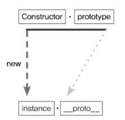
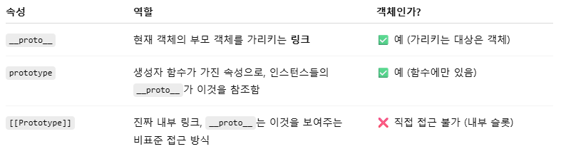
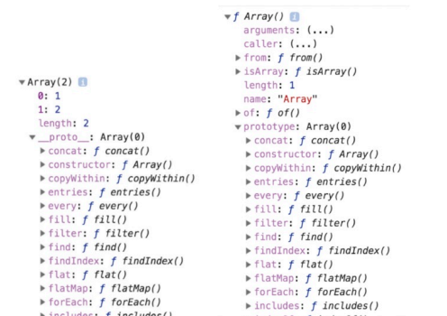
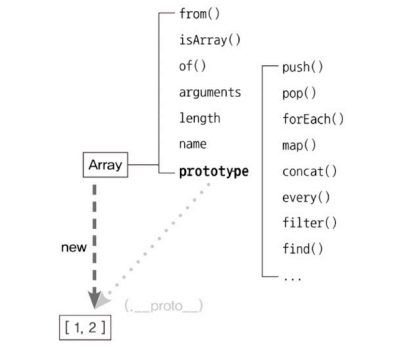
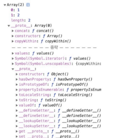
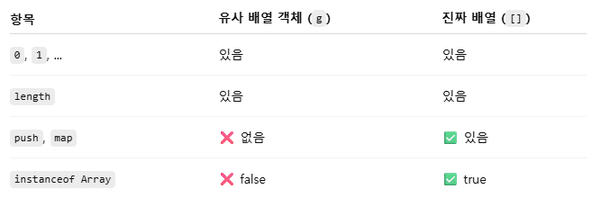
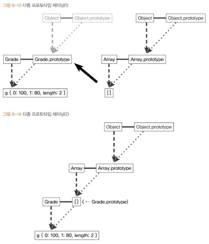

# Chapter 6. 프로토타입
- [Chapter 6. 프로토타입](#chapter-6-프로토타입)
  - [6-1. 프로토타입의 개념 이해](#6-1-프로토타입의-개념-이해)
    - [6-1-1. constructor, prototype, instance](#6-1-1-constructor-prototype-instance)
    - [6-1-2. constructor 프로퍼티](#6-1-2-constructor-프로퍼티)
  - [6-2. 프로토타입 체인](#6-2-프로토타입-체인)
    - [6-2-1. 메서드 오버라이드](#6-2-1-메서드-오버라이드)
    - [6-2-2. 프로토타입 체인](#6-2-2-프로토타입-체인)
    - [6-2-3. 객체 전용 메서드의 예외사항](#6-2-3-객체-전용-메서드의-예외사항)
    - [6-2-4. 다중 프로토타입 체인](#6-2-4-다중-프로토타입-체인)
  - [6-3. 정리](#6-3-정리)
- [Q\&A](#qa)

> 자바스크립트 : 프로토타입 기반 언어
>   - 어떤 객체를 원형으로 삼고 복제(참조) = 클래스 기반 언어의 상속

## 6-1. 프로토타입의 개념 이해
### 6-1-1. constructor, prototype, instance
  
```js
var instance = new Constructor();
```
- Constructor는 생성자 함수
- new Constructor() 호출 → 새로운 instance 생성
- 이 instance에는 **`__proto__`(숨겨진 프로퍼티)** 자동 부여
- ✨ `__proto__`는 Constructor의 prototype(프로퍼티) 참조
  - ```js
    Constructor.prototype === instance.`__proto__`  // true
    ```
> 🤔 prototype? `__proto__` ?
>
> - **prototype** : 생성자 함수가 가진 속성(객체)
>   - 인스턴스가 사용할 메서드 저장
> - **`__proto__`**(던더 프로토, double underscore proto) : 현재 객체의 부모 객체를 가리키는 링크(객체)
>   - 인스턴스는 `__proto__`를 통해 prototype의 메서드에 접근 가능
>      <details>
>      <summary>ES5, ES6에서의 `__proto__`</summary>
>
>      - ES5.1
>          - [[prototype]] 명칭으로 정의
>          - `__proto__`는 브라우저가 [[prototype]] 구현한 대상일 뿐
>           - instance.`__proto__`로 직접 접근 허용X
>           - `Object.getPrototypeOf(instance)`, `Refelect.getPrototypeOf(instance)` 통해 접근 가능
>       - ES6
>         - 대부분의 브라우저가 계속 직접 접근하자 레거시 코드에 대한 호환성 유지 차원에서 정식 인정
>              - 레거시 코드 : 오래되었거나 현재 기준에서 권장되지 않는 방식으로 작성된 코드
>         - 브라우저에서의 호환성을 고려한 지원일 뿐 권장X
>         - Object.getPrototypeOf(instance);
>         - Object.setPrototypeOf(instance, prototype);
>         - Object.create(prototype);
>   </details>
> 
> * [[프로퍼티]] : V8 엔진에서 디버깅할 때만 표시해주는 정보, 콘솔에서 열어볼 수 있으나 실제 코드 상 접근 불가

*생성자 함수와 프로토타입 예시*
```js
function Person(name) {
  this._name = name;
}
Person.prototype.getName = function () {
  return this._name;
};

const suzi = new Person("Suzi");

// 1) 반환값 : undefined
suzi.__proto__.getName(); 

// 2) 반환값 : Suzi
suzi.getName();

//3) 반환값 : Suzi__proto__
suzi.__proto__._name = 'Suzi__proto__'; 
suzi.__proto__.getName(); 
```
-  Person 생성자 함수의 prototype에 getName 메서드 지정
-  Person의 인스턴스는 `__proto__` 프로퍼티를 통해 get Name 호출 가능
- 반환 값 다른 이유
  - 어떤 함수를 메서드로 호출하면 메서드명 바로 앞의 객체가 this
  - 1)의 this = suzi.`__proto__`
    - 이 객체 내부에는 name 프로퍼티 없음
    - 찾고자 하는 식별자 없으므로 undefined 반환
  - 2)의 this = suzi
    - suzi 객체에는 getName 없음
    - 프로토타입 체인으로 인해 suzi.`__proto__`의 getName 찾음
      - 프로토타입 체인
        - 객체에서 속성/메서드 찾을 때 위로 따라 올라가는 경로
          - 모든 객체는 자신의 부모 역할을 하는 객체를 가리키는 **숨겨진 링크 ([[Prototype]], 즉 `__proto__`)** 가짐
          - 이 링크를 따라 올라가며 원하는 속성 찾음
        - 객체 → 객체.`__proto__` → 생성자.prototype → Object.prototype → null
          - ```js
            suzi.__proto__ === Person.prototype; // true
            Person.prototype.__proto__ === Object.prototype; // true
            ```
  - 3)의 this = Suzi`__proto__`
  - this가 인스턴스가 되려면 `__proto__` 생략!
- ✨ `__proto__` 생략 가능 → 해당 메서드나 프로퍼티에 접근 가능

*배열 리터럴과 Array의 관계*  
```js
var arr = [1, 2];
console.dir(arr);
console.dic(Array);
```


- Array는 new 연산자와 함께 호출하든 배열 리터럴을 생성하든 인스턴스 생성됨
- 인스턴스의 `__proto__`는 Array.prototype을 참조하고, `__proto__`가 생략 가능하도록 설계되어 있어 메서드를 자신의 것처럼 호출 가능
- 단 prototype 내부에 있지 않은 메서드는 인스턴스가 직접 호출 불가

### 6-1-2. constructor 프로퍼티
- prototype 객체 내부, `__proto__` 객체 내부엔 constructor 프로퍼티 존재
- 원래의 생성자 함수(자기 자신) 참조
- 인스턴스로부터 그 원형이 무엇인지 알 수 있는 수단
- 읽기 전용 속성이 부여된 예외 경우(number, string, boolean) 제외하고 값을 바꿀 수 있음

*constructor 프로퍼티*
```js
var arr = [1, 2];
Array.prototype.constructor === Array // true
arr._proto_.constructor === Array // true
arr.constructor === Array // true

var arr2 = new arr.constructor(3, 4);
console. log(arr2); // [3, 4]
```

*constructor 변경*
```js
var NewConstructor = function () {
  console.log('this is new constructor!');
};

var dataTypes = [
  1,       // Number & false 
  'test',  // String & false 
  true,    // Boolean & false
  null,    // NewConstructor & false
  undefined,      // NewConstructor & false
  function () {}, // NewConstructor & false
  /test/,         // NewConstructor & false
  new Number(),   // NewConstructor & false
  new String(),   // NewConstructor & false
  new Boolean(),  // NewConstructor & false
  new Object(),   // NewConstructor & false
  new Array(),    // NewConstructor & false
  new Function(), // NewConstructor & false
  new RegExp(),   // NewConstructor & false
  new Date(),     // NewConstructor & false
  new Error(),     // NewConstructor & false
  new NewConstructor()     // NewConstructor & True
];

dataTypes.forEach(function (d) {
  d.constructor = NewConstructor;
  console.log(d.constructor.name, '&', d instanceof NewConstructor);
});
```
- 모든 데이터가 `instanceof ` 명령에 대해 false 반환
  - 객체 instanceof 생성자 함수 : 앞에 있는 객체가 뒤에 있는 생성자 함수의 .prototype과 연결되어 있는지 프로토타입 체인을 따라가며 검사하는 연산자
  - 객체.`__proto__` === 생성자함수.prototype(객체.`__proto__`.`__proto__` === 생성자함수.prototype)
  - 하나라도 같으면 true, 끝까지 없으면 false
- constructor을 변경해도 참조하는 대상이 변경될 뿐 이미 만들어진 인스턴스의 원형이 바뀌거나 데이터 타입이 변하지 않음
  - 인스턴스의 생성자 정보를 알아내고자 constructor 프로퍼티에 의존하는 게 항상 안전하진 않음

> 💡 공식 성립
>
> ① 동일 대상 가리킴
> ```js
>  [constructor]
>  [instance].__proto__.constructor
>  [instance].constructor
>  Object.getPrototypeOf([instance]).constructor
>  [constructor].prototype.constructor
> ```
> ② 동일 객체 접근
> ```js
>[Constructor].prototype
>[instance].__proto__
>[instance]
>Object.getPrototypeOf([instance])
>```

## 6-2. 프로토타입 체인
### 6-2-1. 메서드 오버라이드
- `__proto__` 생략 시 인스턴스는 prototype에 정의된 프로퍼티나 메서드를 자신의 것처럼 사용 가능
- 인스턴스가 동일한 이름의 프로퍼티나 메서드를 가지고 있다면?
```js
var Person = function (name) {
  this.name = name;
};

Person.prototype.getName = function () {
  return this.name;
};

var iu = new Person('지금');

iu.getName = function () {
  return '바로 ' + this.name;
};

console.log(iu.getName()); // 바로 지금
```
- 자바스크립트엔진이 getName 메서드 찾는 방식
  - ✨ 가장 가까운 대상인 자신의 프로퍼티 → 없으면 `__proto__` 검색
    - prototype 상 프로퍼티를 직접 설정해 주거나 call, apply를 통해 `__proto__` 우회 가능
    - ```js
      console.log(iu.__proto__.getName()); // ❌ undefined
      
      Person.prototype.name = '지금';
      console.log(iu.__proto__.getName()); // '지금금'

      console.log(iu.__proto__.getName.call(iu)); // '지금'
      ```
### 6-2-2. 프로토타입 체인
- 프로토타입 체인 : 어떤 데이터의 `__proto__` 프로퍼티 내부에서 다시 `__proto__`프로퍼티가 연쇄적으로 이어진 것
- 프로토타입 체이닝 : 프로토타입 체인을 따라가며 검색하는 것, 메서드 오버라이드와 동일한 맥락

*배열의 내부 구조와 내부 도식*

- `__proto__`의 constructor : Object()
  - prototype가 객체이기 때문
  - 기본적으로 모든 객체의 `__proto__`에는 Object.prototype 연결


- 배열 뿐만 아닌 자바스크립트 데이터는 이러한 프로토타입 체인 구조 지님
- 각 생성자 함수는 모두 함수이기 때문에 Function 생성자 함수의 prototype과 연결되고 재귀적으로 반복해 사용자가 접근하고자 하는 정보를 얻을 수 있음

### 6-2-3. 객체 전용 메서드의 예외사항
- Object.prototype은 언제나 프로토타입의 최상단에 존재
  - 어떤 생성자 함수이든 prototype은 반드시 객체이기 때문
  - 객체에서만 사용할 메서드는 프로토타입 객체 안에 정의X
    - 다른 데이터 타입도 해당 메서드를 사용할 수 있게 됨
    - Object의 static method로 부여

*Object의 정적 메서드 목록*

```js
Object.assign()
Object.create()
Object.defineProperty()
Object.freeze()
Object.getOwnPropertyNames()
Object.getPrototypeOf()
Object.setPrototypeOf()
// ...등등
```
- 직접 호출해야 함
  - this를 통한 연결 불가능
  - Object.freeze(obj)

<details>
<summary>Object.create</summary>

- Object.prototype의 메서드에 접근할 수 없는 경우 생성
- Object.create(null) : `__proto__`가 없는 객체 생성
```js
var _proto = Object.create(null);
_proto.getValue = function (key) {
  return this[key];
};
var obj = Object.create(_proto);
obj.a = 1;
console.log(obj.getValue('a')); // 1
```
- _proto : __proto__가 없고, Object.prototype을 상속받지 않는 완전한 빈 객체 생성
  - toString, hasOwnProperty 같은 기본 메서드 없음
- 직접 getValue 메서드 정의
  - 자신(this) 속성 중 key에 해당하는 값 반환
- obj : _proto를 프로토타입으로 가짐
  - Obj.`__proto__` === _proto
- _proto에서 getValue() 찾아 실행
  - _proto.getValue.call(obj)처럼 실행
  -  this는 obj, obj['a'] === 1 → 1 출력
- 반드시 존재하던 내장 메서드 및 프로퍼티 제거
  - 장점 : 객체 자체의 무게 가벼워져 성능상 이점 가짐
  - 단점 : 기본 기능에 제약 생김
</details>

### 6-2-4. 다중 프로토타입 체인
- 대각선의 `__proto__`를 연결하면 무한대로 체인 관계 이을 수 있음
  - `__proto__`가 가리키는 대상(생성자 함수의 prototype이 연결하고자 하는 상위 생성자 함수의 인스턴스)을 바라보게 해주기

*Grade 생성자 함수와 인스턴스*
```js
var Grade = function () {
  var args = Array.prototype.slice.call(arguments);
  for (var i = 0; i < args.length; i++) {
    this[i] = args[i];
  }
  this.length = args.length;
};
var g = new Grade(100, 80); // g = {0: 100, 1: 80, length: 2}
```
- g는 유사 배열 객체
  - 배열 메서드 사용 불가
  - 
  - 배열의 메서드를 직접 쓰게 하려면 g.`__proto__`(Grade.prototype)가 배열의 인스턴스 바라보면 됨
  - 

```js
console.log(g);   // Grade(2) [100, 80]
g.pop();
console.log(g);   // Grade(1) [100]
g.push(90);
console.log(g);   // Grade(2) [100, 90]
```
- g는 프로토타입 체인에 따라 g, Grade.prototype, Array.prototype, Object.prototype까지 접근 가능

## 6-3. 정리
- 어떤 생성자 함수를 new 연산자와 함께 호출
  - Constructor에 정의된 내용을 바탕으로 새로운 인스턴스 생성
  - `__proto__` 자동 부여
    - Constructor의 prototyp 프로퍼티 참조
    - 생략 가능
      - 인스턴스는 Constructor.prototype 메서드를 자신의 메서드처럼 호출 가능
- Constructor.prototype
  - constructor : 생성자 함수 자신 가리킴
  - 인스턴스가 자신의 생성자 함수가 무엇인지 알고자 할 때 필요한 수단
- 프로토타입 체이닝 : `__proto__`안의 `__proto__`를 찾아가는 과정
  - 자신으로부터 가장 가까운 대상부터 먼 대상으로 접근
  - 원하는 값 찾으면 검색 중단
  - 최종적으로 Object.prototype에 도달
    - 모든 데이터 타입에서 사용할 수 있는 범용적인 메서드만 존재
    - 객체 전용 메서드는 Object 생성자 함수에 정적으로 담김
  - 프로토타입 체인은 무한대의 단계로 생성 가능

---
# Q&A

**1. 자바스크립트는 클래스 기반 언어가 아닌데, 상속은 어떻게 이루어지나요?**  
자바스크립트는 프로토타입 기반 언어입니다.  
클래스처럼 보이지만 실제로는 어떤 객체를 원형으로 삼아 참조하는 방식으로 상속이 이루어집니다.  
객체가 생성될 때 __proto__라는 내부 링크가 자동으로 연결되는데, 이게 생성자 함수의 prototype 객체를 참조합니다.  
그래서 인스턴스는 prototype에 정의된 메서드에 접근할 수 있고, 마치 상속처럼 동작합니다.

**2. __proto__와 prototype의 차이를 설명해주세요.**  
prototype은 생성자 함수에 자동으로 붙는 속성으로, 인스턴스들이 공통으로 사용할 메서드를 정의하는 곳입니다.  
반면 __proto__는 모든 객체가 가지는 내부 링크로, 그 객체의 부모 프로토타입을 가리킵니다.  
즉, instance.__proto__ === Constructor.prototype 관계가 항상 성립하고 이 연결을 통해 프로토타입 체이닝이 동작하게 됩니다.

**3. instanceof는 내부적으로 어떤 식으로 작동하나요?**  
instanceof는 인스턴스의 __proto__ 체인을 따라 올라가며 그 경로 중 하나라도 우변 생성자 함수의 prototype과 일치하면 true를 반환합니다.  
즉, obj instanceof Constructor는
obj.__proto__ === Constructor.prototype || obj.__proto__.__proto__ === Constructor.prototype ...
이런 식으로 확인합니다.
그래서 단순히 obj.constructor = OtherConstructor로 속성을 바꾸더라도 instanceof OtherConstructor는 여전히 false입니다.

**4.자바스크립트에서 배열처럼 보이지만 배열이 아닌 객체를 만들면 어떻게 되나요?**  
유사배열객체는 push, map 같은 배열 메서드를 상속받지 못하기 때문에
prototype을 Array 인스턴스로 설정하거나 call/apply로 메서드를 빌려 써야 합니다.

**5. Object의 정적 메서드와 prototype 메서드의 차이를 설명해주세요.**  
Object의 정적 메서드는 일반 객체의 __proto__를 통해 접근할 수 없고, 직접 Object.freeze(obj)처럼 호출해야 합니다.  
반면 prototype 메서드는 Object.prototype에 정의되어 있어 모든 객체가 상속을 통해 직접 호출할 수 있습니다.  
즉, 정적 메서드는 대상 객체를 인자로 받고,
프로토타입 메서드는 this를 기준으로 동작하는 차이가 있습니다.