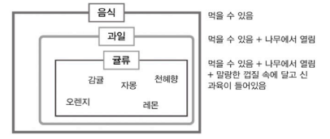
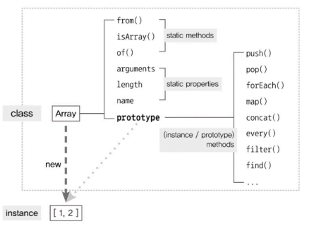
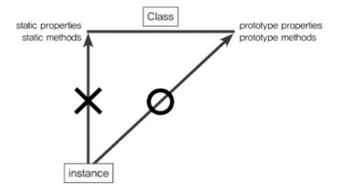
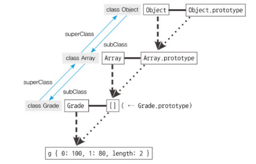
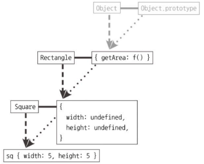
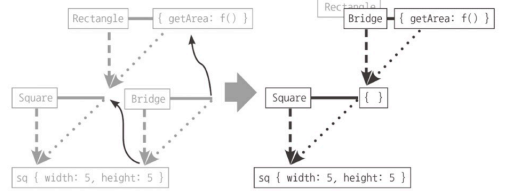
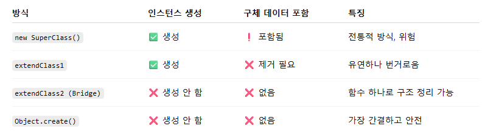

# Chapter 7. 클래스
- [Chapter 7. 클래스](#chapter-7-클래스)
  - [7-1. 클래스와 인스턴스의 개념 이해](#7-1-클래스와-인스턴스의-개념-이해)
  - [7-2. 자바스크립트의 클래스](#7-2-자바스크립트의-클래스)
  - [7-3. 클래스 상속](#7-3-클래스-상속)
    - [7-3-1. 기본 구현](#7-3-1-기본-구현)
    - [7-3-2. 클래스가 구체적인 데이터를 지니지 않게 하는 방법 + constructor 복구](#7-3-2-클래스가-구체적인-데이터를-지니지-않게-하는-방법--constructor-복구)
      - [① 직접 속성 제거 + freeze()](#-직접-속성-제거--freeze)
      - [② Bridge 빈 함수 활용](#-bridge-빈-함수-활용)
      - [③ Object.create()](#-objectcreate)
    - [7-3-3. 상위 클래스에의 접근 수단 제공](#7-3-3-상위-클래스에의-접근-수단-제공)
  - [7-4. ES6의 클래스 및 클래스 상속](#7-4-es6의-클래스-및-클래스-상속)
  - [7-5. 정리](#7-5-정리)
- [Q\&A](#qa)

> 👀 **들어가기 전**
>
> 자바스크립트는 프로토타입 기반 언어
> - '상속' 개념 존재X
> - ES6에서 클래스 문법 추가
>   - 일정 부분 프로토타입을 활용하고 있음


## 7-1. 클래스와 인스턴스의 개념 이해
- 일반적인 개념 이해
  - **클래스(class)**
    - 어떤 개체의 공통 속성을 모아 정의한 추상적인 개념
    - super-, sub-를 접목해 상위 클래스(superclass)/하위 클래스(subclass)로 표현
      - 하위 클래스는 상위 클래스를 포함하면서 더 구체적인 개념 추가
      - 즉, 클래스는 하위로 갈수록 상위 클래스의 속성을 상속하면서 더 구체적인 요건 추가/변경
    <details>
    <summary>클래스 간의 상하관계</summary>
    
    
    - 음식 : 과일의 superclass
    - 과일 : 음식의 subclass, 귤류의 superclass
    - 귤류 : 음식의 sub-subclass
    </details>
  - **인스턴스(instance)**
    - 어떤 클래스의 속성을 지니는 실존하는 개체
- 접근 방식
  - 현실 세계상
    - 인스턴스 → 클래스 
    - 개체들이 존재한 상태에서 이를 구분짓기 위해 클래스 도입
    - 하나의 개체가 같은 레벨에 있는 서로 다른 여러 클래스의 인스턴스일 수 있음
  - 프로그래밍 언어상
    - 클래스 → 인스턴스 
    - 클래스를 바탕으로 인스턴스 생성
    - 한 인스턴스는 하나의 클래스만을 바탕으로 생성
      - 다중상속을 지원하든 안 하든 인스턴스 입장에서 클래스는 '직계존속'
  - 비교
    - 공통점 : 공통 요소를 지니는 집단을 분류하기 위한 개념
    - 차이점
      - 현실 - 인스턴스들로부터 공통점 발견해 클래스 정의(추상적 개념)
      - 프로그래밍 - 클래스가 먼저 정의되어야만 그로부터 공통적인 요소 지니는 개체 생성 가능(추상적인 대상일 수도, 구체적인 개체일 수도 있음)

## 7-2. 자바스크립트의 클래스
- 생성자 함수를 호출하면 인스턴스 생성
  - 생성자 함수 = 일종의 클래스
  - 생성자 함수.prototype 객체 내부 요소 = 인스턴스에 상속
    - 프로토타입 체이닝에 의한 참조이나 결과적으론 상속과 동일하게 동작
    - 인스턴스에 상속(참조)되는지 여부에 따라 static member와 prototype method(instance member)로 나뉨
  

*클래스 관점에서 바라본 프로토타입 시스템 예시*
```js
// 생성자
var Rectangle = function (width, height) {
  this.width = width;
  this.height = height;
};

// (프로토타입) 메서드
Rectangle.prototye.getArea = function () {
  return this.width * this.height;
};

// 스태틱 메서드
Rectangle.isRectangle = function (instance) {
  return instance instanceof Rectangle && 
    instance.with > 0 && instance.height > 0;
}

var rect1 = new Rectangle(3, 4)
console.log(rect1.getArea()); // 12 (O)
console.log(rect1.isRectangle(rect1)); // Error (X)
console.log(Rectangle.isRectangle(rect1)); // true
```
- 프로토타입 메서드
  - `rect1.getArea()`
    - `rect1.(__proto__).getArea()`
    - this = rect1
  - 인스턴스에서 직접 호출할 수 있는 메서드
- 스태틱 메서드
  - `rect1.isRectangle(rect1)`
    - rect1 (X) → rect1.`__proto__` (X) → rect1.`__proto__.__proto__`(= Object.prototype) (X)
    - Uncaught TypeError : not a function
  - 인스턴스에서 직접 접근할 수 없는 메서드
  - 생성자 함수를 this로 해야만 호출 가능

  


> 🤔 **자바스크립트에서의 클래스는?**
> - 구체적인 인스턴스가 사용할 메서드를 정의한 '틀'의 역할을 담당하는 목적 => **추상적 개념**
> - 클래스 자체를 this로 해 직접 접근해야만 하는 스태틱 메서드를 호출할 때의 클래스 => **하나의 개체**로 취급

## 7-3. 클래스 상속
- 이해를 목표로!
  - 프로토타입 체인을 활용해 클래스 상속 구현
  - 최대한 전통적인 객체지향 언어에서의 클래스와 비슷한 형태로 발전시키기!

### 7-3-1. 기본 구현
*Grade 생성자 함수 및 인스턴스*
```js
var Grade = function () {
  var args = Array.prototype.slice.call(arguments);
  for (var i = 0; i < args.length; i++) {
    this[i] = args[i];
  }
  this.length = args.length;
};
Grade.prototype = [];
var g = new Grade(100, 80); // g = {0: 100, 1: 80, length: 2}
```

- 기본적으로 프로토타입 체이닝을 통해 상속 구현
  - superclass, subclass의 구현X
- 문제점 : ① length 삭제 가능(configurable), ② Grade.prototype에 빈 배열 참조
    ```js
    g.push(90);
    console.log(g);  // Grade {0: 100, 1: 80, 2: 90, length: 3}

    delete g.length;
    g.push(70);
    console.log(g);  // Grade {0: 70, 1: 80, 2: 90, length: 1}
    ```
    - delete g.length
      - 내장객체인 배열 인스턴스의 length - configurable: false(삭제 불가)
      - Grade 클래스의 인스턴스 - 배열 메서드 상속하나 기본적으로는 **일반 객체**의 성질 그대로 지님 => length **삭제 가능**
    - g.push(70)
      - `push()` :현재 g.length 값을 읽어 해당 인덱스(g[length])에 value 삽입 → g.length += 1
      - 위 코드에서 length 삭제해 프로토타입 체이닝을 통해 `g.__proto__.length` 찾음
      - Grade.prototype는 빈 배열로 length = 0 
      - index 0번째에 70 삽입, length =1

        <details>
        <summary>요소가 있는 배열을 prototype에 매칭한다면?</summary>

        ```js
        Grade.prototype = ['a', 'b', 'c', 'd'];
        var g = new Grade(100, 80);

        g.push(90);
        console.log(g);  // Grade {0: 100, 1: 80, 2: 90, length: 3}

        delete g.length;
        g.push(70);
        console.log(g);  // Grade {0: 100, 1: 80, 2: 90,  4: 70, length: 5}
        ```
        - g.length가 없으므로 `g.__proto__.length`(4)에 70 push
        - 값이 없는 인덱스는 존재X (undefined 아님)
        </details>
- 클래스에 있는 **값**이 인스턴스의 동작에 영향 주면 안 됨
- 오직 인스턴스가 사용할 메서드만 지닌 '틀'로서만 작용해야 함


### 7-3-2. 클래스가 구체적인 데이터를 지니지 않게 하는 방법 + constructor 복구
<details>
<summary>예시 - Rectangle, Square 클래스</summary>

```js
// Rectangle, Square 클래스 기본 구현
var Rectangle = function (width, height) {
  this.width = width;
  this.height = height;
};

Rectangle.prototype.getArea = function () {
  return this.width * this.height;
};

var rect = new Rectangle(3, 4);
console.log("rect.getArea():", rect.getArea()); // 12


var Square = function (width) {
  this.width = width;
  this.height = width;
};

Square.prototype.getArea = function () {
  return this.width * this.height;
};

var sq1 = new Square(5);
console.log("sq1.getArea():", sq1.getArea()); // 25


// Rectangle을 상속하는 Square 클래스
var Square2 = function (width) {
  Rectangle.call(this, width, width);
};

Square2.prototype = new Rectangle();  // Rectangle 인스턴스를 상속
Square2.prototype.constructor = Square2; // constructor 복원

var sq2 = new Square2(5);
console.log("sq2.getArea():", sq2.getArea()); // 25
```

- 문제점
  - 구체적 데이터 포함 : Rectangle 인스턴스 복사하면서 width, height 속성 상속
  - `new Rectangle()` 호출 시, 인자 안 줌
    - this.width, this.height에 undefined 저장
    - 나중에 상속 체인에서 충돌 가능성, 메모리 낭비, 예측 불가능한 동작 발생
</details>

#### ① 직접 속성 제거 + freeze()
```js
function extendClass1(SuperClass, SubClass, subMethods) {
  SubClass.prototype = new SuperClass(); // 구체 데이터 포함됨

  for (var prop in SubClass.prototype) {
    if (SubClass.prototype.hasOwnProperty(prop)) {
      delete SubClass.prototype[prop];   // 구체 데이터 제거
    }
  }


  if (subMethods) {
    for (var method in subMethods) {
      SubClass.prototype[method] = subMethods[method];
    }
  }

  Object.freeze(SubClass.prototype); // 변경 불가하게 만듦
  return SubClass;
}

var Square = extendClass1(Rectangle, function (width) {
  Rectangle.call(this, width, width)
});
```
- extendClass1
  - SuperClass와 SubClass, SubClass에 추가할 메서드들이 정의된 객체받음
  - SubClass의 prototype 내용 정리
  - freeze
- 여전히 new SuperClass() 호출 → 생성자 비용 발생

#### ② Bridge 빈 함수 활용
- 흐름 : SubClass.prototype → Bridge.prototype → SuperClass.prototype

- Bridge 빈 함수 만들기
- Bridge.prototype이 Rectangle.prototype을 참조하게 함
- Square.prototype에 new Bridge()로 할당
- Bridge가 Rectangle 대체 => 구체적인 데이터 안 남음
```js
var extendClass2 = (function () {
  var Bridge = function () {};

  return function (SuperClass, SubClass, subMethods) {
    Bridge.prototype = SuperClass.prototype;
    SubClass.prototype = new Bridge(); // 인스턴스 없이 체인만 연결
    SubClass.prototype.constructor = SubClass;
    if (subMethods) {
      for (var method in subMethods) {
        SubClass.prototype[method] = subMethods[method];
      }
    }

    Object.freeze(SubClass.prototype);
    return SubClass;
  };
})();
```
- Bridge를 클로저로 활용해 메모리에 불필요한 함수 선언 줄임
- subMethods에는 SubClass의 prototype에 담길 메서드를 객체로 전달

#### ③ Object.create()
```js
// 동일한 코드 일부 생략
Square.prototype = Object.create(Rectangle.prototype);
SubClass.prototype.constructor = SubClass;
Object.freeze(Square.prototype);
```
- 인스턴스 생성X
- `Square.prototype.__proto__` === Rectangle.prototype



### 7-3-3. 상위 클래스에의 접근 수단 제공
- 하위 클래스에서 상위 클래스의 메서드를 실행한 뒤 추가 동작을 하고 싶은 경우 사용
- super()를 직접 구현하여 생성자 및 메서드를 모두 호출 가능하게 함 (ES5 기준)
- SuperClass.prototype.method.apply(this, arguments) 같은 방식의 불편함 해결
<details>
<summary>예시 전체 코드</summary>

```js
// 1. 클래스 상속 함수 정의 + super() 메서드 구현
function extendClass(SuperClass, SubClass, subMethods) {
  // 프로토타입 연결: 구체 데이터 없이 상속
  SubClass.prototype = Object.create(SuperClass.prototype);
  SubClass.prototype.constructor = SubClass;

  // super 메서드 추가
  SubClass.prototype.super = function (propName) {
    var self = this;

    if (!propName) {
      // 생성자 호출용: this.super()(...) → SuperClass.apply(this, arguments)
      return function () {
        return SuperClass.apply(self, arguments);
      };
    }

    // 메서드 호출용: this.super('method')() → SuperClass.prototype.method.apply(this, arguments)
    var prop = SuperClass.prototype[propName];
    if (typeof prop === 'function') {
      return function () {
        return prop.apply(self, arguments);
      };
    }
  };

  // 서브 클래스의 자체 메서드 등록
  if (subMethods) {
    for (var method in subMethods) {
      SubClass.prototype[method] = subMethods[method];
    }
  }

  Object.freeze(SubClass.prototype); // 실수 방지
  return SubClass;
}

// 2. 부모 클래스 정의
function Rectangle(width, height) {
  this.width = width;
  this.height = height;
}

Rectangle.prototype.getArea = function () {
  return this.width * this.height;
};

// 3. 자식 클래스 정의 (super 활용)
var Square = extendClass(
  Rectangle,
  function (width) {
    // this.super() → 부모 생성자 Rectangle(width, width)
    this.super()(width, width);
  },
  {
    getArea: function () {
      // this.super('getArea')() → 부모 메서드 호출 후 확장
      console.log("size is :", this.super("getArea")());
    }
  }
);

// 4. 실행 테스트
var sq = new Square(10);

// ➤ 내부 흐름:
// this.super()(10, 10) → Rectangle(10, 10) → this.width = 10, this.height = 10
// this.super('getArea')() → 10 * 10 → 100

sq.getArea();                         // 출력: size is : 100
console.log(sq.super("getArea")());  // 출력: 100

```
</details>

- `this.super()`
  - SuperClass.apply(this, arguments)
  - 인자 없이 호출 → SuperClass의 생성자 실행
- `this.super('메서드')()`
  - SuperClass.prototype[메서드].apply(this, arguments)
  - 메서드명 넣어 호출 → SuperClass의 프로토타입 메서드 실행
- super 자체가 SuperClass를 가리킬 수 없음

## 7-4. ES6의 클래스 및 클래스 상속
<details>
<summary>ES5 vs ES6 클래스 문법 + 상속 코드 비교</summary>

```js
// ES5 클래스 정의 방식
var ES5 = function (name) {
  this.name = name;
};

// 정적(static) 메서드 정의
ES5.staticMethod = function () {
  return this.name + ' + staticMethod';
};

// 인스턴스 메서드 정의
ES5.prototype.method = function () {
  return this.name + ' + method';
};

var es5Instance = new ES5('es5');
console.log(ES5.staticMethod());         // ES5 staticMethod (this.name은 undefined)
console.log(es5Instance.method());       // es5 + method


// ES6 클래스 문법
class ES6 {
  constructor(name) {
    this.name = name;
  }

  static staticMethod() {
    return this.name + ' + staticMethod';
  }

  method() {
    return this.name + ' + method';
  }
}

const es6Instance = new ES6('es6');
console.log(ES6.staticMethod());         // ES6 staticMethod (this.name은 undefined)
console.log(es6Instance.method());       // es6 + method


// ES6 클래스 상속
class Rectangle {
  constructor(width, height) {
    this.width = width;
    this.height = height;
  }

  getArea() {
    return this.width * this.height;
  }
}

class Square extends Rectangle {
  constructor(width) {
    super(width, width); // 부모 생성자 호출
  }

  getArea() {
    console.log('size is :', super.getArea()); // 부모 메서드 호출
  }
}

const sq = new Square(10);
sq.getArea();  // size is : 100
```
</details>

- ES5 클래스 방식
  - function 생성자 사용해 클래스 역할
  - 정적 메서드: ES5.staticMethod
  - 인스턴스 메서드: ES5.prototype.method
  - new 키워드로 인스턴스 생성

- ES6 클래스 문법
  - class 키워드 도입 → 구조 명확해짐
  - constructor()는 생성자 역할
  - static method()로 정적 메서드 작성
  - 일반 메서드는 prototype에 자동 연결됨
  - ES6 클래스 상속 흐름
    - class Square extends Rectangle	: Square는 Rectangle을 상속받음
    - constructor(width) :	생성자 정의
    - super(width, width) :	부모 생성자 Rectangle(width, width) 호출
    - super.getArea() :	부모 메서드 호출 (this는 여전히 Square 인스턴스)
    - 출력
      - size is : 100 → Rectangle.getArea() 실행 결과


## 7-5. 정리
- 자바스크립트 = 프로토타입 기반 언어
  - 클래스 및 상속 개념은 존재하지 않지만 프로토타입 기반으로 비슷하게 동작하는 기법들 도입됨
- 개념
  - **클래스** : 어떤 사물의 공통 속성을 모아 정의한 추상적인 개념
    - 상위 클래스의 조건 충족 + 더 구체적인 조건 추가 = 하위 클래스
    - **프로토타입 메서드** : 클래스의 prototype 내부에 정의된 메서드(인스턴스가 호출 가능)
    - **스태틱 메서드** : 클래스(생성자 함수)에 직접 정의한 메서드(클래스에 의해서만 호출 가능)
  - **인스턴스** : 클래스의 속성을 지니는 구체적인 사례
- 클래스 상속을 흉내내는 방법
  - 전제 : constructor 프로퍼티가 원래의 생성자 함수를 바라보도록 조정  
  ① SubClass.prototype에 SuperClass의 인스턴스를 할당한 다음 프로퍼티 모두 삭제  
  ② 빈 함수(Bridge) 활용  
  ③ Object.create 이용 

---
# Q&A
**1. 자바스크립트에서 클래스와 인스턴스는 어떤 개념인가요?**  
클래스는 공통적인 속성과 행동을 정의한 추상적인 틀이며, 인스턴스는 해당 클래스를 기반으로 생성된 구체적인 객체입니다.  
자바스크립트는 본래 클래스 개념이 없고 프로토타입 기반 언어지만, ES6부터 클래스 문법이 도입되어 객체지향 방식으로 코드를 구조화할 수 있게 되었습니다.

**2. static 메서드와 prototype 메서드의 차이는 무엇인가요?**  
static 메서드는 클래스 자체에서 호출하는 메서드이며, 인스턴스에서는 사용할 수 없습니다.   반면 prototype 메서드는 인스턴스를 통해 호출하는 메서드입니다.  
static은 보통 클래스 차원의 유틸성 기능에 사용되고, prototype 메서드는 인스턴스마다 공통적으로 사용하는 동작을 정의할 때 사용됩니다.

**3. ES5에서는 클래스 상속을 어떻게 구현하나요?**  
ES5에서는 생성자 함수와 프로토타입 체인을 활용해 상속을 구현합니다.  
하지만 이 과정에서 상위 클래스의 인스턴스를 직접 prototype에 할당하면 구체적인 데이터가 그대로 상속되는 문제가 발생할 수 있습니다.  
이를 방지하기 위해 직접 속성을 제거하거나, 중간에 빈 함수(Bridge)를 활용하거나, Object.create()를 사용하는 방식이 사용됩니다.

**4. ES6 클래스에서 super()와 super.method()의 차이는 무엇인가요?**  
super()는 생성자 내부에서 부모 클래스의 생성자를 호출할 때 사용하고, super.method()는 부모 클래스의 메서드를 호출할 때 사용합니다.  
둘 다 부모의 기능을 재사용하면서 하위 클래스에서 확장하거나 수정할 수 있도록 도와주는 수단입니다.

**5. ES5에서는 하위 클래스가 상위 클래스 메서드를 어떻게 호출하나요?**  
ES5에는 super 키워드가 없기 때문에, 클로저와 apply() 메서드를 이용해 부모의 메서드를 수동으로 호출하는 방식으로 구현합니다.  
이렇게 하면 상위 클래스의 동작을 기반으로 하위 클래스에서 로직을 확장할 수 있지만, 구현이 복잡하고 실수할 여지가 많기 때문에 ES6의 super 문법이 더 안정적이고 직관적인 방법입니다.